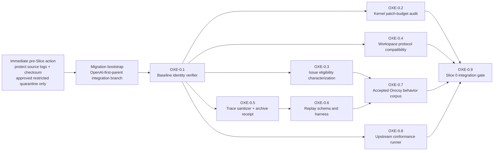
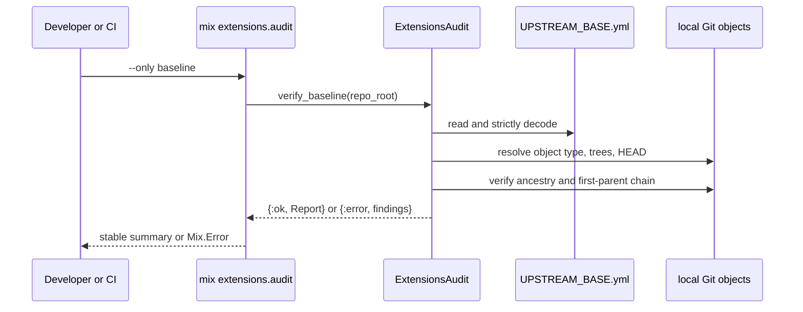

# OpenAI Extension Migration Technical MIU Design

Status: Approved for implementation after the parent architecture approval gate

Date: 2026-07-29

Last reviewed: 2026-07-30

Parent architecture:
`openai_upstream_orocsy_extension_architecture.md`, revision 2

Scope: translate the approved migration direction into independently
implementable technical units. This revision fully specifies the first Slice 0
unit only. Later units are named to make the dependency boundary explicit, but
they are not implementation-ready until their own traces are added.

## Decision

Begin Slice 0 with `OXE-0.1`, an offline upstream-baseline verifier. It makes
the pinned OpenAI commit and tree identity executable before kernel hooks,
Orocsy behavior, or replay tooling are introduced.

Do not combine the patch-budget implementation with this unit. The baseline is
known now; the allowed hook paths and line budgets are not knowable until the
Slice 1 hook prototype is reviewed. `OXE-0.1` creates the trusted reference
that the later patch-budget audit consumes.

That hook prototype may be built and discarded during Slice 0 to inform
`OXE-0.2`; landing the production extension host remains Slice 1 work.

## Observed Repository State

These facts were checked in the architecture worktree on 2026-07-29:

| Fact | Observed value |
| --- | --- |
| Design branch | `codex/openai-extension-architecture` at `2394ee8` |
| Pinned OpenAI commit object | present locally as a Git commit |
| Pinned commit | `f8e8b8a670c799f6e0ade7a8c25c4bf4a4a56ec7` |
| Repository tree | `37a4c6c184db05cd2d59bfc50943979919ec988a` |
| `elixir/` subtree | `77d9ba67775e6681eb1ad5cf03a019e678a8e941` |
| Configured remotes | only `origin`; no durable `openai` remote configuration |
| Baseline ancestry of this design branch | false; this branch descends from Orocsy `main` |

The last row is intentional and load-bearing: implementation of `OXE-0.1`
must occur on the future integration branch created from the pinned OpenAI
commit, not on this design branch.

## Slice 0 Decomposition



Raw trace preservation is an immediate operational prerequisite, not an MIU
and not branch-gated. Before migration branch work, protect the retained source
logs from rotation or deletion and compute their checksums. Raw logs may
contain prompts, tool payloads, paths, or secrets: they remain outside Git and
may be copied only to an owner-approved, access-restricted quarantine. That
quarantine is not the replay corpus or long-lived archive.

`OXE-0.5` owns sanitization, automated secret scanning, human privacy review,
and the receipt for the redacted durable archive. If no approved quarantine
exists, protect the source files in place and block migration bootstrap until
an owner, location, retention policy, and checksum receipt are recorded. This
design does not claim that external preservation has already occurred.

The bootstrap operation is also a migration prerequisite rather than a
behavior MIU. The numbered boxes after it are provisional boundaries; this
document does not authorize their implementation.

`OXE-0.9` must execute the baseline audit only for the new integration
lineage. Old-`main` freeze-window hotfix branches correctly fail the ancestry
check and must not run that gate. Shared CI configuration remains allowed when
branch or lineage conditions enforce this scope.

## MIU OXE-0.1 - Verify The Pinned Upstream Baseline

### Runtime Problem

The migration will resolve kernel files in favor of one exact OpenAI tree and
later claim that no-op mode matches that baseline. Today the identity exists
only as prose:

```md
- Repository: `https://github.com/openai/symphony`
- Commit: `f8e8b8a670c799f6e0ade7a8c25c4bf4a4a56ec7`
- OpenAI Symphony version: `0.0.2`
```

That is readable by a reviewer but not enforceable by CI. A branch based on a
different OpenAI commit, a typo in the manifest, a missing object in a shallow
checkout, or a merge with the wrong first-parent order could all yield
plausible later audit output against the wrong kernel.

`OXE-0.1` adds one behavior: `mix extensions.audit --only baseline` succeeds
only when the checkout proves the exact pinned commit, repository tree,
`elixir/` subtree, and OpenAI-first-parent lineage from a versioned manifest.
It performs no fetch and changes no repository or Git state.

Business invariant: every later use of “upstream baseline” resolves to one
immutable Git object and one verified branch lineage.

### Preconditions And Boundary

Implementation starts only after the integration worktree is created directly
from `openai/main@f8e8b8a` and current Orocsy history is merged with OpenAI as
first parent, following the parent architecture's branch model.

In scope:

- versioned baseline manifest
- pure manifest validation and Git evidence collection
- typed findings and a deterministic report
- a Mix task entry point
- hermetic tests using temporary local Git repositories
- documentation that names the manifest as machine authority

Out of scope:

- adding or fetching the `openai` remote
- classifying later upstream commits
- registering kernel hook paths or line budgets
- comparing runtime behavior with no-op extensions
- porting any Orocsy runtime behavior
- network access, checkout, merge, reset, or source-file mutation

### Data Shape

Repository-root `UPSTREAM_BASE.yml`:

```yaml
schema_version: 1
repository: https://github.com/openai/symphony
commit: f8e8b8a670c799f6e0ade7a8c25c4bf4a4a56ec7
tree: 37a4c6c184db05cd2d59bfc50943979919ec988a
elixir_tree: 77d9ba67775e6681eb1ad5cf03a019e678a8e941
version: 0.0.2
spec_status: draft-v1
verified_at: 2026-07-29
```

| Value | Lifetime | Scope / authority |
| --- | --- | --- |
| Baseline commit | until reviewed upstream sync | whole repository; primary identity |
| Repository tree | same as commit | whole repository; independent cross-check |
| Elixir subtree | same as commit | runtime subtree; later diff input |
| Repository URL | until source changes | provenance only; no network use during audit |
| Version/spec status | descriptive | human compatibility context, not identity |
| Verification date | historical | audit provenance, never freshness authority |
| Audit report | one invocation | local/CI result, not persisted authority |

The manifest accepts full, lowercase, 40-character object IDs only. Short SHAs
are rejected before invoking Git. Unknown keys are rejected for schema version
1 so a misspelled identity field cannot become an ignored annotation.

```elixir
%SymphonyElixir.ExtensionsAudit.Report{
  check: :baseline,
  baseline_commit: "f8e8b8a670c799f6e0ade7a8c25c4bf4a4a56ec7",
  head: "<40-character-sha>",
  repository_tree: "37a4c6c184db05cd2d59bfc50943979919ec988a",
  elixir_tree: "77d9ba67775e6681eb1ad5cf03a019e678a8e941",
  first_parent_verified: true,
  findings: []
}
```

Failures are typed rather than prose-only:

```elixir
%SymphonyElixir.ExtensionsAudit.Finding{
  code: :baseline_not_on_first_parent,
  field: "commit",
  expected: "f8e8b8a670c799f6e0ade7a8c25c4bf4a4a56ec7",
  actual: nil,
  detail: "pinned commit is not present in HEAD first-parent history"
}
```

Allowed finding codes in this MIU are:

- `:manifest_missing`
- `:manifest_invalid_yaml`
- `:manifest_schema_unsupported`
- `:manifest_unknown_key`
- `:manifest_field_invalid`
- `:git_unavailable`
- `:not_a_git_worktree`
- `:baseline_object_missing`
- `:baseline_object_not_commit`
- `:baseline_tree_mismatch`
- `:baseline_elixir_tree_missing`
- `:baseline_elixir_tree_mismatch`
- `:head_unavailable`
- `:baseline_not_ancestor`
- `:baseline_not_on_first_parent`

### Technology Constraint

Git worktrees store `.git` as either a directory or a pointer file. Root
detection must therefore use `git -C <root> rev-parse --show-toplevel`, not
`File.dir?(".git")`.

A normal ancestry check does not prove OpenAI is the first parent of the
Orocsy-history merge. The verifier runs both:

```text
git merge-base --is-ancestor <baseline> HEAD
git rev-list --first-parent HEAD
```

and requires the baseline to appear in the second command's exact output.

CI may be offline. If a shallow or partial clone omits the baseline, the audit
returns a typed failure with repair guidance; it never fetches. YAML is
normalized once into a typed struct. Git commands use argument lists through
`System.cmd/3`, never shell interpolation.

### Design / Flow



Validation order is manifest, commit object, tree identities, `HEAD`, ordinary
ancestry, then first-parent ancestry. Invalid manifest data never reaches Git.
A missing object stops dependent checks so one root cause does not become a
page of cascading findings.

### Best-Practice Fix

Keep policy-free evidence collection in one library module and Mix-specific
output/exit behavior in the task:

```elixir
defmodule SymphonyElixir.ExtensionsAudit do
  @moduledoc false

  alias __MODULE__.Report

  @spec verify_baseline(Path.t(), keyword()) ::
          {:ok, Report.t()} | {:error, [Finding.t()]}
  def verify_baseline(repo_root, opts \\ []) do
    git = Keyword.get(opts, :git, &System.cmd/3)

    with {:ok, manifest} <- load_manifest(repo_root),
         {:ok, evidence} <- collect_git_evidence(repo_root, manifest, git),
         [] <- validate_evidence(manifest, evidence) do
      {:ok, Report.from(manifest, evidence)}
    else
      {:error, findings} when is_list(findings) -> {:error, findings}
      findings when is_list(findings) -> {:error, findings}
    end
  end
end
```

Function injection supports deterministic unit tests; production always uses
`System.cmd/3`.

```elixir
defmodule Mix.Tasks.Extensions.Audit do
  use Mix.Task

  alias SymphonyElixir.ExtensionsAudit

  @shortdoc "Verifies the pinned upstream baseline and extension patch budget"
  @switches [only: :string, repo_root: :string]

  @impl Mix.Task
  def run(args) do
    {opts, argv, invalid} = OptionParser.parse(args, strict: @switches)
    validate_args!(opts, argv, invalid)

    case ExtensionsAudit.verify_baseline(repo_root(opts)) do
      {:ok, report} -> Mix.shell().info(format_success(report))
      {:error, findings} -> raise_findings!(findings)
    end
  end
end
```

For this MIU, `--only` accepts only `baseline`. The option exists now so
`OXE-0.2` can add `budget` without changing the command family. Invoking the
task without `--only` runs every implemented check; in `OXE-0.1`, that is
only the baseline check.

Repository-root resolution defaults from `Mix.Project.project_file/0`, not
the caller's current directory. `--repo-root` exists for hermetic task tests
and diagnosis. The library function always requires an explicit root.

Planned files:

```text
UPSTREAM_BASE.yml
elixir/lib/symphony_elixir/extensions_audit.ex
elixir/lib/mix/tasks/extensions.audit.ex
elixir/test/symphony_elixir/extensions_audit_test.exs
elixir/test/mix/tasks/extensions_audit_task_test.exs
```

The implementation also updates the parent architecture to name
`UPSTREAM_BASE.yml` as machine authority. It does not yet add the task to
`make all`; `OXE-0.9` owns the full Slice 0 gate after all Slice 0 checks
exist.

### Alternatives Rejected

- Verify only that the commit string equals the design document.
  Two prose sources can agree while the checkout has a missing or different
  object.
- Verify ordinary ancestry only.
  This accepts the wrong merge-parent order.
- Fetch `openai` automatically when the object is missing.
  An audit must not mutate repository state or depend on the network.
- Require an `openai` remote named exactly `openai` in every CI run.
  Remote configuration is local operational state; immutable objects are code
  authority. Remote setup and sync governance need a separate design.
- Use only the release version or a Git tag.
  OpenAI Symphony is pre-1.0 and the architecture pins a commit.
- Add a Git library dependency.
  Git is already a runtime-development prerequisite and its object semantics
  are the authority being checked.
- Implement `UPSTREAM_PATCH_BUDGET.yml` in this MIU.
  Reviewed hook paths, fingerprints, and line limits do not exist until the
  extension-host hook prototype. Adding them now would create false precision.

### Code Translation

The load-bearing target shape is strict identity validation plus the
first-parent test:

```elixir
with :ok <- validate_full_sha(manifest.commit),
     {:ok, "commit"} <- git_object_type(repo_root, manifest.commit, git),
     {:ok, tree} <- git_tree(repo_root, manifest.commit, git),
     :ok <- expect(tree, manifest.tree, :baseline_tree_mismatch),
     {:ok, elixir_tree} <- git_elixir_tree(repo_root, manifest.commit, git),
     :ok <- expect(elixir_tree, manifest.elixir_tree, :baseline_elixir_tree_mismatch),
     true <- first_parent_contains?(repo_root, manifest.commit, git) do
  {:ok, evidence}
end
```

- `validate_full_sha/1` exists because Git accepts abbreviations and revision
  expressions that do not belong in a trust manifest.
- Re-derived tree IDs independently check the copied commit identity and
  create stable inputs for later subtree audits.
- `first_parent_contains?/3` exists because ordinary reachability cannot
  prove the OpenAI-kernel branch topology.
- Every Git call uses `git -C <repo_root>` so the task works from `elixir/`,
  the repository root, a linked worktree, or a test fixture.

Stable success output:

```text
extensions.audit baseline: ok commit=f8e8b8a670c799f6e0ade7a8c25c4bf4a4a56ec7 tree=37a4c6c184db05cd2d59bfc50943979919ec988a elixir_tree=77d9ba67775e6681eb1ad5cf03a019e678a8e941 first_parent=true
```

Failure output is one line per typed finding in deterministic code order,
followed by `Mix.raise("extensions.audit baseline failed")`. Output contains no
remote credentials, environment variables, Git config, or commit messages.

### Risk / Test

Tests are written before implementation.

Exact failing tests:

```text
ExtensionsAuditTest:
  rejects an unknown schema key before invoking git
  rejects a short or revision-expression commit before invoking git
  reports a missing baseline object without cascading tree findings
  reports a repository tree mismatch
  reports an elixir subtree mismatch
  rejects ordinary ancestry when the baseline is absent
  rejects ancestry when the baseline is not on the first-parent chain
  accepts an OpenAI-first-parent merge with exact commit and trees
  accepts a linked git worktree
  never invokes fetch checkout merge reset or config

ExtensionsAuditTaskTest:
  runs the baseline check by default
  accepts only baseline for --only in OXE-0.1
  resolves the default root from the Mix project file
  prints stable success output
  raises once with deterministic typed findings
```

The strongest false-positive case is a branch where the pinned OpenAI commit
is reachable only through the second parent of a merge. `git merge-base
--is-ancestor` succeeds there, but `OXE-0.1` must fail with
`:baseline_not_on_first_parent`. A hermetic repository test constructs this
counterexample explicitly.

The strongest false-negative risk is a shallow CI checkout whose content is
correct but whose baseline ancestor was omitted. The audit intentionally fails
closed with `:baseline_object_missing`; CI must fetch sufficient history
before rerunning it.

Focused validation:

```bash
cd elixir
mix test test/symphony_elixir/extensions_audit_test.exs \
  test/mix/tasks/extensions_audit_task_test.exs
mix specs.check
mix extensions.audit --only baseline
```

Handoff validation for the implementation commit:

```bash
cd elixir
make all
```

Acceptance conditions:

1. The manifest matches the pinned commit and both trees re-derived by Git.
2. Correct content on the wrong first-parent topology fails.
3. Missing history fails with a typed finding and no fetch.
4. Malformed manifest input cannot reach `System.cmd/3` as a revision.
5. The library result is deterministic and independently testable without Mix
   shell capture.
6. The task mutates neither files, refs, index, worktree, Git config, nor
   remotes.
7. No extension interface or Orocsy runtime behavior is introduced.

## Next Design Action

`OXE-0.1` is approved, conditional on the parent architecture approval gate.
Next, write the `OXE-0.2` trace. It must derive its initial allowed kernel
paths from an actual extension-host hook prototype against the pinned OpenAI
tree; it must not guess line budgets from the current Orocsy fork.
