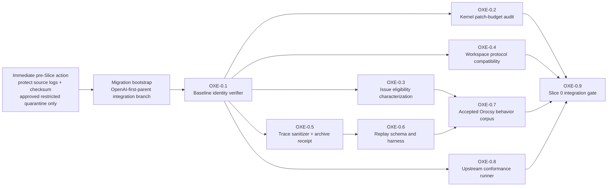
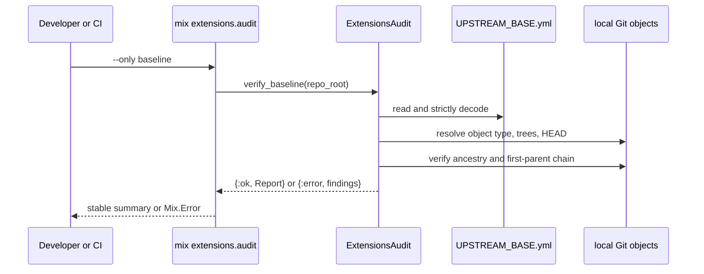

# OpenAI Extension Migration Technical MIU Design

Status: OXE-0.1/0.1a cleared; OXE-0.2 audit implementation cleared; OXE-1.1/1.1a host cleared; OXE-1.2 RED next

Date: 2026-07-29

Last reviewed: 2026-08-15

Parent architecture:
`openai_upstream_orocsy_extension_architecture.md`, revision 2

Scope: translate the approved migration direction into independently
implementable technical units. This revision specifies the first Slice 0 unit,
links the measured `OXE-0.2` kernel patch-budget trace, the reviewed `OXE-1.1`
extension-host trace and red checkpoint, and the `OXE-1.1a` correction that
prevents obsolete prototype fingerprints from becoming production authority.
Other later units are named to make the dependency boundary explicit, but they
are not implementation-ready until their own traces are added.

## Decision

Begin Slice 0 with `OXE-0.1`, an offline upstream-baseline verifier. It makes
the pinned OpenAI commit and tree identity executable before kernel hooks,
Orocsy behavior, or replay tooling are introduced.

Do not combine the patch-budget implementation with this unit. The baseline is
known now; the allowed hook paths and line budgets are not knowable until the
Slice 1 hook prototype is reviewed. `OXE-0.1` creates the trusted reference
that the later patch-budget audit consumes.

That hook prototype may be built and discarded during Slice 0 to inform
`OXE-0.2`; landing the production extension host remains Slice 1 work.

## Observed Repository State

These facts were checked in the architecture worktree on 2026-07-29:

| Fact | Observed value |
| --- | --- |
| Design branch | `codex/openai-extension-architecture` at `2394ee8` |
| Pinned OpenAI commit object | present locally as a Git commit |
| Pinned commit | `f8e8b8a670c799f6e0ade7a8c25c4bf4a4a56ec7` |
| Repository tree | `37a4c6c184db05cd2d59bfc50943979919ec988a` |
| `elixir/` subtree | `77d9ba67775e6681eb1ad5cf03a019e678a8e941` |
| Configured remotes | only `origin`; no durable `openai` remote configuration |
| Baseline ancestry of this design branch | false; this branch descends from Orocsy `main` |

The last row is intentional and load-bearing: implementation of `OXE-0.1`
must occur on the future integration branch created from the pinned OpenAI
commit, not on this design branch.

## Slice 0 Decomposition



Raw trace preservation is an immediate operational prerequisite, not an MIU
and not branch-gated. Before migration branch work, protect the retained source
logs from rotation or deletion and compute their checksums. Raw logs may
contain prompts, tool payloads, paths, or secrets: they remain outside Git and
may be copied only to an owner-approved, access-restricted quarantine. That
quarantine is not the replay corpus or long-lived archive.

`OXE-0.5` owns sanitization, automated secret scanning, human privacy review,
and the receipt for the redacted durable archive. The current source-in-place
protection and checksum evidence are recorded in
`openai_extension_trace_corpus_receipt.md`. No approved external quarantine
or durable preservation is claimed; the receipt keeps the single-host loss
risk explicit.

The bootstrap operation is also a migration prerequisite rather than a
behavior MIU. The numbered boxes after it are provisional boundaries; this
document does not authorize their implementation.

`OXE-0.7` must produce the fork-behavior disposition ledger required by the
owner's 2026-07-30 dual-fidelity ruling. Every one of the 229 existing fork
commits, or a mechanically traceable behavior cluster for the May delivery
layer, receives one provenance (`owner-requested` or `agent-initiated`) and one
disposition: `port`, `superseded-by-upstream`, `drop`, or `defer`. A `port` row
names its characterization test and target owner; a superseded row names the
upstream commit; a drop requires its reason and, for owner-requested behavior,
explicit owner approval; a defer names its slice. `OXE-0.9` and cutover require
zero unclassified rows.

`OXE-0.9` must execute the baseline audit only for the new integration
lineage. Old-`main` freeze-window hotfix branches correctly fail the ancestry
check and must not run that gate. Shared CI configuration remains allowed when
branch or lineage conditions enforce this scope.

## MIU OXE-0.1 - Verify The Pinned Upstream Baseline

### Runtime Problem

The migration will resolve kernel files in favor of one exact OpenAI tree and
later claim that no-op mode matches that baseline. Today the identity exists
only as prose:

```md
- Repository: `https://github.com/openai/symphony`
- Commit: `f8e8b8a670c799f6e0ade7a8c25c4bf4a4a56ec7`
- OpenAI Symphony version: `0.0.2`
```

That is readable by a reviewer but not enforceable by CI. A branch based on a
different OpenAI commit, a typo in the manifest, a missing object in a shallow
checkout, or a merge with the wrong first-parent order could all yield
plausible later audit output against the wrong kernel.

`OXE-0.1` adds one behavior: `mix extensions.audit --only baseline` succeeds
only when the checkout proves the exact pinned commit, repository tree,
`elixir/` subtree, and OpenAI-first-parent lineage from a versioned manifest.
It performs no fetch and changes no repository or Git state.

Business invariant: every later use of “upstream baseline” resolves to one
immutable Git object and one verified branch lineage.

### Preconditions And Boundary

The integration worktree starts directly from `openai/main@f8e8b8a`. The
owner's 2026-07-30 ruling explicitly blesses reviewable upstream-only
checkpoints during Slice 0; Orocsy-history integration remains Slice 2 work.
Intermediate branch mechanics are not the acceptance criterion. The binding
criterion is dual fidelity: the final runtime must mechanically protect the
pinned upstream baseline and completely disposition the accepted fork behavior.

In scope:

- versioned baseline manifest
- pure manifest validation and Git evidence collection
- typed findings and a deterministic report
- a Mix task entry point
- hermetic tests using temporary local Git repositories
- documentation that names the manifest as machine authority

Out of scope:

- adding or fetching the `openai` remote
- classifying later upstream commits
- registering kernel hook paths or line budgets
- comparing runtime behavior with no-op extensions
- porting any Orocsy runtime behavior
- network access, checkout, merge, reset, or source-file mutation

### Implementation Progress

Observed at the pre-OXE-0.1a checkpoint on 2026-08-13:

| Item | Evidence |
| --- | --- |
| Integration lineage | `codex/openai-extension-integration` was created directly from `f8e8b8a670c799f6e0ade7a8c25c4bf4a4a56ec7` |
| Machine authority | repository-root `UPSTREAM_BASE.yml` contains the approved eight-field schema and pinned identities |
| Library seam | `SymphonyElixir.ExtensionsAudit.verify_baseline/2` validates the manifest, local Git object identity, both trees, ordinary ancestry, and first-parent ancestry |
| CLI seam | `mix extensions.audit [--only baseline] [--repo-root PATH]` emits the stable success line or deterministic typed findings |
| Safety boundary | tests prove malformed revisions do not reach Git, inherited repository-redirect variables are removed, every Git subprocess disables promisor lazy fetches and optional locks, and the audit invokes only its read-only Git allowlist |
| Topology boundary | temporary local repository tests accept an OpenAI-first-parent merge and reject the same baseline when it is reachable only through the second parent |
| Focused tests | 28 tests green across `extensions_audit_test.exs` and `extensions_audit_task_test.exs` |
| Hermeticity | task success/default-root tests and Git topology tests use temporary repositories; no test requires the ambient checkout to contain the pinned object |
| Candidate gate | focused suite, formatter, specs, Credo, build, Dialyzer, direct audit, and 100% total coverage pass after Round 2 hardening |
| Handoff blocker at that checkpoint | four consecutive exact `make all` runs stopped on timing-sensitive pinned-upstream SSH/retry tests; the candidate did not modify those paths |
| Remaining gate at that checkpoint | final implementation review and an owner-approved fix or waiver for the unchanged upstream-suite blocker; OXE-0.1a later supplied the fix |

The current integration checkpoint contains the approved design history plus
the `OXE-0.1` candidate, not the Orocsy runtime merge. That deferred merge is
the owner-approved sequence; it does not waive the Slice 2 integration or the
dual-fidelity gate.

### Validation Record

Final local evidence on 2026-07-30:

| Command | Outcome |
| --- | --- |
| `mix test test/symphony_elixir/extensions_audit_test.exs test/mix/tasks/extensions_audit_task_test.exs` | pass, 21 tests |
| focused `mix test --cover ...` | both OXE-0.1 modules report 100%; the selected-test command itself cannot satisfy the repository-wide 100% threshold because unrelated modules are intentionally not exercised |
| `mix extensions.audit --only baseline` | pass with the approved commit, repository tree, Elixir tree, and `first_parent=true` |
| `mix format --check-formatted` | pass |
| `mix lint` | pass; specs check and Credo strict report no issues |
| `mix build` | pass |
| `mix dialyzer --format short` | pass, zero errors |
| `make all` | setup, build, format, and lint pass; the full test run reports 100% total coverage but exits on four upstream tests |

The four `make all` failures are the two fake-SSH port trace waits at
`ssh_test.exs:105` and `ssh_test.exs:135`, plus the two retry-window lower
bounds at `core_test.exs:1022` and `core_test.exs:1062`. They reproduce when
run alone. `git diff f8e8b8a --` over those test files and their SSH/orchestrator
implementations is empty, so this implementation does not alter their code.
At that checkpoint they remained a pinned-upstream/environment handoff blocker
rather than being silently widened into OXE-0.1 scope. OXE-0.1a later fixed
their test-observation races as a separate support MIU.

Review-hardening evidence on 2026-08-13 supersedes the counts, but not the
classification, above:

| Command | Outcome |
| --- | --- |
| focused audit/task suite | pass, 28 tests |
| first exact `make all` | setup/build/format/lint pass; 322 tests, 1 fake-SSH trace timeout at `ssh_test.exs:105`, 6 skipped, 100% total coverage |
| isolated `ssh_test.exs:105` with the same seed | pass, showing the first failure is suite-timing dependent |
| second exact `make all` | setup/build/format/lint pass; 322 tests, fake-SSH timeout at `ssh_test.exs:135` plus retry lower-bound failure at `core_test.exs:1062`, 6 skipped, 100% total coverage |
| final exact `make all` after replacement-object hardening | setup/build/format/lint pass; 323 tests, 1 fake-SSH trace timeout at `ssh_test.exs:105`, 6 skipped, 100% total coverage |
| final exact `make all` after Git-trace hardening | setup/build/format/lint pass; 324 tests, 1 retry lower-bound failure at `core_test.exs:1062`, 6 skipped, 100% total coverage |
| `mix extensions.audit --only baseline` | pass with the approved identities and `first_parent=true` |
| `mix help extensions.audit` | pass; task usage and offline contract are discoverable |
| `mix dialyzer --format short` | pass, zero errors |

The varying failure subset was stronger evidence of timing sensitivity, but at
that checkpoint it did not make the full gate green. Repository policy blocked
landing until OXE-0.1a fixed those unchanged test failures. No SSH,
orchestrator, retry, or corresponding test file was changed by OXE-0.1 itself.

### Implementation Review Disposition

The two-axis review of implementation checkpoint `175354d` found four spec
issues and four standards/smell issues. The candidate was hardened as follows:

| Review finding | Disposition |
| --- | --- |
| Partial-clone Git commands could demand-fetch missing promisor objects | Fixed: every audit subprocess sets `GIT_NO_LAZY_FETCH=1`; the command-contract test asserts the guard. `GIT_OPTIONAL_LOCKS=0` also suppresses optional state refreshes. |
| Wrong-first-parent counterexample used a fake Git adapter | Fixed: accepting and rejecting cases now share a real temporary repository fixture with opposite merge-parent order. |
| Repeated bespoke temporary-directory cleanup | Fixed: all audit/task root and Git-repository constructors share `ExtensionsAuditFixture`, which owns cleanup registration. |
| README run instructions were missing | Fixed in the repository and Elixir READMEs, including manifest authority, command usage, offline behavior, and failure handling. |
| Repeated fake-Git command switches | Hardened: common successful command evidence and per-test overrides now share one scripted adapter; topology tests use real Git. |
| Candidate changed the approved branch sequence without explicit owner approval | Resolved after this review: the owner's 2026-07-30 ruling blesses upstream-only Slice 0 checkpoints and leaves the merge in Slice 2. |
| Exact `make all` was not green at this checkpoint | Superseded by OXE-0.1a: the test-only stabilization fixes the observation races and the exact gate is green. |

At that checkpoint, the implementation review improved the candidate
materially but did not clear it to land. OXE-0.1a later cleared the remaining
repository gate.

The final independent re-review of checkpoint `603f952` found no new issues.
The spec axis confirmed that the promisor lazy-fetch and hermetic wrong-parent
findings are resolved; its surviving findings are the owner-controlled
branch-sequence decision (`P1`) and exact handoff validation (`P2`). The
standards axis confirmed that the cleanup, README, and duplicate-fixture
findings are resolved; its sole surviving finding is the exact `make all`
landing blocker (`P1`). At that checkpoint, those findings were represented by
the then-open rows above.

That checkpoint review was superseded by the authoritative review of `8b652b3`
recorded in `openai_extension_oxe01_implementation_review.md`. Round 2 found
three P1 and eight P2 issues. The 2026-08-13 hardening candidate disposes them
as follows; that candidate's status remained subject to the full gate and
re-review:

| Round 2 finding | Candidate disposition |
| --- | --- |
| Inherited `GIT_DIR` and related variables can redirect the audit | Fixed: every Git subprocess unsets all reviewed repository/object/index/namespace redirect variables; a real two-repository regression test proves the target root wins. |
| Ambient-repository tests fail in shallow CI | Fixed: success, default-root, linked-worktree, and topology tests use temporary repositories with their own exact manifests. |
| ANSI-colored stderr breaks byte comparisons | Fixed: the deterministic-error assertion normalizes ANSI using the shared test helper. |
| Non-zero Git exits become semantic mismatch findings and leak raw output | Fixed: only the documented semantic exit remains a mismatch; operational failures become sanitized `:git_unavailable` findings with stage and status. |
| Broad `ErlangError` rescue hides adapter/programming defects | Fixed: only `:enoent` becomes “git executable not found”; other Erlang errors are reraised and regression-tested. |
| Duplicate keys and multiple YAML documents bypass the strict schema | Fixed: all documents are decoded with duplicate-preserving pairs; exactly one document and one occurrence per key are required. |
| Mix task is hidden and its short description promises the future budget check | Fixed: the task has usage documentation and describes only the implemented baseline check. |
| Git command contract is a mutation blacklist | Fixed: tests allow only `rev-parse`, `cat-file`, `merge-base`, and `rev-list`. |
| Temporary Git repositories inherit global hooks/signing config | Fixed: the shared fixture clears global/system config, signing, and hook paths. |
| Linked-worktree test does not create a linked worktree | Fixed: it now asserts a pointer-file `.git` before auditing. |
| Unreadable manifests are mislabeled as invalid YAML | Fixed: read failures use typed `:manifest_unreadable` findings with OS error text. |
| Branch sequencing requires owner resolution | Resolved by owner ruling: upstream-only Slice 0 checkpoints are blessed; Orocsy integration stays in Slice 2, with dual fidelity enforced by OXE-0.7/OXE-0.9. |

Final two-axis re-review of committed candidate `9994f23` found no surviving
or new spec findings and no in-scope standards or smell findings. The sole
surviving `P1` at that checkpoint was the repository-level exact-`make all`
blocker recorded in the validation table; it was not an OXE-0.1 implementation
defect. OXE-0.1a later fixed that test-observation blocker rather than waiving
it.

### Data Shape

Repository-root `UPSTREAM_BASE.yml`:

```yaml
schema_version: 1
repository: https://github.com/openai/symphony
commit: f8e8b8a670c799f6e0ade7a8c25c4bf4a4a56ec7
tree: 37a4c6c184db05cd2d59bfc50943979919ec988a
elixir_tree: 77d9ba67775e6681eb1ad5cf03a019e678a8e941
version: 0.0.2
spec_status: draft-v1
verified_at: 2026-07-29
```

| Value | Lifetime | Scope / authority |
| --- | --- | --- |
| Baseline commit | until reviewed upstream sync | whole repository; primary identity |
| Repository tree | same as commit | whole repository; independent cross-check |
| Elixir subtree | same as commit | runtime subtree; later diff input |
| Repository URL | until source changes | provenance only; no network use during audit |
| Version/spec status | descriptive | human compatibility context, not identity |
| Verification date | historical | audit provenance, never freshness authority |
| Audit report | one invocation | local/CI result, not persisted authority |

The manifest accepts full, lowercase, 40-character object IDs only. Short SHAs
are rejected before invoking Git. Unknown keys are rejected for schema version
1 so a misspelled identity field cannot become an ignored annotation.

```elixir
%SymphonyElixir.ExtensionsAudit.Report{
  check: :baseline,
  baseline_commit: "f8e8b8a670c799f6e0ade7a8c25c4bf4a4a56ec7",
  head: "<40-character-sha>",
  repository_tree: "37a4c6c184db05cd2d59bfc50943979919ec988a",
  elixir_tree: "77d9ba67775e6681eb1ad5cf03a019e678a8e941",
  first_parent_verified: true,
  findings: []
}
```

Failures are typed rather than prose-only:

```elixir
%SymphonyElixir.ExtensionsAudit.Finding{
  code: :baseline_not_on_first_parent,
  field: "commit",
  expected: "f8e8b8a670c799f6e0ade7a8c25c4bf4a4a56ec7",
  actual: nil,
  detail: "pinned commit is not present in HEAD first-parent history"
}
```

Allowed finding codes in this MIU are:

- `:manifest_missing`
- `:manifest_unreadable`
- `:manifest_invalid_yaml`
- `:manifest_schema_unsupported`
- `:manifest_unknown_key`
- `:manifest_field_invalid`
- `:git_unavailable`
- `:not_a_git_worktree`
- `:baseline_object_missing`
- `:baseline_object_not_commit`
- `:baseline_tree_mismatch`
- `:baseline_elixir_tree_missing`
- `:baseline_elixir_tree_mismatch`
- `:head_unavailable`
- `:baseline_not_ancestor`
- `:baseline_not_on_first_parent`

### Technology Constraint

Git worktrees store `.git` as either a directory or a pointer file. Root
detection must therefore use `git -C <root> rev-parse --show-toplevel`, not
`File.dir?(".git")`.

A normal ancestry check does not prove OpenAI is the first parent of the
Orocsy-history merge. The verifier runs both:

```text
git merge-base --is-ancestor <baseline> HEAD
git rev-list --first-parent HEAD
```

and requires the baseline to appear in the second command's exact output.

CI may be offline. If a shallow or partial clone omits the baseline, the audit
returns a typed failure with repair guidance; it never fetches. The task
requires Git 2.36 or newer so `GIT_NO_LAZY_FETCH` is enforced. YAML is decoded
as duplicate-preserving pairs and must contain exactly one document with one
occurrence of each strict-schema key before it is normalized into a typed
struct.

Git commands use argument lists through `System.cmd/3`, never shell
interpolation. Every Git subprocess sets `GIT_NO_LAZY_FETCH=1` so a partial
clone cannot demand-fetch a promisor object, and `GIT_OPTIONAL_LOCKS=0` to
suppress optional repository-state refreshes. It also unsets `GIT_DIR`,
`GIT_WORK_TREE`, `GIT_COMMON_DIR`, object/alternate-object directories, index,
namespace, ceiling, and discovery overrides. This is load-bearing when the
task runs inside a Git hook because inherited Git variables must not redirect
evidence collection to the caller's repository context. It isolates global,
system, and command-scope configuration, disables replacement objects, and
ignores inherited replacement-ref and shallow-file overrides so Git resolves
the checkout's stored objects and topology directly. Git trace, trace2,
packet, performance, ref, setup, shallow, fsmonitor, pack-access, and curl
diagnostic variables are removed so merged stderr cannot corrupt evidence or
leak caller paths.

### Design / Flow



Validation order is manifest, commit object, tree identities, `HEAD`, ordinary
ancestry, then first-parent ancestry. Invalid manifest data never reaches Git.
A missing object stops dependent checks so one root cause does not become a
page of cascading findings.

### Best-Practice Fix

Keep policy-free evidence collection in one library module and Mix-specific
output/exit behavior in the task:

```elixir
defmodule SymphonyElixir.ExtensionsAudit do
  @moduledoc false

  alias __MODULE__.Report

  @spec verify_baseline(Path.t(), keyword()) ::
          {:ok, Report.t()} | {:error, [Finding.t()]}
  def verify_baseline(repo_root, opts \\ []) do
    git = Keyword.get(opts, :git, &System.cmd/3)

    with {:ok, manifest} <- load_manifest(repo_root),
         {:ok, evidence} <- collect_git_evidence(repo_root, manifest, git),
         [] <- validate_evidence(manifest, evidence) do
      {:ok, Report.from(manifest, evidence)}
    else
      {:error, findings} when is_list(findings) -> {:error, findings}
      findings when is_list(findings) -> {:error, findings}
    end
  end
end
```

Function injection supports deterministic unit tests; production always uses
`System.cmd/3`.

```elixir
defmodule Mix.Tasks.Extensions.Audit do
  use Mix.Task

  alias SymphonyElixir.ExtensionsAudit

  @shortdoc "Verifies the pinned upstream baseline"
  @switches [only: :string, repo_root: :string]

  @impl Mix.Task
  def run(args) do
    {opts, argv, invalid} = OptionParser.parse(args, strict: @switches)
    validate_args!(opts, argv, invalid)

    case ExtensionsAudit.verify_baseline(repo_root(opts)) do
      {:ok, report} -> Mix.shell().info(format_success(report))
      {:error, findings} -> raise_findings!(findings)
    end
  end
end
```

For this MIU, `--only` accepts only `baseline`. The option exists now so
`OXE-0.2` can add `budget` without changing the command family. Invoking the
task without `--only` runs every implemented check; in `OXE-0.1`, that is
only the baseline check.

Repository-root resolution defaults from `Mix.Project.project_file/0`, not
the caller's current directory. `--repo-root` exists for hermetic task tests
and diagnosis. The library function always requires an explicit root.

Implementation files:

```text
UPSTREAM_BASE.yml
elixir/lib/symphony_elixir/extensions_audit.ex
elixir/lib/mix/tasks/extensions.audit.ex
elixir/test/symphony_elixir/extensions_audit_test.exs
elixir/test/mix/tasks/extensions_audit_task_test.exs
elixir/test/support/extensions_audit_fixture.exs
```

The parent architecture already names `UPSTREAM_BASE.yml` as machine
authority and is kept synchronized with this trace. The implementation does
not yet add the task to `make all`; `OXE-0.9` owns the full Slice 0 gate after
all Slice 0 checks exist.

### Alternatives Rejected

- Verify only that the commit string equals the design document.
  Two prose sources can agree while the checkout has a missing or different
  object.
- Verify ordinary ancestry only.
  This accepts the wrong merge-parent order.
- Fetch `openai` automatically when the object is missing.
  An audit must not mutate repository state or depend on the network.
- Require an `openai` remote named exactly `openai` in every CI run.
  Remote configuration is local operational state; immutable objects are code
  authority. Remote setup and sync governance need a separate design.
- Use only the release version or a Git tag.
  OpenAI Symphony is pre-1.0 and the architecture pins a commit.
- Add a Git library dependency.
  Git is already a runtime-development prerequisite and its object semantics
  are the authority being checked.
- Implement `UPSTREAM_PATCH_BUDGET.yml` in this MIU.
  Reviewed hook paths, fingerprints, and line limits do not exist until the
  extension-host hook prototype. Adding them now would create false precision.

### Code Translation

The load-bearing target shape is strict identity validation plus the
first-parent test:

```elixir
with :ok <- validate_full_sha(manifest.commit),
     {:ok, "commit"} <- git_object_type(repo_root, manifest.commit, git),
     {:ok, tree} <- git_tree(repo_root, manifest.commit, git),
     :ok <- expect(tree, manifest.tree, :baseline_tree_mismatch),
     {:ok, elixir_tree} <- git_elixir_tree(repo_root, manifest.commit, git),
     :ok <- expect(elixir_tree, manifest.elixir_tree, :baseline_elixir_tree_mismatch),
     true <- first_parent_contains?(repo_root, manifest.commit, git) do
  {:ok, evidence}
end
```

- `validate_full_sha/1` exists because Git accepts abbreviations and revision
  expressions that do not belong in a trust manifest.
- Re-derived tree IDs independently check the copied commit identity and
  create stable inputs for later subtree audits.
- `first_parent_contains?/3` exists because ordinary reachability cannot
  prove the OpenAI-kernel branch topology.
- Every Git call uses `git -C <repo_root>` so the task works from `elixir/`,
  the repository root, a linked worktree, or a test fixture.

Stable success output:

```text
extensions.audit baseline: ok commit=f8e8b8a670c799f6e0ade7a8c25c4bf4a4a56ec7 tree=37a4c6c184db05cd2d59bfc50943979919ec988a elixir_tree=77d9ba67775e6681eb1ad5cf03a019e678a8e941 first_parent=true
```

Failure output is one line per typed finding in deterministic code order,
followed by `Mix.raise("extensions.audit baseline failed")`. Output contains no
remote credentials, environment variables, Git config, or commit messages.

### Risk / Test

Tests are written before implementation.

Exact failing tests:

```text
ExtensionsAuditTest:
  rejects an unknown schema key before invoking git
  rejects a short or revision-expression commit before invoking git
  reports a missing baseline object without cascading tree findings
  reports a repository tree mismatch
  reports an elixir subtree mismatch
  rejects ordinary ancestry when the baseline is absent
  rejects ancestry when the baseline is not on the first-parent chain
  accepts an OpenAI-first-parent merge with exact commit and trees
  accepts a linked git worktree
  never invokes fetch checkout merge reset or config

ExtensionsAuditTaskTest:
  runs the baseline check by default
  accepts only baseline for --only in OXE-0.1
  resolves the default root from the Mix project file
  prints stable success output
  raises once with deterministic typed findings
```

The strongest false-positive case is a branch where the pinned OpenAI commit
is reachable only through the second parent of a merge. `git merge-base
--is-ancestor` succeeds there, but `OXE-0.1` must fail with
`:baseline_not_on_first_parent`. A hermetic repository test constructs this
counterexample explicitly.

The strongest false-negative risk is a shallow CI checkout whose content is
correct but whose baseline ancestor was omitted. The audit intentionally fails
closed with `:baseline_object_missing`; CI must fetch sufficient history
before rerunning it.

Focused validation:

```bash
cd elixir
mix test test/symphony_elixir/extensions_audit_test.exs \
  test/mix/tasks/extensions_audit_task_test.exs
mix specs.check
mix extensions.audit --only baseline
```

Handoff validation for the implementation commit:

```bash
cd elixir
make all
```

Acceptance conditions:

1. The manifest matches the pinned commit and both trees re-derived by Git.
2. Correct content on the wrong first-parent topology fails.
3. Missing history fails with a typed finding and no fetch.
4. Malformed manifest input cannot reach `System.cmd/3` as a revision.
5. The library result is deterministic and independently testable without Mix
   shell capture.
6. The task mutates neither files, refs, index, worktree, Git config, nor
   remotes.
7. No extension interface or Orocsy runtime behavior is introduced.

## Next Design Action

The repository-gate blocker was resolved by the separate support MIU
[`openai_extension_oxe01a_gate_stabilization.md`](openai_extension_oxe01a_gate_stabilization.md).
It keeps the baseline verifier scope closed and changes only how the pinned
upstream SSH/retry tests observe asynchronous completion and retry scheduling.
Its one-scheduler red baseline failed on the first iteration before the change;
after the test-only fix, 100 repeated focused iterations and the exact
`make all` gate are green. The gate is fixed rather than waived.

`OXE-0.1` is approved, conditional on the parent architecture approval gate.
The next trace is now recorded in
[`openai_extension_oxe02_kernel_patch_budget.md`](openai_extension_oxe02_kernel_patch_budget.md).
It derives three allowed kernel paths and a 40-changed-line total ceiling from
an actual no-op extension-host prototype against the pinned OpenAI tree. The
prototype exposed and corrected an immutable-turn-context recursion hazard;
its code was discarded, and production host work remains Slice 1 scope.

`OXE-0.2` was implemented red-first at checkpoints `1ec682d` and `ff7b986`.
Implementation review found and closed a staged-index bypass at `de41f63`.
Independent review then found three remaining source-authority gaps, closed at
`e490387`: the audit now checks baseline-to-worktree, baseline-to-index, and
baseline-to-HEAD candidates independently; required-hook presence follows
effective worktree content only; and direct-Orocsy rejection includes grouped
aliases. Its focused 46-test suite, three real audit modes, formatter, specs,
strict Credo, and exact `make all` gate pass; the full gate reports 342 tests,
six skipped, 100% total coverage, and zero Dialyzer errors. No extension-host
or Orocsy runtime code landed.

The Slice 1 host trace is now recorded in
[`openai_extension_oxe11_extension_host.md`](openai_extension_oxe11_extension_host.md).
It decomposes the slice into four ordered MIUs and keeps `OXE-1.1` kernel-free:
facade, immutable closed registry, four public interfaces, shared failure types, and
neutral no-op adapters. `OXE-1.1` concretizes the shared failure types; the
hook-owned context, event, and decision structs remain in their owning MIUs.
Independent review corrected the startup-latch,
decoded-workflow-input, and test-isolation boundaries. The resulting focused
11-test red checkpoint at `45335b7` failed only because the generic host
modules did not exist. At checkpoint `a6d0393` its focused suite passed 17
tests; exact `make all` passed 359 tests with six skipped, 100% total coverage,
strict Credo clean, and zero Dialyzer errors. Both extension audits reported
zero changed kernel files and zero changed kernel lines.

The implementation review then reproduced a stronger authority failure: the
current manifest's exact admission and delivery patches pass the budget audit
but do not compile against the production facade. It also showed that direct
pinned-upstream delivery and app-server tests do not necessarily enter through
admission first. The support trace
[`openai_extension_oxe11a_host_prototype_reconciliation.md`](openai_extension_oxe11a_host_prototype_reconciliation.md)
records the RED/GREEN lifecycle correction and the provisional compatible
probe. The manifest remains unchanged and fail-closed. Exact current hook
fingerprints may be revised only after the owning context/differential RED
tests and architecture review. The first `OXE-1.1a` exact full gate was green,
but independent Spec review then found a non-atomic first-selection race. Its
RED regression and direct malformed-config/drift coverage are now green;
the exact post-rework `make all` gate passes 363 tests with zero failures, six
skipped, 100% total coverage, strict Credo clean, and zero Dialyzer errors.
Final independent re-review then repeated 100 synchronized races with exactly
one published revision per round and found no surviving Spec or Standards
issue. `OXE-1.1a` is cleared at `0ea6f5f`; `OXE-1.2` owns the next RED
checkpoint.
