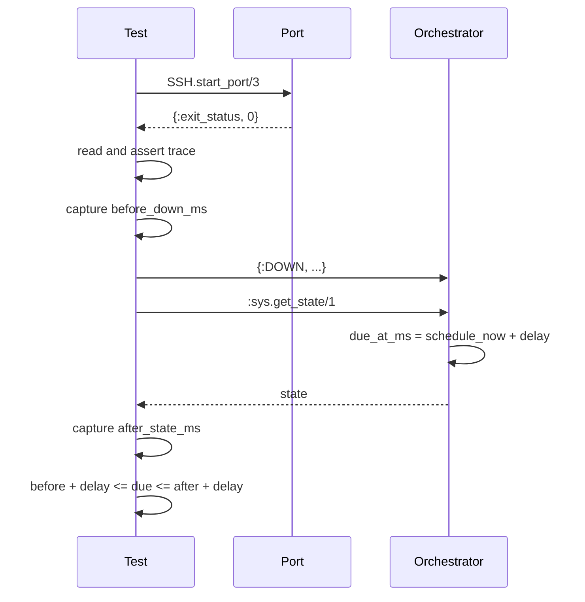

# Technical MIU OXE-0.1a - Stabilize The Pinned-Upstream Full Gate

Status: implemented and validated; repository gate cleared

## Runtime Problem

`OXE-0.1` is implementation-review clean but cannot land while the repository's
required `make all` gate is red. The failures occur in pinned-upstream tests,
not in the extension audit:

- `SSHTest` starts a real executable port, then polls for a side-effect file for
  at most 500 ms. Under scheduler pressure the correct port can finish after the
  polling budget, so the test reports a timeout without observing the port's
  actual completion event.
- `CoreTest` asks the orchestrator to schedule a retry, sleeps for 50 ms, and
  then asserts how much of the delay remains. Mailbox and scheduler latency is
  therefore subtracted from the lower bound even though the orchestrator
  selected the correct retry delay.

Current risky test shapes:

```elixir
assert {:ok, port} = SSH.start_port("localhost", "printf ok")
wait_for_trace!(trace_file) # 20 polls * 25 ms

send(pid, {:DOWN, ref, :process, self(), :boom})
Process.sleep(50)
state = :sys.get_state(pid)
assert_due_in_range(state.retry_attempts[issue_id].due_at_ms, 39_500, 40_500)
```

Observed red-capable command on 2026-08-13:

```bash
ERL_FLAGS='+S 1:1' mix test --repeat-until-failure 100 \
  test/symphony_elixir/core_test.exs:1022 \
  test/symphony_elixir/core_test.exs:1062 \
  test/symphony_elixir/core_test.exs:1102 \
  test/symphony_elixir/ssh_test.exs:105 \
  test/symphony_elixir/ssh_test.exs:135
```

The first iteration completed in 6.1 seconds with both SSH tests failing on the
500 ms side-effect polling timeout. Four earlier exact `make all` runs varied
between either SSH timeout and either retry lower-bound failure, while isolated
reruns could pass. That varying subset is the user-visible symptom: a correct
candidate cannot produce a trustworthy landing verdict.

## Data Shape

| Value | Example | Lifetime | Scope |
| --- | --- | --- | --- |
| Port completion | `{port, {:exit_status, 0}}` | until received by the port owner | one SSH test process |
| Fake SSH trace | `ARGV:-T localhost bash -lc ...` | one test | unique temporary directory |
| Retry request lower bound | monotonic millisecond captured before `:DOWN` | one assertion | one orchestrator test |
| Retry observation upper bound | monotonic millisecond captured after `:sys.get_state/1` | one assertion | one orchestrator test |
| Retry due time | `now_ms + retry_delay_ms` | until retry fires or state is cleared | one issue in orchestrator state |

The values are process-local or live in a unique test fixture. No production
configuration, durable state, network contract, or customer data changes.

## Technology Constraint

Erlang ports already provide an ordered `{:exit_status, status}` completion
message because `SSH.start_port/3` enables `:exit_status`. File polling is a
weaker proxy and cannot prove the subprocess is done.

OTP guarantees message ordering from one sender to one receiver. After the test
sends `:DOWN`, its following synchronous `:sys.get_state/1` request cannot be
handled first by the same orchestrator process. This removes the need for a
sleep. `System.monotonic_time/1` is appropriate for intervals, but a remaining
time sampled after unrelated work is not the scheduled delay.

## Design / Flow



Business invariant: the gate must distinguish a wrong SSH invocation or retry
policy from ordinary scheduler variance. It must not change the production
policy merely to make tests green.

## Best-Practice Fix

Keep the change test-only:

1. Replace trace-file polling with a helper that waits for the port's normal
   exit status, then inspect the already-complete trace.
2. Remove the retry sleeps. Bracket the request/observation window with
   monotonic timestamps and prove the due time was calculated from some instant
   inside that causal window plus the exact policy delay.

Target assertion shape:

```elixir
before_down_ms = System.monotonic_time(:millisecond)
send(pid, {:DOWN, ref, :process, self(), :boom})
state = :sys.get_state(pid)
after_state_ms = System.monotonic_time(:millisecond)

assert due_at_ms >= before_down_ms + 40_000
assert due_at_ms <= after_state_ms + 40_000
```

The bounds derive from message causality rather than an invented scheduler
tolerance.

## Alternatives Rejected

- Increase the 500 ms file-poll or retry tolerance: rejected because a larger
  arbitrary number leaves the same false-negative mechanism in place.
- Mark the tests flaky or waive `make all`: rejected because repository policy
  makes reproducible full-gate failures landing blockers.
- Change `SSH.start_port/3` or retry production code: rejected because the
  observed failures are in test observation and the production diff from the
  pinned upstream is empty.
- Freeze or mock monotonic time: rejected because the existing real OTP-process
  seam can prove scheduling without introducing a time abstraction solely for
  tests.

## Code Translation

```elixir
assert_receive {^port, {:exit_status, 0}}, 5_000
```

This observes the public completion signal already requested by
`SSH.start_port/3`; the timeout is only a dead-process safety ceiling, not the
condition used to infer successful execution.

```elixir
assert due_at_ms >= before_down_ms + expected_delay_ms
assert due_at_ms <= after_state_ms + expected_delay_ms
```

These lines prove that the orchestrator used the exact delay at a point between
request and synchronized observation. Scheduler latency widens the measured
window but cannot make a correct result fail.

## Risk / Test

Risks are limited to tests: a port that never exits now consumes up to the
explicit ExUnit receive timeout, and an unexpected nonzero exit must fail with
the observed status rather than later as a missing trace.

Red baseline:

- focused one-scheduler stress command above: 5 tests, 2 SSH failures;
- exact `make all`: four attempts produced varying SSH/retry timing failures.

Green acceptance:

```bash
mix test test/symphony_elixir/ssh_test.exs \
  test/symphony_elixir/core_test.exs:1022 \
  test/symphony_elixir/core_test.exs:1063 \
  test/symphony_elixir/core_test.exs:1104

ERL_FLAGS='+S 1:1' mix test --repeat-until-failure 100 \
  test/symphony_elixir/core_test.exs:1022 \
  test/symphony_elixir/core_test.exs:1063 \
  test/symphony_elixir/core_test.exs:1104 \
  test/symphony_elixir/ssh_test.exs:105 \
  test/symphony_elixir/ssh_test.exs:135

make all
```

Acceptance requires no production-file changes, the focused stress loop green,
and one exact green `make all` run. The OXE-0.1 parent trace and implementation
review must then record that the repository gate is cleared by OXE-0.1a rather
than waived.

## Validation Record - 2026-08-13

| Command | Outcome |
| --- | --- |
| red baseline, five focused tests with `ERL_FLAGS='+S 1:1'` | failed on iteration 1: both fake-SSH trace waits timed out; 5 tests, 2 failures |
| SSH slice, 20 repeated one-scheduler iterations | pass: 40 focused test executions across the two SSH tests |
| retry slice, 20 repeated one-scheduler iterations | pass: 60 focused test executions across the three retry tests |
| combined acceptance, 100 repeated one-scheduler iterations | pass: 500 focused test executions across all five formerly flaky tests |
| focused normal-scheduler suite | pass: full `ssh_test.exs` plus three retry tests, 11 tests total |
| `mix format --check-formatted` | pass |
| exact `make all` | pass: 324 tests, 0 failures, 6 skipped, 100% total coverage, zero Dialyzer errors |
| production diff check | pass: no `elixir/lib/` file changed in OXE-0.1a |

The implemented change follows the design above exactly: SSH tests wait on the
real port exit status, retry tests use request/observation windows around the
unchanged policy delay, and no timeout or production retry behavior is relaxed.
