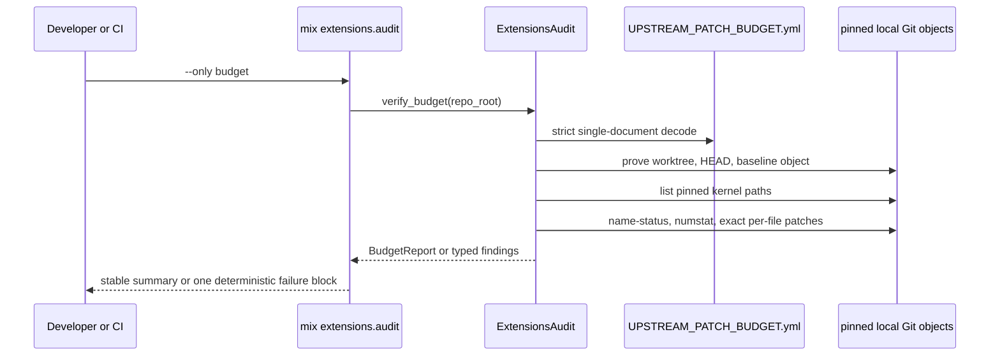

# OXE-0.2 Kernel Patch-Budget Audit Technical Trace

Status: implementation and independent review cleared; production hook host not landed

Date: 2026-08-13

Parent architecture:
`openai_upstream_orocsy_extension_architecture.md`, revision 2

Depends on:

- `OXE-0.1` pinned upstream-baseline verifier
- `OXE-0.1a` full-suite gate stabilization
- pinned OpenAI commit `f8e8b8a670c799f6e0ade7a8c25c4bf4a4a56ec7`

## Decision

Add a second offline `extensions.audit` check that fails closed when a file
owned by the pinned OpenAI kernel diverges outside the measured extension-host
prototype, exceeds its measured changed-line ceiling, or no longer has the
reviewed patch fingerprint.

Do not land the prototype host in this MIU. `OXE-0.2` lands the manifest,
evidence collector, deterministic findings, task surface, and hermetic tests.
Slice 1 owns the production facade, registry, interfaces, no-op adapters, and
no-op differential proof.

Business invariant: every changed line in a pinned OpenAI kernel file is either
byte-for-byte part of a reviewed hook patch or causes a deterministic audit
failure before integration can proceed.

## Prototype Question

What is the smallest real kernel write set that can expose the four approved
extension responsibilities without importing an Orocsy implementation or
changing no-op runtime behavior?

The throwaway prototype used the eventual facade name
`SymphonyElixir.Extensions` and returned only no-op/delegate decisions. It
exercised four lifecycle seams:

1. admission after the final tracker refresh and before worker selection;
2. delivery after workspace creation and before the repository hook/model run;
3. authorization with one immutable context captured at turn start and carried
   through the app-server receive loop;
4. observer notification after the immutable event is assembled and before the
   existing message subscriber runs.

The prototype was made against integration checkpoint `b534d9d`. A direct Git
comparison proved that its three kernel files were still byte-identical to the
pinned OpenAI commit before prototype edits.

## Observed Prototype Result

The prototype compiled with warnings treated as errors. The unchanged core and
app-server modules passed together: 71 tests, zero failures.

Its first app-server run failed one existing stream-update test. The
authorization callback was captured correctly at turn start, but a recursive
receive-loop path passed only the old auto-approval Boolean after the first
notification. The corrected prototype carries one immutable runtime tuple
through every recursive path. This is a design constraint, not a test-only
detail: a per-turn authorization snapshot must never be reconstructed or
degraded mid-turn.

Measured against the pinned kernel:

| Kernel file | Named hook | Added | Deleted | Changed | Prototype patch SHA-256 |
| --- | --- | ---: | ---: | ---: | --- |
| `elixir/lib/symphony_elixir/orchestrator.ex` | `dispatch.admission_before_worker_selection` | 7 | 0 | 7 | `33ec698629bad5a0f6fc59e2297aa33df058aa1ded771515ee366f166121c90e` |
| `elixir/lib/symphony_elixir/agent_runner.ex` | `delivery.workspace_ready_before_model` | 7 | 1 | 8 | `317cacea7600e5a30f6cd57c202550df21a3a1cecc2b8daff3d4a2462c0e8336` |
| `elixir/lib/symphony_elixir/codex/app_server.ex` | `authorization.immutable_turn_context` | 20 | 4 | 24 | `0665701f982e9238532b0e5c28cfc8e2167b7cb3fa0c9edd0de5740a8b06a6bf` |
| `elixir/lib/symphony_elixir/codex/app_server.ex` | `observer.after_event_assembly` | 1 | 0 | 1 | `ef86399e4d7b6cc31cc62114ffc21cd4263daf1d1c3c159b121960462d889538` |
| **Total** | four hooks, three kernel files | **35** | **5** | **40** | combined: `49539e03a54e86599551ff497add3efbf1e0790aabdb62332f5b994d821d3972` |

The combined app-server patch fingerprint is
`627495f2c55450f127a7e6498c481185c04922b989e7ae569a1126f11ab6271c`.
The 23-line throwaway no-op facade itself had SHA-256
`2c985d2ed9700010e532dadbf2e6e138cfa06073e7783f312d8153c9569a8885`;
it is extension code and is not charged to the kernel budget.

These are observed ceilings, not estimates. Any production need above 7, 8,
25 per file or 40 total changed kernel lines requires a reviewed manifest
revision. The audit does not grant contingency lines.

## Runtime Problem

The architecture currently says “keep the OpenAI kernel small,” but nothing
mechanically distinguishes a reviewed facade call from policy added directly
to `Orchestrator`, `AgentRunner`, or `Codex.AppServer`. A plausible extension
implementation can therefore pass ordinary tests while silently recreating the
fork inside upstream-owned files.

`OXE-0.1` proves which Git object is the upstream authority. `OXE-0.2` uses
that exact object as the left side of every kernel comparison and adds one
behavior:

```text
mix extensions.audit --only budget
```

succeeds only when the current checkout has no unregistered pinned-kernel
change and every present registered hook matches both its reviewed fingerprint
and its changed-line ceiling.

## Preconditions And Boundary

In scope:

- repository-root `UPSTREAM_PATCH_BUDGET.yml`
- strict, duplicate-aware manifest validation before invoking Git
- pinned-kernel path discovery from the baseline tree
- exact path, changed-line, and SHA-256 patch verification
- direct Orocsy dependency rejection in changed kernel lines
- typed findings and stable task output
- `--only budget`; default task execution runs baseline, then budget
- hermetic temporary-repository tests
- documentation of the prototype evidence and audit authority

Out of scope:

- landing `SymphonyElixir.Extensions` or any adapter
- enabling Orocsy behavior
- claiming no-op runtime equivalence
- changing the measured ceilings without a new prototype and architecture review
- assigning ownership to future extension modules
- adding the audit to shared CI; `OXE-0.9` owns lineage-scoped CI wiring
- fetching Git history, checking out refs, writing the index, or mutating files

## Manifest Authority

Repository-root `UPSTREAM_PATCH_BUDGET.yml` is the machine authority. Schema
version 1 has this shape:

```yaml
schema_version: 1
baseline_commit: f8e8b8a670c799f6e0ade7a8c25c4bf4a4a56ec7
kernel_root: elixir/lib/symphony_elixir
prototype_checkpoint: b534d9d08bfb8559770746d0cec72022337c7189
prototype_total_patch_sha256: 49539e03a54e86599551ff497add3efbf1e0790aabdb62332f5b994d821d3972
total_max_changed_lines: 40
files:
  - path: elixir/lib/symphony_elixir/orchestrator.ex
    max_changed_lines: 7
    required: false
    expected_patch_sha256: 33ec698629bad5a0f6fc59e2297aa33df058aa1ded771515ee366f166121c90e
    hooks:
      - id: dispatch.admission_before_worker_selection
        max_changed_lines: 7
        prototype_patch_sha256: 33ec698629bad5a0f6fc59e2297aa33df058aa1ded771515ee366f166121c90e
  - path: elixir/lib/symphony_elixir/agent_runner.ex
    max_changed_lines: 8
    required: false
    expected_patch_sha256: 317cacea7600e5a30f6cd57c202550df21a3a1cecc2b8daff3d4a2462c0e8336
    hooks:
      - id: delivery.workspace_ready_before_model
        max_changed_lines: 8
        prototype_patch_sha256: 317cacea7600e5a30f6cd57c202550df21a3a1cecc2b8daff3d4a2462c0e8336
  - path: elixir/lib/symphony_elixir/codex/app_server.ex
    max_changed_lines: 25
    required: false
    expected_patch_sha256: 627495f2c55450f127a7e6498c481185c04922b989e7ae569a1126f11ab6271c
    hooks:
      - id: authorization.immutable_turn_context
        max_changed_lines: 24
        prototype_patch_sha256: 0665701f982e9238532b0e5c28cfc8e2167b7cb3fa0c9edd0de5740a8b06a6bf
      - id: observer.after_event_assembly
        max_changed_lines: 1
        prototype_patch_sha256: ef86399e4d7b6cc31cc62114ffc21cd4263daf1d1c3c159b121960462d889538
```

`required: false` is intentional during Slice 0: the measured hook may be
absent, but any change to that kernel file must already match the reviewed
prototype exactly. Slice 1 changes the field to `true` when it lands the host.
An absent required hook is then a failure.

The manifest accepts only repository-relative, normalized paths under
`kernel_root`. Absolute paths, `..`, empty segments, backslashes, NUL bytes,
duplicate file paths, duplicate hook IDs, unknown keys, and non-lowercase full
SHA-256 values fail before Git.

## Kernel Ownership Rule

“Kernel file” means a blob present below `kernel_root` in the pinned baseline
tree. That definition is derived with `git ls-tree`; it is not inferred from
the current checkout.

Consequences:

- modifying or deleting any baseline kernel file is audited;
- renames are treated as a deletion plus an addition because rename detection
  is disabled;
- a baseline kernel change outside the three registered files fails;
- new extension modules are not mislabeled as kernel divergence merely because
  they live below `symphony_elixir/`;
- owning interfaces and dependency direction for new extension modules remain
  Slice 1 checks.

Changed kernel lines may reference only the generic
`SymphonyElixir.Extensions` facade. Any added line containing an `Orocsy`
module token fails even when it enters through a grouped alias such as
`SymphonyElixir.{Orocsy.Policy}`, and even if a manifest fingerprint was
mistakenly updated.

## Deterministic Fingerprint

For each registered file, the audit runs both equivalent argument-list
commands:

```text
git -C <root> diff --no-ext-diff --no-textconv --no-renames --no-color --full-index --unified=3 \
  <baseline_commit> -- <registered_path>
git -C <root> diff --no-ext-diff --no-textconv --no-renames --no-color --cached \
  --full-index --unified=3 <baseline_commit> -- <registered_path>
git -C <root> diff --no-ext-diff --no-textconv --no-renames --no-color --full-index --unified=3 \
  <baseline_commit> <head_commit> -- <registered_path>
```

The expected fingerprint is lowercase SHA-256 of the exact stdout bytes. The
first command compares the pinned baseline with effective worktree content,
the second compares it independently with staged index content, and the third
compares it independently with the resolved `HEAD` commit. Results for the
same path are merged without double-counting. Consequently, neither an
unstaged edit, a staged patch hidden by restoring baseline worktree bytes, nor
a committed patch hidden by staging baseline bytes can bypass the audit.
Required-hook presence follows only effective worktree content; historical
HEAD or index candidates can produce findings but cannot make an absent runtime
hook appear present. On a clean integration or CI checkout all three sources
are byte-identical. The baseline and HEAD are full object IDs, the path is
validated and separated by `--`,
external diff drivers, text-conversion filters, and rename heuristics are
disabled, and Git configuration is isolated by the existing audit environment.

Changed lines are additions plus deletions from `--numstat`. A binary marker,
malformed row, duplicate row, unexpected path, non-zero Git status, or output
that cannot be mapped back to the pinned tree fails closed.

Each hook retains its isolated prototype fingerprint and ceiling for review and
fixture recomposition. Runtime enforcement uses the exact composed file
fingerprint plus its file and total ceilings; this is stronger than accepting
the hook fragments independently because a change cannot be hidden in the
composition or moved between hooks. The whole-prototype SHA is provenance only.

## Data Shape

```elixir
%SymphonyElixir.ExtensionsAudit.BudgetReport{
  check: :budget,
  baseline_commit: "f8e8b8a670c799f6e0ade7a8c25c4bf4a4a56ec7",
  head: "<40-character-sha>",
  changed_kernel_files: [],
  changed_lines: 0,
  maximum_changed_lines: 40,
  findings: []
}
```

Allowed `OXE-0.2` finding codes:

- `:budget_manifest_missing`
- `:budget_manifest_unreadable`
- `:budget_manifest_invalid_yaml`
- `:budget_manifest_schema_unsupported`
- `:budget_manifest_unknown_key`
- `:budget_manifest_field_invalid`
- `:budget_baseline_mismatch`
- `:budget_git_unavailable`
- `:kernel_path_unregistered`
- `:kernel_file_deleted`
- `:kernel_patch_binary`
- `:kernel_patch_fingerprint_mismatch`
- `:kernel_file_budget_exceeded`
- `:kernel_total_budget_exceeded`
- `:kernel_direct_orocsy_dependency`
- `:kernel_required_hook_missing`

Manifest failures are reported before Git. Git evidence failures stop dependent
checks. Semantic findings are sorted by registered path and then finding-code
order. Raw Git stderr, environment values, diff contents, and source lines are
never included in CLI output.

## Flow



Default `mix extensions.audit` runs the baseline check first. It does not run
the budget check when baseline identity or first-parent lineage is invalid,
because a budget relative to an untrusted baseline is meaningless.

## Git Command Contract

`OXE-0.2` extends the existing read-only allowlist with only `ls-tree` and
`diff`. All calls retain `GIT_NO_LAZY_FETCH=1`, optional-lock suppression,
replacement-object suppression, isolated config, repository redirect cleanup,
and trace/debug cleanup.

No `fetch`, `checkout`, `switch`, `merge`, `reset`, `update-index`, `config`,
or shell invocation is permitted. Missing baseline history is repaired outside
the audit.

## Best-Practice Module Boundary

Keep the baseline and budget public operations in
`SymphonyElixir.ExtensionsAudit`, but give each manifest its own typed decoder
and report struct. Share only hardened filesystem, YAML-pair, path, and Git
execution helpers. Do not make one permissive union manifest or one generic
“check map” interpreter.

The Mix task owns option selection, ordered execution, formatting, and exit
behavior. The library owns evidence and typed results.

## TDD Trace

Write these failures before implementation:

```text
ExtensionsAuditBudgetTest:
  rejects duplicate, unknown, traversal, absolute, and ill-typed manifest fields before Git
  rejects a manifest baseline that differs from UPSTREAM_BASE.yml
  derives protected kernel files from the pinned tree, not the current checkout
  rejects a changed pinned kernel file outside the registry
  rejects deletion or rename of a pinned kernel file
  rejects binary and malformed numstat evidence
  rejects an over-budget registered patch
  rejects a fingerprint mismatch below the line ceiling
  rejects direct SymphonyElixir.Orocsy dependency lines
  rejects grouped-alias Orocsy module tokens
  rejects an uncommitted change to a registered or unregistered pinned kernel file
  rejects a staged kernel patch hidden by baseline worktree content
  rejects a committed kernel patch hidden by baseline index and worktree content
  allows absent optional Slice 0 hooks
  rejects an absent required Slice 1 hook
  requires Slice 1 hooks in effective worktree content, not historical HEAD or index content
  accepts the exact measured prototype patches
  invokes only rev-parse, cat-file, ls-tree, and diff for budget evidence

ExtensionsAuditTaskTest:
  accepts budget for --only
  runs baseline then budget by default
  does not run budget when baseline fails
  prints a stable zero-diff budget success line
  raises once with deterministic sanitized budget findings
```

The strongest false positive is a current checkout with new extension modules
below `symphony_elixir/` but no changed baseline-owned file. It must pass the
kernel budget because new extension ownership is not kernel divergence.

The strongest false negative is an unregistered baseline file changed by one
line while all registered hooks remain exact. It must fail
`:kernel_path_unregistered` even though the total changed-line count is below
40.

The app-server regression must send at least two notifications before an
authorization request and prove that the same immutable turn-context identity
reaches the facade after every recursive receive-loop hop.

## Validation

The red checkpoint is
`1ec682d9c3ff8131d315a3fc4a6e32ef669d82cf`. It introduced the manifest,
strict fixtures, and acceptance tests without production audit support; the
focused run failed 12 tests because `verify_budget` and the task surface did
not yet exist.

The green implementation checkpoint is
`ff7b98625e95e980b4e062f123a2ed06fec33e7b`. It adds the shared hardened Git
runner, strict budget decoder and validator, pinned-tree evidence collector,
deterministic findings and reports, task ordering, and hermetic boundary
coverage. It does not add the facade, adapters, kernel hooks, or Orocsy runtime
behavior.

Implementation review then found that the original baseline-to-worktree diff
could miss staged kernel bytes when the working file was restored to baseline.
The regression failed at `ff7b986`, proving the bypass. Checkpoint
`de41f6344dba1f1616b5c2689ee781f5f8b6329f` closes it by auditing staged-index
and worktree candidates independently and merging duplicate safe path evidence
without double-counting.

Independent review then attacked the remaining source-authority boundaries.
It proved that a committed kernel patch could be hidden from both worktree and
index evidence, that a required hook could be falsely satisfied by the union
of historical sources, and that grouped aliases could evade the direct-Orocsy
token check. The three regressions failed against `de41f63`. Checkpoint
`e4903872d695f9ed2aed7ee87e3dcf8f33537c57` closes them with an independent
baseline-to-HEAD channel, effective-worktree-only required-hook authority, and
module-token detection that includes grouped aliases.

Observed validation at the hardened checkpoint:

| Command | Outcome |
| --- | --- |
| focused baseline, budget, and task suites | pass, 46 tests |
| `mix extensions.audit --only baseline` | pass with the pinned object, trees, and first-parent proof |
| `mix extensions.audit --only budget` | pass with zero kernel divergence and a 40-line ceiling |
| default `mix extensions.audit` | pass in baseline-then-budget order |
| `mix format --check-formatted`, `mix specs.check`, strict Credo, and `git diff --check` | pass |
| `make all` | pass; 342 tests, 6 skipped, 100% total coverage, Dialyzer zero errors |

Reproduction commands:

```bash
cd elixir
mix test test/symphony_elixir/extensions_audit_budget_test.exs \
  test/symphony_elixir/extensions_audit_test.exs \
  test/mix/tasks/extensions_audit_task_test.exs
mix format --check-formatted
mix specs.check
mix extensions.audit --only baseline
mix extensions.audit --only budget
```

The exact handoff validation is:

```bash
cd elixir
make all
```

## Acceptance Conditions

1. The budget manifest baseline exactly equals `UPSTREAM_BASE.yml`.
2. Zero kernel divergence passes while the Slice 0 hooks remain optional.
3. One unregistered baseline-kernel line fails.
4. A registered patch below its line ceiling but with different bytes fails.
5. A byte-exact patch above either its file or total ceiling fails.
6. Kernel deletion, rename, binary patch, malformed Git evidence, and missing
   history fail closed.
7. Added direct Orocsy dependencies, including grouped aliases, fail
   independently of the fingerprint.
8. Default task execution never evaluates budget against an unverified
   baseline.
9. The implementation mutates no file, object, ref, index, worktree, config, or
   remote and performs no network access.
10. No production extension host or Orocsy runtime behavior lands in this MIU.

## Alternatives Rejected

- Count the current Orocsy fork diff. It measures years of accumulated policy,
  not the new extension seam.
- Permit a rounded contingency budget. It turns a measured boundary into spare
  unreviewed capacity.
- Protect only the three registered paths. A new kernel patch elsewhere would
  be invisible.
- Hash only added lines. Deletions and context movement can change mechanics
  while preserving added text.
- Use Git rename detection. Its similarity heuristics make a safety boundary
  configuration-dependent.
- Land the throwaway facade now. Slice 1 still owes registry lifetime,
  interface types, no-op adapters, and differential behavior proof.

## Next Action

Begin the Slice 1 technical trace for the production facade, interfaces,
registry lifetime, no-op adapters, and differential equivalence proof.
Production hook code remains absent until that next trace is reviewed.
