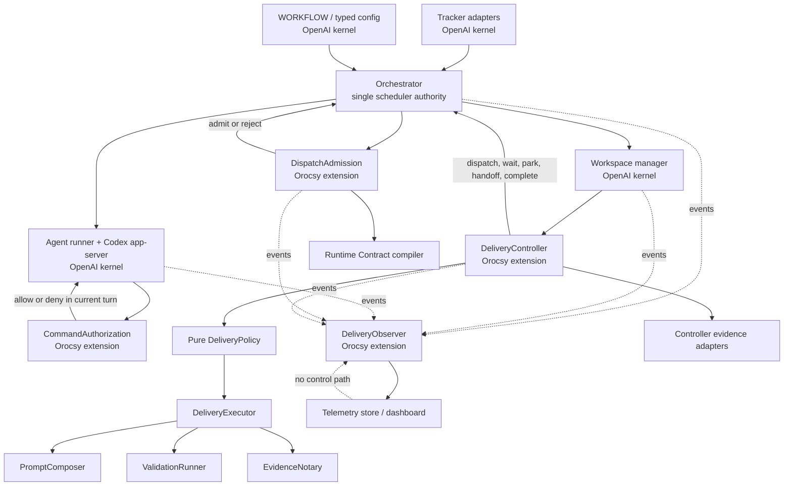
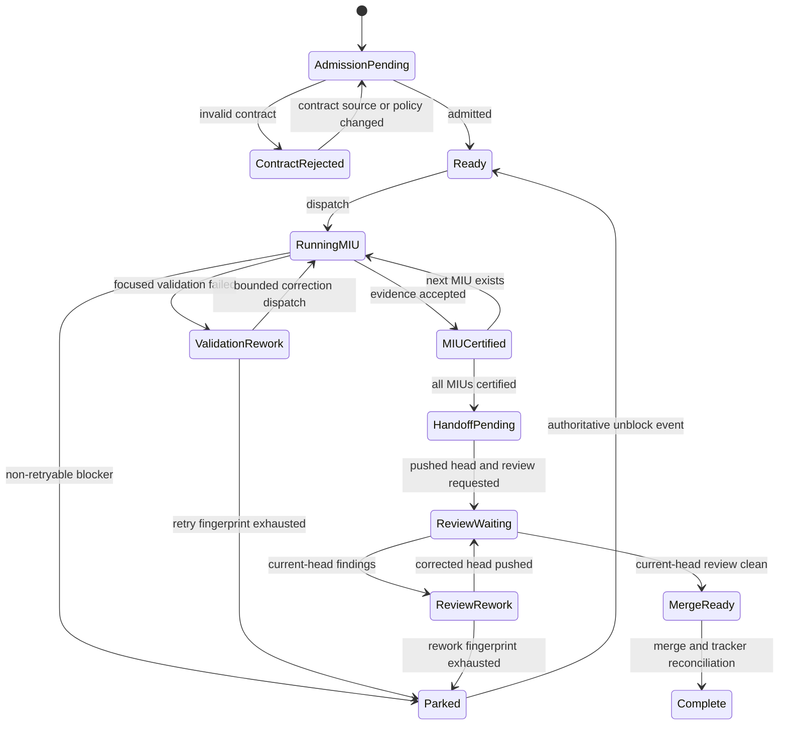

# OpenAI-Upstream Orocsy Extension Architecture

Status: Proposed, revision 2 after architecture review

Date: 2026-07-28

Last revised: 2026-08-15 for the OXE-1.1a atomic host-latch correction

## Decision

Use OpenAI Symphony as the runtime kernel and implement Orocsy delivery
governance through explicit extension interfaces.

The first upstream baseline is:

- Repository: `https://github.com/openai/symphony`
- Commit: `f8e8b8a670c799f6e0ade7a8c25c4bf4a4a56ec7`
- OpenAI Symphony version: `0.0.2`
- Upstream specification: Draft v1 at that commit

The existing Orocsy fork remains the behavior and regression-test donor. It is
not the architectural base for the new kernel. Existing Orocsy behavior is
ported only when a characterization test and an explicit extension owner prove
that the behavior is still required.

This is a controlled migration, not a blind merge, rebase, or replay of the
fork's 229 local commits.

## Plain-Language Summary

OpenAI Symphony remains the engine that finds tickets, reserves work, creates
workspaces, runs Codex, retries infrastructure failures, and tracks active
workers.

Orocsy becomes a governed extension around that engine:

1. Admission checks that a ticket is executable before spending model tokens.
2. The delivery controller chooses the next MIU, validation, review, handoff,
   or unblock action from authoritative facts.
3. Command authorization decides whether one Codex command or tool call is
   allowed without restarting the session.
4. The observer explains where time and tokens went but cannot control work.

The old fork is mined for accepted behavior and tests. Its large modified
orchestrator and app-server files are not copied over. This lets Orocsy keep its
MIU, validation, review, and merge discipline while making future OpenAI
updates much smaller and more predictable.

## Normative Scope And Superseded Documents

This document is the normative source for the OpenAI-kernel/Orocsy-extension
seams and migration architecture.

It supersedes these earlier documents only where they define runtime seams,
telemetry-to-policy control paths, or upstream-fork strategy:

- `workflows/symphony-runtime-delivery.md`
- `elixir/docs/token_usage_telemetry_design.md`
- `elixir/docs/scope_unblock_runtime_design.md`
- `examples/orocsy-agentic-delivery/orocsy-delivery-runtime-architecture.md`
- `examples/orocsy-agentic-delivery/skills/agentic-delivery-loop/references/symphony-fork-workflow.md`

Their accepted behavioral requirements remain characterization-test inputs.
They are not architectural authority where they conflict with this document.

## Why This Change

Observed at the design baseline:

- Orocsy `main`: `9a001b49bb7ea2a4b5854e506e88d33248cb6359`
- OpenAI `main`: `f8e8b8a670c799f6e0ade7a8c25c4bf4a4a56ec7`
- Merge base: `58cf97da06d556c019ccea20c67f4f77da124bf3`
- Divergence: 229 Orocsy-only commits and 31 OpenAI-only commits
- Same-path overlap: 21 files
- Orocsy orchestrator: approximately 5,970 lines
- OpenAI orchestrator: approximately 1,990 lines
- Orocsy Codex app-server client: approximately 5,595 lines
- OpenAI Codex app-server client: approximately 1,071 lines

The current fork has accumulated delivery policy, review state, command scope,
recovery, telemetry, and incident-specific behavior inside the scheduler and
app-server client. This makes a local fix easy to add but hard to compose,
verify, or reconcile with upstream improvements.

OpenAI's latest runtime includes process supervision, retry-claim refresh,
workspace cleanup, generic tracker adapters, typed config reload, dispatch
validation, input-blocked handling, and inactivity semantics that should be
adopted as kernel behavior.

Orocsy has valuable behavior that upstream intentionally does not provide:

- machine-readable issue contracts
- MIU progression and certification
- bounded validation rework
- exact-head GitHub Codex review
- review-to-rework reconciliation
- evidence-backed handoff and merge gates
- command authorization against declared scope
- detailed delivery telemetry and incident records

Those capabilities remain, but they must not be implemented as patches spread
across the upstream kernel.

## Goals

1. Track and adopt OpenAI Symphony updates regularly.
2. Preserve upstream scheduler, workspace, tracker, retry, and app-server
   semantics by default.
3. Keep the orchestrator as the single authority for scheduling state.
4. Give Orocsy delivery governance explicit, typed extension interfaces.
5. Reject invalid issue contracts before a workspace or model worker starts.
6. Make every retry bounded by a typed cause, wake condition, and fingerprint.
7. Keep telemetry and dashboards observer-only.
8. Preserve useful Orocsy behavior through characterization tests.
9. Allow the Orocsy extensions to be disabled so the upstream-compatible
   kernel can run independently.
10. Prove the migration using replay and one bounded NutriBuddy canary before
    production cutover.

## Non-Goals

- Upstreaming Orocsy's full delivery workflow into OpenAI Symphony.
- Making the upstream orchestrator aware of MIUs, GitHub Codex review, or
  NutriBuddy.
- Replaying every historical Orocsy commit.
- Letting an implementation worker rewrite its own issue authority.
- Using observer stores, analyzer summaries, or dashboard state as controller
  input. Raw token, time, and rate-limit events may be normalized separately as
  controller evidence.
- Creating a general workflow engine.
- Automatically merging every future OpenAI commit.
- Supporting worker backends other than Codex app-server. Codex-specific
  thread, turn, approval, token, rate-limit, config, and message semantics are
  accepted deliberately; no generic worker-runtime seam is reserved.

## Governing Principles

### Preserve The OpenAI Kernel

The following remain kernel responsibilities:

- workflow loading and typed configuration
- tracker adapters and candidate normalization
- issue eligibility and concurrency
- claims, retries, and reconciliation
- per-issue workspace lifecycle
- Codex app-server protocol and process lifecycle
- runtime logs and basic status snapshots

Orocsy extensions may return decisions to the kernel. They may not mutate the
orchestrator's internal `running`, `claimed`, or `retry_attempts` structures.

### Keep Policy Outside Mechanics

`WORKFLOW.md` remains repository-owned worker policy. Machine-enforced Orocsy
policy is implemented behind extension interfaces. The kernel executes typed
decisions without knowing their business meaning.

### One Authority Per Fact

| Fact | Authority |
| --- | --- |
| Issue identity and current tracker state | Tracker adapter |
| Running, claimed, and retry-queued state | OpenAI orchestrator |
| Issue contract and MIU definitions | Current Linear issue revision |
| Workspace branch, files, commits, and dirty state | Git and filesystem |
| Test or validation result | Validation process result |
| GitHub review state | GitHub current-head review data |
| Delivery transition | Orocsy delivery policy |
| Signed MIU/handoff evidence | Controller Evidence Notary |
| Live token, quiet-time, and rate-limit facts | Kernel progress-evidence accumulator |
| Human-readable operational history | Observer telemetry |

Telemetry may repeat authoritative facts for diagnosis. Repeated telemetry is
never promoted into authority.

### No Hidden Model Retry

A model worker starts only for an admitted, executable delivery decision.
Waiting for review, invalid contracts, provider quota, unchanged policy denial,
and unchanged validation blockers do not launch exploratory model sessions.

### Rejection Is Not Rework

An invalid issue contract is an authority-definition problem. It is rejected
before product implementation begins.

A code or test failure after implementation begins is product rework. It may
return to the same implementation role under a bounded correction.

## Target Architecture



The absent arrow from telemetry back to the orchestrator or delivery controller
is intentional.

## Extension Host

The kernel receives one immutable extension registry. On the current pinned
baseline it is resolved lazily from the decoded `WORKFLOW.md` front-matter map
at the first decision-facade call, because changing application startup or the
kernel configuration schema would exceed the reviewed patch authority. The
normal production sequence still reaches the pre-claim admission facade first.
Allowing delivery or authorization to resolve the same closed registry keeps
the facade valid when pinned upstream modules are exercised directly, without
moving lifecycle order into those modules. Once resolved, adapter selection is
atomically latched for the local BEAM lifetime; concurrent first decision calls
cannot publish different selector sets. A selector change fails with a typed
restart-required result rather than replacing code in flight. Workflow reload
may still change validated extension options for future issue admissions and
future worker sessions.

Suggested layout:

```text
elixir/lib/symphony_elixir/
  extensions.ex
  extension_registry.ex
  extensions/
    dispatch_admission.ex
    delivery_controller.ex
    command_authorization.ex
    delivery_observer.ex
    noop/
      dispatch_admission.ex
      delivery_controller.ex
      command_authorization.ex
      delivery_observer.ex
  orocsy/
    admission.ex
    delivery_controller.ex
    delivery_policy.ex
    delivery_executor.ex
    prompt_composer.ex
    validation_runner.ex
    evidence_notary.ex
    command_authorization.ex
    observer.ex
    runtime_contract.ex
    controller_evidence.ex
    validation.ex
    review.ex
    handoff.ex
```

The default registry uses no-op adapters that preserve OpenAI behavior. The
Orocsy distribution selects the Orocsy adapters through validated configuration.
Configuration selects a known adapter name; it does not turn arbitrary YAML
strings into Elixir modules.

`SymphonyElixir.Extensions` is the only facade imported by kernel modules.
Kernel call sites do not depend directly on Orocsy modules or individual
adapter implementations.

Example:

```yaml
extensions:
  delivery: orocsy
  command_authorization: orocsy
  observers:
    - orocsy
```

## Interface 1: DispatchAdmission

Purpose: decide whether a tracker issue is sufficiently valid to enter the
scheduler.

The interface is called after candidate normalization and before the issue is
claimed or a workspace is created.

```elixir
@callback evaluate(Issue.t(), AdmissionContext.t()) ::
  :kernel_default |
  {:admit, Admission.t()} |
  {:reject, Rejection.t()} |
  {:error, ExtensionFailure.t()}
```

`:kernel_default` is the generic no-op result: the extension made no admission
decision, so the kernel continues its existing eligibility path. Adapter
failure is never converted to this result.

`Admission` contains:

```elixir
%Admission{
  issue_id: String.t(),
  issue_identifier: String.t(),
  issue_revision: String.t(),
  policy_revision: String.t(),
  contract_hash: String.t() | nil,
  contract: map() | nil,
  admitted_at: DateTime.t()
}
```

`Rejection` contains:

```elixir
%Rejection{
  class: :invalid_runtime_contract | :unsupported_contract_version,
  issue_id: String.t(),
  issue_identifier: String.t(),
  issue_revision: String.t(),
  contract_source_hash: String.t(),
  fingerprint: String.t(),
  owner: :ticket_contract,
  errors: [ContractError.t()],
  retry: {:on_contract_or_policy_change, String.t()},
  report: :tracker_once_per_rejection
}
```

Contract errors are structured values, not controller-facing prose:

```elixir
%ContractError{
  code: :read_context_denied,
  miu_id: "COD-276-MIU-1",
  field: "read_context",
  value: "src/features/discover/**",
  conflicting_field: "denied_scope",
  conflicting_value: "src/**",
  suggested_action: :remove_or_narrow_denial
}
```

### Rejection Behavior

1. Do not claim the issue.
2. Do not create or reconcile a product workspace.
3. Do not launch Codex app-server.
4. Persist one rejection record keyed by contract-source hash, policy revision,
   and error fingerprint. A prose-only issue edit does not create another
   rejection report.
5. Add one tracker comment containing exact errors and repair guidance.
6. Optionally move the issue to a configured specification-blocked state.
7. Ignore the same rejection on later polls.
8. Re-evaluate only when the fenced contract source or policy revision changes.

`contract_source_hash` is always available, including when YAML decoding fails.
`contract_hash` exists only after successful normalization. `issue_revision`
remains contextual evidence and a tiebreaker, not the primary rejection-dedupe
key.

Durable admission records live outside product workspaces:

```text
<runtime-state-root>/admission/<tracker-scope>/<issue-id>.json
```

They are runtime cache and deduplication data, not business authority.

### Contract Repair

The default repair owner is the ticket author or coordinating Codex task.

An optional automated `contract_repair` role may be added later. It must:

- run separately from the product implementation worker
- receive the issue description and structured contract errors
- have no product repository write authority
- have only the tracker tools required to revise the issue
- perform at most one repair attempt for one rejection fingerprint
- finish by submitting a new issue revision

The implementation worker never edits its own Runtime Contract.

## Interface 2: DeliveryController

Purpose: expose one deep delivery-governance interface to the kernel while
keeping decision logic and effects separated inside its implementation.

```elixir
@callback handle(DeliveryEvent.t(), DeliveryContext.t()) ::
  :kernel_default |
  {:ok, DeliveryDecision.t(), [DeliveryEvent.t()]} |
  {:error, ControllerFailure.t(), [DeliveryEvent.t()]}
```

The Orocsy adapter composes these private roles:

| Internal role | Responsibility |
| --- | --- |
| `DeliverySnapshotAssembler` | Read authoritative controller evidence into typed snapshots. |
| `DeliveryPolicy` | Pure reducer from event and snapshot to a decision or effect plan. |
| `DeliveryExecutor` | Execute bounded effect plans without mutating scheduler maps. |
| `PromptComposer` | Build complete first-turn, continuation, and rework prompts plus immutable Codex thread/turn configuration. |
| `ValidationRunner` | Run declared validation commands with timeout and scrubbed environment. |
| `EvidenceNotary` | Sign and verify MIU, validation, baseline, and handoff evidence using a key outside worker workspaces. |
| `ReviewAdapter` | Fetch current-head GitHub review facts. |
| `MergeExecutor` | Re-fetch irreversible preconditions and perform configured merge/tracker effects. |

`DeliveryPolicy` remains deterministic and side-effect-free. `DeliveryExecutor`
may execute only effect types declared by the policy. It feeds typed results
back through the policy until a final scheduler decision is reached. This
bounded internal evaluation loop has a configured maximum effect-step count; it
is not a general workflow engine.

Neither the controller nor its private roles may mutate the orchestrator's
`running`, `claimed`, or `retry_attempts` maps.

Allowed decisions:

```elixir
{:dispatch, RunPlan.t()}
{:continue, TurnPlan.t()}
{:retry, RetryPlan.t()}
{:wait, WaitPlan.t()}
{:park, Correction.t()}
{:handoff, HandoffPlan.t()}
{:complete, Completion.t()}
```

`RunPlan` and `TurnPlan` own complete worker composition, not an appended prompt
fragment:

```elixir
%RunPlan{
  mode: :implementation | :validation_rework | :review_rework | :handoff_recovery,
  prompt: String.t(),
  continuation_prompt: String.t(),
  thread_config: %{
    approval_policy: term(),
    sandbox_policy: term(),
    cwd: String.t(),
    skills_enabled: [String.t()],
    plugins_enabled: [String.t()],
    dynamic_tools: [ToolSpec.t()]
  },
  contract_snapshot: Admission.t(),
  scope_snapshot: ScopeSnapshot.t(),
  max_turns: pos_integer()
}
```

`PromptComposer` is the only Orocsy module that translates delivery mode,
contract, corrections, and evidence into worker-facing English and immutable
Codex thread/turn configuration.

Every `RetryPlan` must contain:

```elixir
%RetryPlan{
  class: atom(),
  fingerprint: String.t(),
  attempt: pos_integer(),
  max_attempts: pos_integer(),
  wake_condition: term(),
  delay_ms: non_neg_integer(),
  preserve_workspace: boolean(),
  next_run: RunCompositionRequest.t() | nil
}
```

A retry is illegal without a maximum attempt count and a state-change or
time-based wake condition.

### Delivery Snapshot

`DeliverySnapshot` is assembled from controller evidence:

```elixir
%DeliverySnapshot{
  admission: Admission.t(),
  issue: Issue.t(),
  workspace: WorkspaceSnapshot.t() | nil,
  mius: [MiuSnapshot.t()],
  validations: [ValidationResult.t()],
  review: ReviewSnapshot.t() | nil,
  corrections: [Correction.t()],
  correction_history: CorrectionHistory.t(),
  certificate_chain: CertificateChain.t(),
  progress: ProgressEvidence.t(),
  provider: ProviderEvidence.t(),
  delivery_history: DeliveryHistory.t(),
  worker: CodexWorkerContext.t(),
  toolchain: ToolchainEvidence.t(),
  operator_decisions: [OperatorDecision.t()],
  policy_revision: String.t()
}
```

Controller evidence is obtained directly from Git, filesystem, process results,
the tracker, and GitHub. It is not reconstructed from dashboard text or token
telemetry.

Nested evidence includes:

- current and historical correction fingerprints and classifications
- certificate ancestry and contiguity through the current `HEAD`
- live uncached/cached token counters, quiet-time clocks, and first-progress
  counters computed from app-server events
- provider rate-limit state and its observed time
- delivery event-log facts required by accepted gates
- local or SSH worker host, workspace path, and host capability facts
- toolchain probe results and resolved validation commands

`review` is advisory until execution. Any merge or irreversible tracker
transition carries freshness preconditions. `MergeExecutor` must re-fetch
GitHub PR head, mergeability, current-head review state, and required checks
immediately before mutation and fail closed if they differ.

### Delivery State Machine



Review waiting is an external wait state. It does not launch a model worker
merely to poll GitHub.

### Delivery Events And Typed Unblocks

Delivery events include:

- candidate and admission events
- workspace and branch events
- Codex session, turn, tool, and progress events
- validation results
- review and merge reconciliation results
- background reconciliation ticks
- operator decisions
- policy and contract revision changes

`Parked -> Ready` requires one typed unblock:

| Unblock class | Required evidence |
| --- | --- |
| `policy_superseded` | new policy revision invalidates the blocking fingerprint |
| `contract_superseded` | new contract-source hash compiles and admits |
| `review_superseded` | new PR head or newer current-head review state |
| `progress_superseded` | new durable file, commit, validation, or certificate evidence |
| `environment_restored` | fresh provider/network/toolchain probe |
| `operator_approved` | signed operator decision naming correction and permitted action |
| `loop_exhausted` | never automatic; transition is `operator_required` |

The operator-decision ingestion path is a versioned controller-evidence file or
provider-native tracker action. Free-text comments and edited correction JSON
do not grant authority.

Background review and unblock reconciliation enters through typed events even
when an issue is not admitted or currently running. It does not bypass
admission before any new implementation worker is launched.

### Signed Evidence

`EvidenceNotary` owns evidence authenticity and replay resistance:

- the signing key is persistent and outside worker workspaces
- worker-writable authority labels are never trusted
- every certificate binds issue, contract source/hash, policy revision, MIU,
  branch, base SHA, evidence SHA, and creation time
- handoff certificates additionally bind the contiguous certificate chain and
  current pushed head
- verification fails closed on missing, stale, malformed, non-contiguous, or
  replayed evidence
- key identifiers and algorithms are versioned so rotation can be audited

The observer may record certificate metadata, but it cannot mint or validate
controller authority.

## Interface 3: CommandAuthorization

Purpose: authorize one parsed shell, Codex tool, tracker tool, or provider tool
intent inside the active Codex app-server turn.

```elixir
@callback authorize(CommandIntent.t(), TurnContext.t()) ::
  :kernel_default |
  :allow |
  {:allow_once, AuthorizationLease.t()} |
  {:deny, AuthorizationDenial.t()} |
  {:error, ExtensionFailure.t()}
```

`:kernel_default` preserves the pre-extension approval path. It is not an
approval and must not be emitted by an Orocsy policy adapter.

Rules:

- Authorization operates on parsed command intent, canonical paths, and the
  immutable admission/turn snapshot.
- `CommandIntent` is a tagged union for shell commands, dynamic tool calls,
  tracker mutations, and provider-native operations.
- Immutable turn authority is captured before `turn/start`, bound to the
  server-returned turn id immediately afterward, and passed through the
  app-server receive loop with each authorization request.
- Write scope implies read authority for the same MIU target.
- Existing targets must resolve to regular files inside the workspace.
- Missing creatable targets may receive one exact-path containment probe.
- `allow_once` continues in the current app-server turn.
- A denial returns a structured tool result to the active turn.
- A denial does not terminate and recreate the model session.
- Equivalent shell spellings share the same semantic fingerprint.
- Broad or ambiguous commands are denied without speculative retries.
- Tracker mutations such as state changes are evaluated against the current
  delivery mode and exact issue identity, not merely tool name.

If the worker genuinely needs undeclared context, it may emit a structured
scope-blocked result containing the requested path, operation, and reason. The
delivery policy parks for contract-owner review. The implementation worker may
request authority; it may not grant itself authority.

The kernel client forwards closed lifecycle and decoded request facts through
`SymphonyElixir.Extensions.capture_turn/3` and
`SymphonyElixir.Extensions.handle_turn_authorization/3`. The deep facade owns
capture/bind failure disposition, parses the closed `CommandIntent`, calls
`authorize/2`, maps non-default decisions to the pinned protocol, and invokes
the exact existing fallback for `:kernel_default`. Import-graph walking,
TypeScript alias resolution, test-to-source inference, review-derived scope,
and Orocsy policy derivation remain behind the Orocsy adapter.

The generic immutable-context/authorization callback should be proposed
upstream before the local hot receive loop is forked. Until accepted upstream,
the kernel patch is kept as one facade call and covered by a no-op differential
test against the pinned OpenAI behavior.

## Interface 4: DeliveryObserver

Purpose: record and summarize events for operators.

```elixir
@callback record(DeliveryEvent.t()) :: :ok | {:error, ObserverFailure.t()}
```

The observer has no decision return value. The facade contains observer errors
and still returns `:ok` to the kernel after logging sanitized failure evidence.

Observer requirements:

- consume immutable events after the controller action is chosen
- use a bounded asynchronous queue
- attach run, issue, attempt, turn, MIU, and decision correlation IDs
- record input, cached input, output, and total tokens separately
- summarize dominant phase, repeated logical operation, and blocker class
- expose raw evidence references without storing secrets
- tolerate observer failure without blocking scheduler progress
- never write corrections, resolve corrections, release claims, retry workers,
  or modify tracker state

Observer output may support human investigation and offline replay. Runtime
controllers must not read observer summaries to make live decisions.

### Event Envelope

Every event uses a versioned envelope:

```json
{
  "schema_version": 1,
  "event_id": "evt_...",
  "emitted_at": "2026-07-28T00:00:00Z",
  "source": "orchestrator",
  "event_type": "delivery.decision",
  "issue_id": "...",
  "issue_identifier": "COD-276",
  "issue_revision": "sha256:...",
  "run_id": "run_...",
  "attempt_id": "attempt_...",
  "turn_id": "turn_...",
  "miu_id": "COD-276-MIU-2",
  "transition_id": "transition_...",
  "operation_fingerprint": "sha256:...",
  "decision": {
    "type": "dispatch",
    "class": "next_miu",
    "wake_condition": null
  },
  "usage": {
    "input_tokens": 0,
    "cached_input_tokens": 0,
    "output_tokens": 0,
    "total_tokens": 0
  },
  "evidence_refs": []
}
```

Lifecycle stages emit paired `stage.started` and `stage.completed` or
`stage.failed` events. This makes time spent in admission, workspace setup,
prompt construction, model execution, validation, review waiting, and handoff
directly measurable.

The Orocsy observer first appends events to a local spool, then builds aggregate
views asynchronously. If the observer queue or spool fails, the kernel emits an
operator-visible `telemetry.delivery_failed` log containing the affected event
ID range. Event loss must never be silent, but it also must not mutate or retry
the delivery decision.

## Controller Evidence Versus Telemetry

| Property | Controller evidence | Telemetry |
| --- | --- | --- |
| Used for live decisions | Yes | No |
| Source | Git, process result, tracker, GitHub, filesystem | Emitted runtime events |
| Mutability | Read-only snapshot | Append-only/summarized |
| Failure effect | Decision may wait or park | Warning only |
| Examples | HEAD SHA, dirty paths, test exit status, review thread state | token totals, dominant phase, elapsed time |

This distinction prevents monitoring from becoming a second, conflicting
orchestrator.

This is an intentional change from the current fork. Today the orchestrator
reads `token-telemetry/workers.jsonl` summaries such as
`blocked_no_durable_progress` and `counted_guard_tokens` to choose live
park/continue behavior. During migration:

1. raw Codex token/rate-limit events and orchestrator clocks move into a
   kernel-owned `ProgressEvidence` accumulator
2. `DeliverySnapshot.progress` receives an immutable controller-grade snapshot
3. `DeliveryPolicy` computes typed progress decisions from that evidence
4. the observer independently records the same source events for reporting
5. analyzer summaries and dashboard output stop feeding controller decisions

This re-homing is required before E15 can pass. Observer-only behavior is the
target architecture, not a claim about the legacy runtime.

## Failure And Retry Semantics

| Class | Model worker? | Retry policy | Wake condition |
| --- | --- | --- | --- |
| Invalid Runtime Contract | No | None | contract source or policy revision changes |
| Workflow/config invalid | No | None per tick | valid config reload |
| Provider quota exhausted | No | None | fresh app-server rate-limit/capacity evidence or operator |
| Tracker/network transient | No product worker | bounded backoff | timer plus fresh tracker lookup |
| Workspace setup transient | No model yet | bounded backoff | timer plus fresh issue lookup |
| Input/approval required | No automatic retry | operator/config decision | explicit unblock |
| Safe exact-path authorization | Continue same turn | no new worker | authorization lease |
| Command denied | No equivalent-command retry | park or continue current turn | contract/config change |
| Focused validation failure | Yes, bounded rework | fingerprint limited | changed files/evidence |
| No durable progress | At most one recovery | fingerprint limited | new durable progress |
| Review pending | No | controller polling only | new review event or timeout |
| Current-head review findings | Yes, bounded rework | per review-head fingerprint | new pushed head |
| Clean current-head review | No | none | handoff/merge controller |

The same unchanged fingerprint must never create an endless worker loop.

## Upstream Ownership Matrix

| Subsystem | Upstream source | Orocsy treatment |
| --- | --- | --- |
| Workflow loading and config reload | OpenAI | Adopt |
| Generic tracker model and adapters | OpenAI | Adopt |
| Scheduler claims and concurrency | OpenAI | Adopt |
| Retry refresh and claim release | OpenAI | Adopt |
| Worker/orchestrator supervision | OpenAI | Adopt |
| Workspace lifecycle and cleanup | OpenAI | Adopt; add workspace-ready extension event |
| Codex app-server protocol | OpenAI | Adopt; capture immutable turn context and call authorization facade |
| Base prompt rendering | OpenAI | Adopt; accept complete composition from `PromptComposer` through `RunPlan`/`TurnPlan` |
| Runtime Contract | Orocsy | Port as admission implementation |
| Legacy `DispatchPreflight` | Orocsy | Do not port as one module; decompose across admission, snapshot assembly, prompt composition, branch effects, and notarization |
| MIU progression and certification | Orocsy | Port into pure delivery policy plus evidence notary |
| Validation controller | Orocsy | Split pure validation decisions from effectful `ValidationRunner`; retain timeout and environment scrubbing |
| GitHub review and merge gates | Orocsy | Port behind controller evidence and executor; re-fetch before irreversible effects |
| Scope and command guard | Orocsy | Port behind command authorization |
| Knowledge ledger | Orocsy | Keep only if authoritative purpose is explicit |
| Token telemetry and dashboard | Orocsy | Port as observer |
| Progress guard counters | Orocsy legacy | Re-home as kernel controller evidence; do not read observer summaries |
| RescueSupervisor string classifications | Orocsy legacy | Replace with typed unblock rules and operator decisions; do not port wholesale |
| `.orocsy/delivery` and `orocsy.py` | Orocsy | Version as the Workspace Delivery Protocol |

## Legacy-To-Target Module Mapping

| Legacy module/contract | Target owner |
| --- | --- |
| `RuntimeContract.compile` | `DispatchAdmission` -> `Orocsy.Admission` |
| `IssueRequirements` admission fields | `Orocsy.Admission` |
| `DispatchPreflight` contract checks | `Orocsy.Admission` |
| `DispatchPreflight` branch/workspace effects | `DeliveryExecutor` |
| `DispatchPreflight` prompt inputs | `PromptComposer` |
| `DispatchPreflight` signed state | `EvidenceNotary` |
| `CommandIntent.classify` | `CommandAuthorization` |
| `ScopeAccess.Controller.decide` | `CommandAuthorization` |
| `ValidationController.evaluate` | `DeliveryPolicy` |
| validation command process execution | `ValidationRunner` |
| `ProgressController.decide` | `DeliveryPolicy` using `ProgressEvidence` |
| `HandoffController.evaluate` | `DeliveryPolicy` plus `DeliveryExecutor` |
| `MergeController` | `DeliveryPolicy` plus live `MergeExecutor` |
| `ReviewMonitor` | review evidence adapter and background reconciliation events |
| `RescueSupervisor` | typed unblock rules in `DeliveryPolicy` |
| `TokenTelemetry.record` | `DeliveryObserver` |

The name `DispatchPreflight` is retired for Orocsy delivery checkpoints because
OpenAI SPEC section 6.3 already uses "Dispatch Preflight Validation" for
scheduler configuration validation.

## Workspace Delivery Protocol

The target-repository CLI and `.orocsy/delivery` layout are a versioned
cross-repository protocol:

```text
.orocsy/delivery/
  protocol.json
  state/
  events/
  inbox/
  certificates/
  token-telemetry/
```

`protocol.json` declares:

```json
{
  "schema_version": 1,
  "cli_protocol_version": 1,
  "runtime_min_version": "0.1.0",
  "event_schema_version": 1,
  "certificate_schema_version": 1
}
```

The runtime verifies compatibility before dispatch. The repository-local
`.codex/delivery/bin/orocsy.py` command and runtime event parser are tested
against the same fixtures. Workspace-local state remains issue delivery state;
`<runtime-state-root>/admission/` remains scheduler-side rejection
deduplication state. Neither silently substitutes for the other.

## Relevant OpenAI Changes To Adopt

| Commit | Capability |
| --- | --- |
| `cdb466a` | Preserve last-known-good typed config |
| `476b2b0` | Supervise orchestrator and workers as one restart unit |
| `d476215` | Validate workflow before scheduling |
| `7af5a76` | Generic tracker interface and Linear adapter |
| `7cf29df` | Safe terminal workspace cleanup |
| `0517275` | Fresh retry dispatch without leaked claims |
| `cbd2158` | Retry failed workspace setup and anchor roots |
| `3365695` | Surface input-blocked sessions |
| `3c372fa` | Reject generic input and use inactivity timeout semantics |

Later tracker adapters and release-only changes can be adopted with the
baseline, but they are not prerequisites for the first NutriBuddy canary.

## Kernel Patch Budget

Upstream compatibility is enforced, not merely intended.

`UPSTREAM_PATCH_BUDGET.yml` records:

- the pinned upstream commit
- kernel files allowed to import `SymphonyElixir.Extensions`
- the named hook point in each file
- an expected diff fingerprint for every hook
- maximum changed lines per hook and in total
- the Orocsy characterization test that requires the hook

CI runs `mix extensions.audit` and fails when:

- a kernel file imports an Orocsy implementation directly
- kernel divergence appears outside a registered hook
- a registered hook exceeds its reviewed line budget
- an Orocsy extension module has no owning interface
- no-op extension mode differs from pinned upstream behavior

The initial target is one facade call at each required lifecycle choke point,
not policy logic in kernel files. The exact budget is set after the upstream
hook prototype; increasing it requires architecture review.

The `OXE-1.1a` compatibility probe found that the original `OXE-0.2`
fingerprints call an earlier discarded facade and can pass the audit while
failing to compile against the production host. The audit remains strict, but
those fingerprints are historical prototype authority only and may not be
activated as production hooks. Each hook-owning MIU must remeasure its exact
current facade call after its context and differential RED tests exist, then
receive architecture review before revising the manifest. See
[`openai_extension_oxe11a_host_prototype_reconciliation.md`](openai_extension_oxe11a_host_prototype_reconciliation.md).

The generic registry, immutable turn context, lifecycle events, no-op adapters,
and hook points should be proposed to OpenAI upstream as a standalone
contribution. Orocsy's delivery workflow remains out of that contribution.

## Migration Strategy

### Branch Model

1. Preserve current Orocsy `main` and existing release behavior.
2. Keep a permanent read-only `openai` remote.
3. Create the integration branch directly from pinned
   `openai/main@f8e8b8a`.
4. Land reviewable Slice 0 checkpoints on that upstream-only lineage. The
   owner's 2026-07-30 ruling explicitly blesses deferred merging; intermediate
   branch mechanics are not a cutover criterion.
5. In Slice 2, merge the frozen Orocsy history into the integration branch,
   resolve kernel files by retaining upstream behavior, and wire the extension
   interfaces. This preserves both histories while keeping the OpenAI lineage
   on the integration branch's first-parent chain.
6. Do not cut over `main` until the complete integration passes replay and live
   canary gates and the fork-behavior ledger has zero unclassified rows.

The integration branch may contain multiple reviewed micro-commits, but its
tree must remain buildable at every pushed checkpoint.

### Migration-Window Change Policy

When Slice 0 implementation begins, Orocsy runtime `main` is frozen for feature
and refactor work through Slice 8. Production-blocking hotfixes are allowed.
The design-review period itself does not start the freeze.

Every accepted hotfix creates one entry in
`elixir/docs/openai_extension_port_forward_ledger.md` containing:

- fork commit and PR
- incident and accepted behavior
- touched kernel/extension paths
- disposition: `port`, `skip`, or `superseded`
- target migration slice and characterization test
- ported integration commit, when complete

The ledger is reconciled before every integration-branch push and before the
NutriBuddy canary. A hotfix that touches a registered kernel hook also triggers
an immediate upstream-baseline comparison.

The freeze-window ledger is not sufficient for the pre-existing fork history.
`OXE-0.7` therefore owns a complete fork-behavior disposition ledger for all
229 fork commits, using mechanically traceable behavior clusters for the May
delivery layer and one row per June/July incident fix. Every row records
`owner-requested` or `agent-initiated` provenance and exactly one disposition:
`port`, `superseded-by-upstream`, `drop`, or `defer`. Port rows name the
characterization test and target owner; superseded rows name the upstream
commit; drop rows require a reason and explicit owner approval when the
behavior was owner-requested; defer rows name the target slice. `OXE-0.9` and
cutover both require zero unclassified rows. This is the fork-side counterpart
to the machine-checked upstream baseline.

### Migration Slices

#### Slice 0: Characterization And Baseline

- Before branch setup, protect the retained raw trace sources from rotation or
  deletion, compute checksums, and record an owner and privacy-approved
  restricted quarantine location. Raw logs remain outside Git and are not the
  long-lived replay corpus. Source-in-place evidence is recorded in
  `openai_extension_trace_corpus_receipt.md`; it does not claim durable
  external preservation.
- Add `UPSTREAM_BASE.yml`.
- Add the OpenAI remote and sync procedure.
- Preserve the upstream test suite.
- Add Orocsy characterization tests for required delivery behavior.
- Add architecture dependency checks.
- Add `UPSTREAM_PATCH_BUDGET.yml` and the first `mix extensions.audit`
  contract.
- Archive the retained runtime trace corpus outside Git after redaction and
  secret/privacy scanning.
- Define a versioned replay fixture schema and build a harness skeleton before
  relying on replay as a cutover gate.
- Add eligibility characterization for upstream `dispatchable`,
  `required_labels`, assignments, blockers, active states, and terminal states.
- Version the Workspace Delivery Protocol and add CLI/runtime compatibility
  fixtures.

#### Slice 1: Extension Interfaces

- Add facade, registry, and four public interfaces.
- Add no-op adapters.
- Prove no-op mode matches upstream behavior.
- Record the private `DeliveryPolicy`, `DeliveryExecutor`, `PromptComposer`,
  `ValidationRunner`, and `EvidenceNotary` role contracts. Land code interfaces
  only with the first real Orocsy adapter and its in-memory test adapter.
- Do not port Orocsy behavior yet.

#### Slice 2: Upstream Kernel

- Adopt upstream config, tracker, supervision, retry, workspace, and app-server
  foundations.
- Resolve same-path files in favor of upstream mechanics.
- Keep unused Orocsy modules present but disconnected until their slice.

#### Slice 3: Admission

- Port Runtime Contract parsing into `Orocsy.Admission`.
- Return structured compiler errors.
- Add durable rejection deduplication.
- Prove zero model launch for rejected issues.

#### Slice 4: MIU Delivery Policy

- Port MIU selection, certification, validation, and handoff decisions.
- Replace string-based classifications with typed events and decisions.
- Port signed evidence through `EvidenceNotary` and fail closed on stale or
  non-contiguous chains.
- Add typed operator decisions, background reconciliation events, and
  `Parked -> Ready` unblock rules before retiring `RescueSupervisor`.
- Preserve clean micro-commit progression and committed-but-uncertified
  recovery.

#### Slice 5: Command Authorization

- Port command intent parsing and canonical scope decisions.
- Continue `allow_once` in the same app-server turn.
- Remove model-session restarts used as permission recovery.

#### Slice 6: Review And Merge

- Port exact-head review inspection, bounded review rework, clean-review
  handoff, merge, and tracker reconciliation.
- Keep review polling in the controller, not model workers.

#### Slice 7: Observer Telemetry

- Port attempt and issue aggregates as event subscribers.
- Re-home raw token, clock, and provider counters as `ProgressEvidence` before
  removing telemetry-to-policy reads.
- Add loop signatures and decision facts.
- Verify observer disablement and observer failure do not alter decisions.

#### Slice 8: Replay, Canary, And Cutover

- Replay sanitized, versioned COD-276 fixtures without launching a model.
- Run one concurrency-one NutriBuddy canary.
- Compare decisions, tokens, attempts, workspace state, and handoff evidence.
- Cut over only after exact-head review and all gates are clean.

### Replay Fixture Contract

Raw app-server logs are not replay fixtures. They may contain prompts, tool
payloads, paths, or secrets and remain outside Git.

The Slice 0 sanitizer converts accepted incidents into minimal fixtures:

```json
{
  "fixture_schema_version": 1,
  "incident": "COD-276-certified-miu-next-miu",
  "source_digest": "sha256:...",
  "redaction_report": {
    "secrets_found": 0,
    "free_text_removed": true
  },
  "initial_snapshot": {},
  "events": [],
  "expected_decisions": [],
  "expected_model_launches": 0
}
```

Fixtures contain normalized controller events, snapshots, and expected
decisions only. They exclude prompts, hidden reasoning, full tool output,
credentials, and unrelated repository content. A fixture is committed only
after automated secret scanning and human privacy review.

The replay harness feeds events through admission and delivery interfaces,
captures decisions and effects through in-memory adapters, and fails on
unexpected model launch, tracker mutation, retry, or observer influence.

## Upstream Sync Governance

The current temporary-remote and `merge --ff-only` fork guidance is obsolete
for a diverged fork.

Add a permanent read-only `openai` remote and a baseline manifest:

```yaml
schema_version: 1
repository: https://github.com/openai/symphony
commit: f8e8b8a670c799f6e0ade7a8c25c4bf4a4a56ec7
tree: 37a4c6c184db05cd2d59bfc50943979919ec988a
elixir_tree: 77d9ba67775e6681eb1ad5cf03a019e678a8e941
version: 0.0.2
spec_status: draft-v1
verified_at: 2026-07-29
```

`UPSTREAM_BASE.yml` is the machine authority for this identity. The strict
schema rejects unknown keys and short object IDs.

Each upstream-sync task must:

1. Fetch without merging.
2. List new commits since the pinned baseline.
3. Classify each as `adopt`, `adapt`, `superseded`, or `irrelevant`.
4. Identify same-path kernel and extension-interface changes.
5. Update characterization tests before resolving behavior conflicts.
6. Merge through a dedicated PR.
7. Update the baseline manifest only after validation and canary evidence.

Recommended cadence: weekly comparison and immediate review for upstream
security, process-lifecycle, workspace-safety, or Codex protocol changes.

No scheduled job may auto-merge upstream.

## Verification Architecture

### Kernel Conformance

- OpenAI upstream unit and integration suites pass unchanged where practical.
- Upstream scheduler, retry, workspace, tracker, and app-server scenarios pass
  with no-op extensions.
- Orchestrator restart terminates sibling worker processes.
- Retry refresh releases or reschedules claims correctly.

### Extension Contract Tests

- Each interface is tested through its public contract.
- Pure delivery-policy tests use immutable snapshots and typed events.
- Delivery-controller tests use in-memory executor, notary, validation, review,
  merge, and operator-decision adapters.
- No test reaches into orchestrator private state to prove Orocsy behavior.
- Observer tests prove output without influencing decisions.
- No-op mode is compared with the pinned OpenAI kernel for the same event
  sequence.
- `mix extensions.audit` enforces the kernel patch budget and dependency
  direction.

### Required End-To-End Scenarios

| ID | Scenario | Expected proof |
| --- | --- | --- |
| E1 | malformed Runtime Contract | rejected before claim/workspace/model; one report per contract/error fingerprint |
| E2 | repaired contract revision | re-admitted exactly once |
| E3 | valid first MIU | one worker receives exact run plan |
| E4 | certified MIU followed by next MIU | same branch, next MIU, no false dirty recovery |
| E5 | safe exact-path read | allowed in current turn |
| E6 | denied shell or tracker-tool intent | structured denial, no equivalent-command worker retry |
| E7 | focused validation failure | bounded rework with exact evidence |
| E8 | unchanged validation fingerprint | no endless retry |
| E9 | review pending | no model polling worker |
| E10 | current-head review findings | one bounded rework lane |
| E11 | clean current-head review | merge executor re-fetches head/review/checks before mutation |
| E12 | provider usage limit | parked until capacity changes |
| E13 | orchestrator crash | worker processes terminate with runtime |
| E14 | stale retry issue | fresh tracker lookup releases claim |
| E15 | observer disabled or failed | identical controller decisions |
| E16 | no-op extensions | same decisions, prompts, approvals, retries, and process outcomes as pinned upstream |
| E17 | signed evidence replay/staleness | fails closed without delivery transition |
| E18 | validation environment | secrets scrubbed, timeout enforced, typed result returned |
| E19 | operator unblock | exact correction/fingerprint transition only; prose cannot authorize |
| E20 | background review reconciliation | parked/non-running issue receives event without bypassing admission |
| E21 | local and SSH workers | same admission, delivery, authorization, and notarization invariants |
| E22 | issue eligibility migration | assignment, `dispatchable`, required labels, blockers, and states preserve accepted behavior |
| E23 | Workspace Delivery Protocol mismatch | rejected before worker launch with actionable compatibility report |
| E24 | replay fixture | expected decisions/effects with zero unplanned model launches |
| E25 | kernel patch budget | unexpected core hunk or direct Orocsy dependency fails CI |

### NutriBuddy Canary

Run with:

- one issue
- one local worker
- concurrency `1`
- the current pinned Codex model and effort configuration
- no parallel browser sessions
- retained workspace and complete event evidence

The canary passes only when:

- the intended MIU is selected
- the worker reaches a code or test change without repeated broad discovery
- declared validation runs
- branch and pushed head are correct
- current-head Codex review completes
- any valid feedback is fixed through bounded rework
- the PR merges only after the review state is clean
- telemetry explains token use without influencing the outcome

Stop after the first abnormal attempt and compare its typed decision,
fingerprint, wake condition, and evidence against the applicable E1-E25
scenarios. The canary plan records which scenarios it exercises and which are
proven by replay, contract, or CI gates instead.

## Cutover And Rollback

Cutover requirements:

- all kernel and extension tests pass
- architecture dependency checks pass
- replay results match intended decisions
- NutriBuddy canary passes
- exact-head GitHub Codex review is clean
- upstream baseline manifest is current
- port-forward ledger has no unresolved `port` entries
- kernel patch budget passes
- Workspace Delivery Protocol compatibility is proven
- operational runbook names the active runtime commit

Rollback is switching the runtime launcher back to the last known-good Orocsy
commit. No product workspace is reset or deleted during rollback.

The old runtime remains available until one complete NutriBuddy ticket,
including implementation, validation, review rework, merge, and tracker
completion, succeeds on the new architecture.

## Rejected Alternatives

### Blindly Merge OpenAI Into The Current Fork

Rejected because policy and mechanics are intertwined in the same large core
files. A line-level merge cannot determine which local behavior is still
required.

### Rebase All Orocsy Commits Onto OpenAI

Rejected because it replays historical incident fixes, including fixes that
upstream now supersedes or that should become typed extensions.

### Cherry-Pick Only The Known OpenAI Fixes

Rejected because it keeps the current architectural divergence and misses
future improvements in the same kernel areas.

### Let The Product Worker Repair Invalid Contracts

Rejected because the worker would be modifying the authority that constrains
its own work.

### Let Monitoring Unblock Or Retry Workers

Rejected because it creates a second control plane whose conclusions may
conflict with authoritative scheduler and delivery state.

## Open Design Risks

### Upstream Does Not Yet Expose These Interfaces

The first integration must add a small extension host to upstream core files.
The interface surface must stay narrow enough that future upstream merges
touch only stable call sites.

### Some Orocsy Behavior May Be Accidental

Characterization tests preserve only explicitly accepted outcomes. Historical
behavior is not retained merely because code exists for it.

### Tracker Writes Are An Orocsy Extension

OpenAI deliberately keeps tracker writes out of the generic orchestrator.
Contract rejection reporting, review transitions, and completion updates must
stay inside the Orocsy delivery extension or provider-native tools.

### DeliveryController Could Become A Workflow Engine

The public interface remains one deep controller operation. Its implementation
composes a pure policy and a bounded executor with an explicit effect algebra
and maximum effect-step count. It may not accept arbitrary scripts, dynamically
declared transition graphs, or mutate scheduler maps.

### Kernel Hook Contribution May Be Rejected Upstream

Orocsy still enforces the patch budget, facade-only imports, no-op differential
tests, and an explicit upstream baseline. A rejected upstream proposal does not
justify moving policy back into kernel files.

## Technical MIU Traces

Implementation detail is developed incrementally in
`openai_extension_miu_technical_design.md`. `OXE-0.1` and its test-only
`OXE-0.1a` support unit are review-cleared on the upstream-first integration
lineage. The measured `OXE-0.2` trace and gate-green implementation are
recorded in `openai_extension_oxe02_kernel_patch_budget.md`: a throwaway no-op
host prototype identified three kernel files, four named hook seams, and an
exact 40-changed-line ceiling. Its offline manifest audit passes the exact
repository gate at independent-review checkpoint `e490387`, including separate
effective-worktree, staged-index, and committed-HEAD evidence; required-hook
presence is worktree-authoritative and grouped aliases cannot hide a direct
Orocsy dependency. The prototype code was discarded. No Orocsy runtime
behavior or production kernel hook has been introduced.

The next Slice 1 trace is
`openai_extension_oxe11_extension_host.md`. It splits the host into four
ordered MIUs and starts with a kernel-free facade, immutable closed registry,
four public interfaces, and neutral no-op adapters. It also makes the neutral
`:kernel_default` result explicit so no-op mode can preserve upstream mechanics
without duplicating them inside adapters. The top-level OXE-1.3 MIU uses two
internal reviewed subcheckpoints—authorization, then bounded observation—so
that split does not change the four-MIU decomposition.

## Approval Gate

The architecture review recorded in
`openai_upstream_orocsy_extension_architecture_review.md` approved the
direction but still required revision before this gate. No implementation is
cleared to land until the owner formally accepts the following decisions:

1. OpenAI `f8e8b8a` is the first pinned kernel baseline.
2. Orocsy behavior is ported through the four public interfaces and named
   private controller roles, not merged into core ad hoc.
3. Invalid contracts are rejected before worker launch.
4. Product workers cannot rewrite their own contracts.
5. Telemetry is observer-only.
6. Every retry has a typed class, fingerprint, maximum, and wake condition.
7. Migration uses replay plus one bounded NutriBuddy canary before cutover.
8. Codex app-server is the only supported worker backend.
9. Kernel divergence is constrained by a reviewed patch budget and upstream
   hook proposal.
10. Fork `main` is frozen except for ledgered production hotfixes during
    migration.
