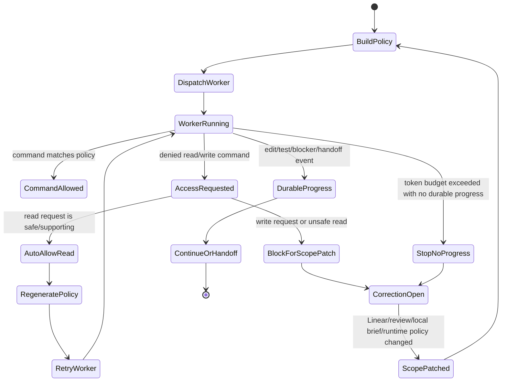
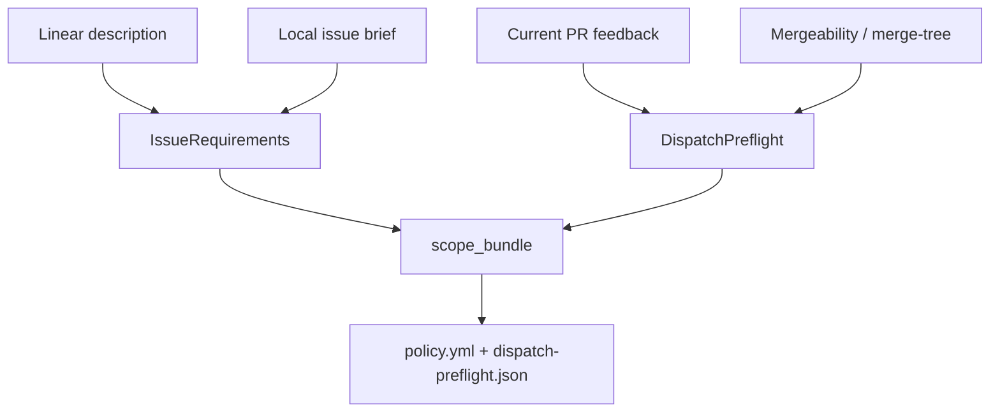
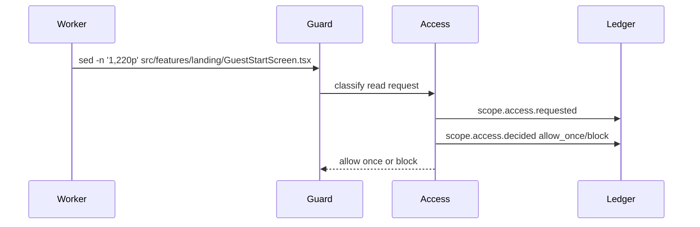
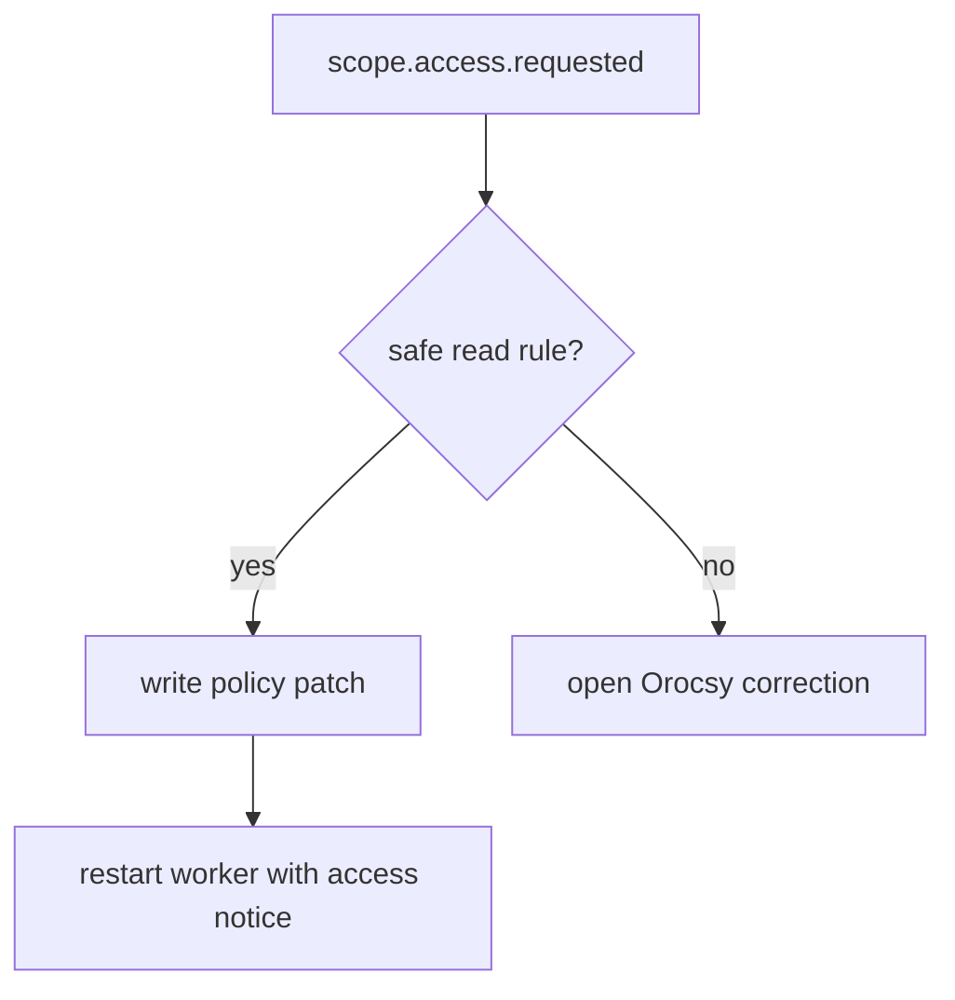
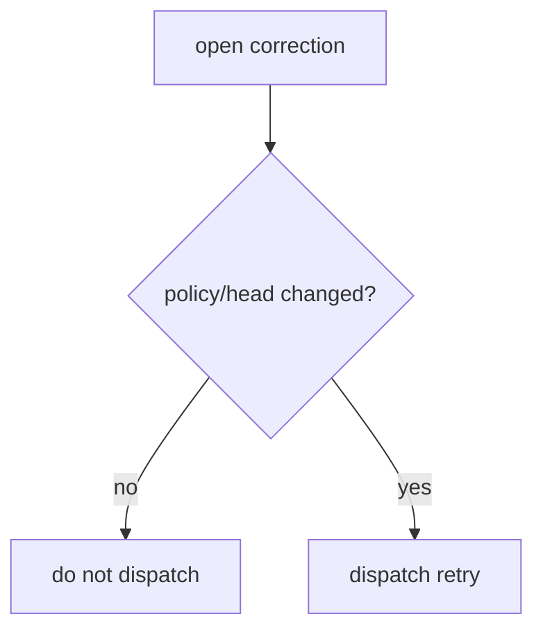
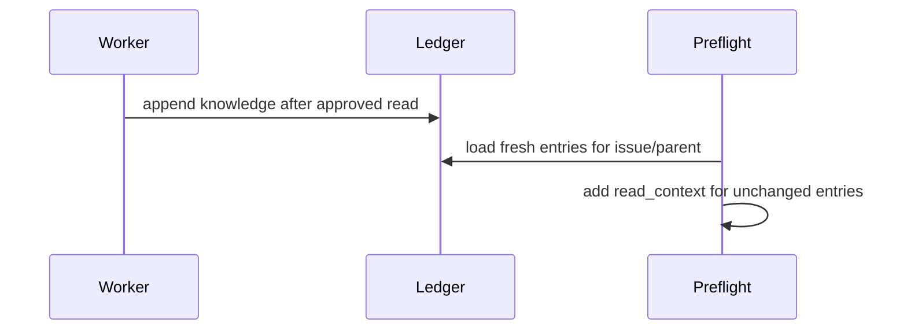
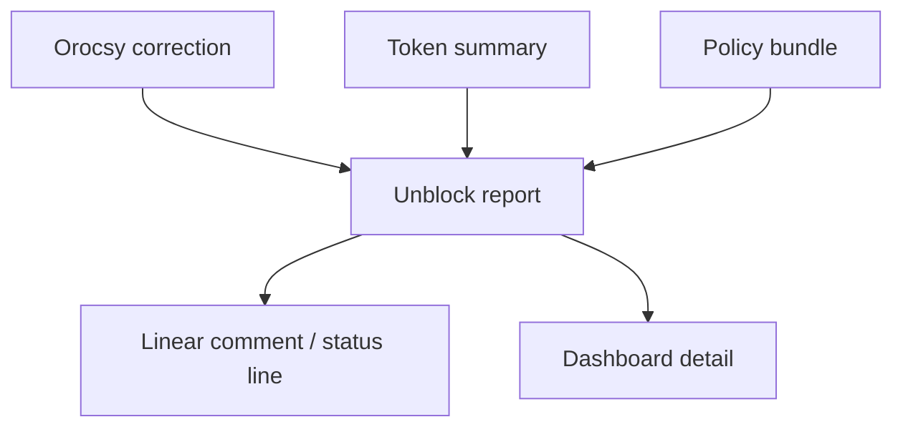

# Symphony Scope Unblock Runtime Design

Status: Proposed runtime design
Date: 2026-07-07
Scope: Orocsy/Symphony dispatch, command policy, review rework, and blocker
recovery. This is runtime design, not downstream product implementation.

## Purpose

Symphony workers need tight write boundaries, but they also need enough read-only
context to behave like a capable human engineer. The current runtime can block a
worker when it reads a file outside declared scope, but that block is too blunt:
some reads are legitimate context requests, some are scope drift, and some
prove the ticket MIU was designed too narrowly.

The target behavior is:

1. Keep write scope strict.
2. Allow justified, bounded read context.
3. Convert denied reads into structured unblock requests instead of silent
   loops.
4. Let the runtime or coordinator update the policy bundle before the next
   retry.
5. Stop repeated no-diff token burn quickly with a precise reason.

COD-266 exposed the gap. A worker attempted to read
`src/features/landing/GuestStartScreen.tsx`. That is not inherently wrong: it
may be useful to understand `GuestPreferenceDraft` handoff. The failure was that
Symphony could not separate "reasonable read-only context" from "out-of-scope
implementation drift", and the generated policy still preserved stale Linear
write scope even after fresh PR review required backend card handling.

## Design Principles

| Principle | Runtime implication |
| --- | --- |
| Write scope is authority | Undeclared writes require correction or explicit policy update. |
| Read context is support | A direct import, review path, focused test, caller, type source, or merge conflict file can be read without making it write scope. |
| Review feedback can supersede stale issue text | Current-head PR feedback and mergeability can add temporary rework scope with provenance. |
| A blocker is progress only when it is actionable | A blocker must name path, operation, reason, command, existing policy, and required policy change. |
| Retry only after state changes | The same correction should not redispatch until policy, issue text, branch, credentials, or runtime code changed. |
| Monitoring observes; controller acts | Telemetry explains token spend. The policy controller decides allow, retry, block, or escalate. |

## Current Failure Shape

Current `IssueRequirements.from_issue/2` appends a local issue brief to the
Linear issue description, then extracts lists such as `write_scope`,
`shared_files`, and `out_of_scope`.

Current risk:

```elixir
description =
  issue
  |> issue_description()
  |> maybe_append_issue_brief(issue.identifier, workspace)

requirements = %{
  "write_scope" => write_scope(description),
  "shared_files" => section_list_all(description, "Shared Files"),
  "out_of_scope" => out_of_scope(description)
}
```

This loses provenance. If old Linear says "`src/app/api/cards/handler.ts` is
out of scope" and a newer local review-rework brief says that current PR review
requires that file, the runtime cannot cleanly decide which statement wins. It
can also generate command policy from only old write scope while placing newer
brief text into shared files.

## Target Scope Model

Replace the single practical scope with a layered policy bundle.

```json
{
  "schema_version": 2,
  "issue": "COD-266",
  "mode": "review_rework",
  "write_scope": [
    {
      "path": "src/features/swipe/SwipeExperience.tsx",
      "source": "linear.write_scope",
      "reason": "Original frontend request wiring MIU",
      "expires": "branch"
    },
    {
      "path": "src/app/api/cards/handler.ts",
      "source": "github.current_head_review",
      "reason": "Fresh review says /api/cards does not consume guest preferences",
      "review_url": "https://github.com/orocsy/nutribuddy/pull/103#discussion_r3533275206",
      "expires": "review_thread_resolved_or_outdated"
    }
  ],
  "read_context": [
    {
      "path": "src/features/landing/GuestStartScreen.tsx",
      "source": "local_issue_brief.read_context",
      "reason": "Confirm GuestPreferenceDraft setup handoff only",
      "max_lines": 220,
      "expires": "turn"
    }
  ],
  "conflict_scope": [
    {
      "path": "src/features/swipe/SwipeDeck.tsx",
      "source": "github.mergeability",
      "reason": "Current PR is dirty/conflicting against origin/main",
      "operation": "write-if-conflicted",
      "expires": "mergeable"
    }
  ],
  "denied_scope": [
    {
      "path": "src/lib/**",
      "operation": "read",
      "source": "local_issue_brief",
      "reason": "Prevent broad schema/domain rediscovery unless compiler names it"
    }
  ]
}
```

### Scope Types

| Scope | Allowed operation | Example | Notes |
| --- | --- | --- | --- |
| `write_scope` | read/write | `SwipeExperience.tsx` | Worker may edit and validate. |
| `read_context` | read only | `GuestStartScreen.tsx` | Worker may inspect bounded ranges, not edit. |
| `conflict_scope` | read/write only during conflict mode | `SwipeDeck.tsx` | Created from mergeability/merge-tree evidence. |
| `validation_scope` | run/read focused tests | `tests/unit/swipe-deck.test.ts` | Derived from validation commands and test failures. |
| `denied_scope` | no operation unless later promoted | `src/lib/**` | Must be explicit and higher priority than broad allow rules. |

## Runtime Flow



## End-To-End Review-Rework Flow

1. **Preflight reads durable truth.**
   - Linear issue description and state.
   - Local issue brief, if present.
   - Current PR head, current-head review threads, unresolved/outdated state.
   - Mergeability and conflict paths, if available.
   - Existing Orocsy corrections and common-knowledge ledger.

2. **Preflight builds a policy bundle with provenance.**
   - Linear still seeds the default write scope.
   - Current-head review can add temporary write scope for review paths.
   - Merge conflict evidence can add conflict scope.
   - Local brief can add read context or override stale out-of-scope statements
     only when marked as review-rework override.

3. **Worker starts with the policy summary.**
   - It sees allowed write scope, read-only context, denied scope, and what to
     do if it needs more.
   - Prompt says: "Request access by attempting the smallest exact read command
     or by creating `scope_access_requested`; do not run broad search."

4. **Command guard intercepts every command.**
   - Exact read in `read_context`: allow.
   - Exact read in `write_scope`: allow.
   - Exact read adjacent to allowed file and matching auto rules: create access
     event and allow once.
   - Write outside write/conflict scope: block and create correction.
   - Broad scan outside policy: block, no retry unless correction changes.

5. **Access controller classifies denied attempts.**
   - If safe read, append `scope.access.approved`, regenerate policy, and retry
     the worker once with explicit notice.
   - If unsafe or write-scope expansion, append `scope.access.blocked`, create
     Orocsy correction, and stop.

6. **Worker must produce one durable outcome.**
   - Scoped edit.
   - Focused validation.
   - Handoff action.
   - Explicit blocker with exact unblock requirement.

7. **Retry is gated by state change.**
   - Same correction plus same policy hash plus same head commit must not
     redispatch.
   - Redispatch only after policy hash, correction state, issue scope, PR head,
     or credentials changed.

## Access Request Event Schema

```json
{
  "schema_version": 1,
  "event": "scope.access.requested",
  "issue": "COD-266",
  "mode": "review_rework",
  "path": "src/features/landing/GuestStartScreen.tsx",
  "operation": "read",
  "command": "sed -n '1,220p' src/features/landing/GuestStartScreen.tsx",
  "reason": "Need to confirm GuestPreferenceDraft is created by setup and handed to SwipeExperience",
  "source": "symphony.runtime.command-guard",
  "policy_hash": "sha256:...",
  "head_sha": "1aebf87ed6",
  "ts": "2026-07-07T03:04:30Z"
}
```

Decision event:

```json
{
  "schema_version": 1,
  "event": "scope.access.decided",
  "issue": "COD-266",
  "path": "src/features/landing/GuestStartScreen.tsx",
  "operation": "read",
  "decision": "allow_once",
  "class": "direct_type_or_prop_context",
  "reason": "The file is the setup caller/source for GuestPreferenceDraft; read-only range is bounded",
  "policy_patch": {
    "read_context": [
      {
        "path": "src/features/landing/GuestStartScreen.tsx",
        "max_lines": 220,
        "expires": "turn"
      }
    ]
  },
  "ts": "2026-07-07T03:04:31Z"
}
```

Blocked decision:

```json
{
  "schema_version": 1,
  "event": "scope.access.decided",
  "issue": "COD-266",
  "path": "src/lib/domain.ts",
  "operation": "read",
  "decision": "block",
  "class": "broad_schema_discovery",
  "reason": "Issue brief forbids src/lib schema/domain probing unless compiler names the missing import",
  "required_correction": "Add exact compiler error or explicit read_context before retry",
  "ts": "2026-07-07T03:05:00Z"
}
```

## Auto-Allow Read Rules

Auto-allow must be narrow and auditable.

| Rule | Allow when | Limit |
| --- | --- | --- |
| `review_path` | PR current-head review names the path | exact file/range |
| `direct_import` | allowed file imports the requested local file | exact file; read only |
| `nearest_caller` | requested file calls/renders allowed component | exact file; read only |
| `focused_test` | validation command or failing test names it | exact test file |
| `merge_conflict` | merge-tree/GitHub mergeability names it | conflict mode only |
| `type_context` | TypeScript/compiler error names missing symbol/file | exact file; read only |
| `common_knowledge_refresh` | ledger entry is stale for a previously approved context file | exact file; read only |

Never auto-allow:

- Writes outside `write_scope` or `conflict_scope`.
- Recursive `rg`, `find`, or `ls` across broad directories that are not already
  scoped.
- Historical session logs, unrelated Linear issues, or broad workflow docs.
- Secret/env/provider files unless the issue is explicitly about that boundary.

## Policy Patch And Retry Rules

The controller writes policy patches to:

```text
.orocsy/delivery/policy-patches/
  scope-access-<timestamp>-<short-id>.json
```

`IssueRequirements.write_workspace_files/2` or `DispatchPreflight.prepare/2`
must merge patches after parsing issue requirements and before writing:

```text
Linear issue + local brief + current PR review + mergeability + policy patches
  -> scope bundle
  -> .orocsy/delivery/policy.yml
  -> .orocsy/delivery/dispatch-preflight.json
```

Retry is allowed only when:

- there is a new policy hash, or
- an open correction was resolved, or
- PR head changed, or
- credentials/environment changed, or
- current review feedback changed.

Retry is denied when:

- same issue, same head, same policy hash, same correction, and no dirty files;
- worker already failed the same access class once in this run;
- worker exceeded no-durable-progress threshold without a new access request or
  blocker.

## Common Knowledge Ledger

Workers should not rediscover the same context repeatedly. Add a scoped ledger:

```text
.orocsy/delivery/knowledge/
  issue-COD-266.jsonl
  parent-COD-246.jsonl
```

Entry shape:

```json
{
  "schema_version": 1,
  "issue": "COD-266",
  "parent": "COD-246",
  "path": "src/features/landing/GuestStartScreen.tsx",
  "git_blob": "sha1-or-object-id",
  "summary": "Defines GuestPreferenceDraft and calls onContinue(draft) from setup controls",
  "relevant_symbols": ["GuestPreferenceDraft", "onContinue"],
  "operation": "read",
  "source_event": "scope.access.decided",
  "valid_until": "file_changes",
  "created_at": "2026-07-07T03:04:31Z"
}
```

Use rules:

- If `git_blob` is unchanged, workers can use the summary before rereading.
- If file changed, mark stale and permit one bounded refresh.
- Knowledge can add `read_context`, not `write_scope`.
- Parent knowledge can be shared across sibling MIUs; child knowledge is local
  unless explicitly promoted.

## Detailed Technical MIUs

### MIU 1 - Scope Bundle With Provenance

#### Runtime Problem

During review rework, stale Linear `write_scope` can contradict current PR
review and local issue briefs. COD-266 had fresh review feedback requiring
`src/app/api/cards/handler.ts`, but the generated policy still allowed only
`SwipeExperience.tsx` and the focused unit test.

Current risky code:

```elixir
description =
  issue
  |> issue_description()
  |> maybe_append_issue_brief(issue.identifier, workspace)

%{
  "write_scope" => write_scope(description),
  "shared_files" => section_list_all(description, "Shared Files"),
  "out_of_scope" => out_of_scope(description)
}
```

Why it breaks: the parser returns lists without source, precedence, or expiry.
The runtime cannot distinguish old Linear scope, appended local override, PR
review paths, and conflict paths.

#### Data Shape

| Value | Example | Lifetime | Scope |
| --- | --- | --- | --- |
| Scope entry | `%{"path" => "src/app/api/cards/handler.ts", "kind" => "write"}` | one preflight / until review outdated | runtime policy |
| Scope source | `github.current_head_review` | one PR head | review rework |
| Expiry | `review_thread_resolved_or_outdated` | until GitHub thread changes | policy controller |
| Policy hash | `sha256:...` | one generated policy | retry guard |

#### Technology Constraint

Elixir maps written to JSON/YAML currently feed `DispatchPreflight`,
`PromptBuilder`, and command guard tests. This MIU must preserve existing
`requirements["write_scope"]` compatibility while adding a richer
`requirements["scope_bundle"]`.

#### Design / Flow



#### Best-Practice Fix

Add `IssueRequirements.scope_bundle/2` and keep legacy keys.

Target shape:

```elixir
%{
  "write_scope" => legacy_write_paths,
  "read_context" => legacy_shared_read_paths,
  "denied_scope" => denied_paths,
  "scope_bundle" => %{
    "write_scope" => entries,
    "read_context" => entries,
    "conflict_scope" => entries,
    "denied_scope" => entries,
    "policy_hash" => hash
  }
}
```

#### Alternatives Rejected

- Alternative: overwrite Linear issue text from local brief.
  Reason rejected: destroys provenance and can silently broaden implementation.
- Alternative: treat all shared files as write scope.
  Reason rejected: makes parallel Symphony unsafe.

#### Code Translation

Implementation targets:

- `lib/symphony_elixir/issue_requirements.ex`
  - parse `Write Scope`, `Read Context`, `Shared Files`, `Out Of Scope`.
  - preserve source labels.
  - expose legacy fields for old callers.
- `lib/symphony_elixir/dispatch_preflight.ex`
  - add current review paths to `scope_bundle.write_scope` only for accepted
    current-head review feedback.
  - add merge conflict paths to `scope_bundle.conflict_scope`.
- `test/symphony_elixir/workspace_and_config_test.exs`
  - parser/provenance tests.
- `test/symphony_elixir/core_test.exs`
  - review preflight scope expansion tests.

#### Risk / Test

Focused tests:

```bash
mise exec -- mix test test/symphony_elixir/workspace_and_config_test.exs test/symphony_elixir/core_test.exs
```

Required new tests:

- `IssueRequirements builds a scope bundle with source provenance and legacy write scope compatibility`
- `review rework preflight adds current-head review paths as temporary write scope`
- `review rework preflight adds mergeability conflict paths as conflict scope`

Expected failure before fix: `scope_bundle` missing or `src/app/api/cards/handler.ts`
remains denied when current-head review names it.

### MIU 2 - Access Request Events From Command Guard

#### Runtime Problem

A denied read currently becomes a policy violation recovery or correction, but
the event does not capture whether the worker needed a reasonable context read,
an unsafe broad read, or a write-scope expansion.

Current risky event:

```elixir
%{
  "event" => "runtime.command-policy-violation",
  "command" => command,
  "pattern" => pattern,
  "recovery_attempt" => attempt
}
```

Why it breaks: the next retry knows the command failed but not the requested
operation, path, reason class, or exact policy patch required.

#### Data Shape

| Value | Example | Lifetime | Scope |
| --- | --- | --- | --- |
| Requested path | `src/features/landing/GuestStartScreen.tsx` | event forever | Orocsy ledger |
| Operation | `read` / `write` / `search` | event forever | command guard |
| Decision | `allow_once` / `block` / `escalate` | event forever | access controller |
| Policy patch | `read_context += path` | until expiry | workspace policy |

#### Technology Constraint

The guard sees shell commands, not semantic file operations. It must infer
operation/path from known command forms (`sed`, `cat`, `rg`, `git diff`,
`apply_patch`) and remain conservative on ambiguous commands.

#### Design / Flow



#### Best-Practice Fix

Create `SymphonyElixir.ScopeAccess` with:

```elixir
def classify_command(command, policy_bundle) do
  %{
    operation: :read,
    paths: ["src/features/landing/GuestStartScreen.tsx"],
    command_class: :bounded_file_read,
    broad?: false
  }
end
```

#### Alternatives Rejected

- Alternative: ask the LLM to explain the blocker after denial.
  Reason rejected: burns another turn and may lose the exact command context.
- Alternative: auto-allow all denied reads once.
  Reason rejected: broad scans can still consume tokens and violate ownership.

#### Code Translation

Implementation targets:

- `lib/symphony_elixir/agent_runner.ex`
  - replace generic denied-command recovery event with access request/decision
    events when command has parseable file paths.
- `lib/symphony_elixir/codex/app_server.ex`
  - use `ScopeAccess` result before returning forbidden command.
- `test/symphony_elixir/app_server_test.exs`
  - exact read request emits `scope.access.requested`.
  - broad read remains blocked.

#### Risk / Test

Focused tests:

```bash
mise exec -- mix test test/symphony_elixir/app_server_test.exs test/symphony_elixir/core_test.exs
```

Required new tests:

- `command guard emits scope access request for exact denied read`
- `command guard classifies broad denied search as blocked scope drift`
- `policy violation recovery includes requested path operation and decision class`

Expected failure before fix: only `runtime.command-policy-violation` is present;
no requested path/operation/decision exists.

### MIU 3 - Safe Read-Only Auto-Unblock Controller

#### Runtime Problem

If a worker needs a directly related read-only file, a human coordinator must
notice, patch scope, and rerun. That leaves Symphony stuck or repeatedly burning
tokens.

Example:

```text
Denied: sed -n '1,220p' src/features/landing/GuestStartScreen.tsx
Reason: worker wants to inspect setup-to-swipe draft handoff.
```

This should be allowed once as read-only if it is a nearest caller/type context
file, but it should not become write scope.

#### Data Shape

| Value | Example | Lifetime | Scope |
| --- | --- | --- | --- |
| Auto rule | `nearest_caller` | runtime code | access controller |
| Policy patch | `read_context` entry | one turn or file change | workspace |
| Retry key | `issue/head/policy_hash/access_class` | one run | retry guard |

#### Technology Constraint

Auto-unblock must be deterministic. It cannot rely on broad semantic analysis
or hidden reasoning. It can use exact imports, current review paths, validation
commands, known failing paths, and common-knowledge entries.

#### Design / Flow



#### Best-Practice Fix

Add `SymphonyElixir.ScopeAccess.Controller`:

```elixir
case ScopeAccess.decide(request, policy_bundle, workspace) do
  {:allow_once, patch} -> write_patch_and_retry(patch)
  {:block, correction} -> create_correction_and_stop(correction)
end
```

Safe rules:

- current review path
- direct import from write-scope file
- focused test path
- conflict path
- common-knowledge refresh path

#### Alternatives Rejected

- Alternative: always block and require human Linear edit.
  Reason rejected: too slow for normal engineering context reads.
- Alternative: let worker continue after denial without policy change.
  Reason rejected: repeats the same blocked command or loses needed context.

#### Code Translation

Implementation targets:

- `lib/symphony_elixir/scope_access.ex` new module.
- `lib/symphony_elixir/agent_runner.ex`
  - on safe read decision, write patch and rerun with `policy_violation`
    prelude that says the read is now allowed read-only.
- `lib/symphony_elixir/dispatch_preflight.ex`
  - merge `policy-patches/*.json` into policy bundle.
- `test/symphony_elixir/core_test.exs`
  - safe read request writes patch and retries once.

#### Risk / Test

Focused tests:

```bash
mise exec -- mix test test/symphony_elixir/core_test.exs
```

Required new tests:

- `safe direct import read writes read-context policy patch and retries once`
- `safe nearest caller read is allowed read-only and never promoted to write scope`
- `unsafe write expansion creates correction and does not retry`

Expected failure before fix: safe read creates permission correction instead of
a policy patch plus retry.

### MIU 4 - Stale Scope Correction And No-Retry Guard

#### Runtime Problem

After a no-diff token burn, Symphony can redispatch the same issue even though
policy has not changed. That creates empty runs.

COD-266 evidence:

```text
same head: 1aebf87
same generated policy: only SwipeExperience + focused test
same blocked read: GuestStartScreen
no dirty files
```

#### Data Shape

| Value | Example | Lifetime | Scope |
| --- | --- | --- | --- |
| Policy hash | `sha256:abc` | one generated policy | dispatch |
| Retry fingerprint | `COD-266/1aebf87/sha256:abc/scope_access:landing-read` | one correction | retry guard |
| Blocker correction | `scope_policy_stale` | until resolved | Orocsy inbox |

#### Technology Constraint

The orchestrator already has token/no-progress guards. This MIU adds a state
change requirement before redispatch, not another token threshold.

#### Design / Flow



#### Best-Practice Fix

Record a retry fingerprint on correction creation. Before dispatch, compare:

- issue id
- PR head sha
- policy hash
- correction id/source
- blocked path/operation

If unchanged, keep issue parked and show next required action.

#### Alternatives Rejected

- Alternative: rely only on max failed retries.
  Reason rejected: a single retry can still burn a large budget when nothing
  changed.

#### Code Translation

Implementation targets:

- `lib/symphony_elixir/orchestrator.ex`
  - dispatch gate checks open correction retry fingerprint.
- `lib/symphony_elixir/dispatch_preflight.ex`
  - include `policy_hash`.
- `test/symphony_elixir/core_test.exs`
  - open stale-scope correction prevents redispatch until policy patch changes.

#### Risk / Test

Focused tests:

```bash
mise exec -- mix test test/symphony_elixir/core_test.exs
```

Required new tests:

- `open stale scope correction prevents redispatch when head and policy hash are unchanged`
- `resolved correction with changed policy hash allows one retry`
- `same blocked access fingerprint is parked without starting a worker`

Expected failure before fix: issue dispatches again with the same open
correction and same policy hash.

### MIU 5 - Common Knowledge Ledger

#### Runtime Problem

Different workers repeatedly rediscover file purpose. If one worker already
confirmed that `GuestStartScreen.tsx` defines the guest draft handoff, a later
worker should know that unless the file changed.

#### Data Shape

| Value | Example | Lifetime | Scope |
| --- | --- | --- | --- |
| Knowledge entry | path + blob + summary | until file blob changes | issue/parent |
| Relevant symbols | `GuestPreferenceDraft` | until file blob changes | read context |
| Promotion level | `issue` / `parent` | parent workstream | dispatch |

#### Technology Constraint

The runtime must not store raw source snippets or huge summaries. It should
store small, human-readable facts and a git blob id for invalidation.

#### Design / Flow



#### Best-Practice Fix

Add `SymphonyElixir.KnowledgeLedger`:

```elixir
%{
  "path" => path,
  "git_blob" => blob_id(workspace, path),
  "summary" => summary,
  "relevant_symbols" => symbols,
  "valid_until" => "file_changes"
}
```

#### Alternatives Rejected

- Alternative: add every previously read file to future prompts.
  Reason rejected: bloats context and repeats stale knowledge.
- Alternative: no shared knowledge.
  Reason rejected: repeated rediscovery wastes tokens across sibling MIUs.

#### Code Translation

Implementation targets:

- `lib/symphony_elixir/knowledge_ledger.ex` new module.
- `lib/symphony_elixir/dispatch_preflight.ex`
  - load fresh knowledge entries as read context.
- `test/symphony_elixir/core_test.exs`
  - unchanged blob adds read context, changed blob marks stale.

#### Risk / Test

Focused tests:

```bash
mise exec -- mix test test/symphony_elixir/core_test.exs
```

Required new tests:

- `knowledge ledger loads unchanged read context by git blob`
- `knowledge ledger marks changed blob stale and permits bounded refresh`
- `parent workstream knowledge is read context only and cannot broaden write scope`

Expected failure before fix: no durable knowledge entry is loaded into preflight.

### MIU 6 - Operator-Facing Unblock Report

#### Runtime Problem

When Symphony blocks, the user sees low-level terms such as permission,
policy-violation, or token-budget without a clear "what changed, what to do
next" explanation.

#### Data Shape

| Value | Example | Lifetime | Scope |
| --- | --- | --- | --- |
| Blocker class | `scope_policy_stale` | correction lifetime | dashboard/report |
| Next action | `update Linear write scope or approve read context` | correction lifetime | user/coordinator |
| Evidence | blocked command + path + policy hash | correction lifetime | handoff |

#### Technology Constraint

The status dashboard already streams compact state. The report should be
derived from Orocsy correction data and telemetry, not another manual summary.

#### Design / Flow



#### Best-Practice Fix

Add a structured report section:

```text
Blocked: scope_policy_stale
Worker asked for: read src/features/landing/GuestStartScreen.tsx
Runtime decision: blocked by stale write_scope policy
Why no retry: same head and same policy hash
Next action: add read_context or update Linear write scope, then redispatch
```

#### Alternatives Rejected

- Alternative: leave only raw correction JSON.
  Reason rejected: the coordinator/user cannot quickly tell what to fix.

#### Code Translation

Implementation targets:

- `lib/symphony_elixir/status_dashboard.ex`
- `lib/symphony_elixir/orchestrator.ex` Linear comment body for corrections.
- `test/symphony_elixir/core_test.exs`
  - blocked correction report includes path, operation, decision, next action.

#### Risk / Test

Focused tests:

```bash
mise exec -- mix test test/symphony_elixir/core_test.exs
```

Required new tests:

- `scope blocker report includes requested path operation policy hash and next action`
- `dashboard distinguishes safe read request from write scope expansion`
- `Linear correction comment explains why retry is parked until policy changes`

Expected failure before fix: status only says permission/token-budget without
scope request path and concrete next action.

## Implementation Order

1. MIU 1: scope bundle with provenance.
2. MIU 2: access request events.
3. MIU 3: safe read-only auto-unblock controller.
4. MIU 4: stale scope no-retry guard.
5. MIU 5: common knowledge ledger.
6. MIU 6: unblock report.

This order matters. Auto-unblock without provenance would just broaden access.
No-retry without access events would block but not explain. Common knowledge
without policy hashing could create stale context.

## Acceptance Scenario: COD-266

Given:

- Linear write scope only names `SwipeExperience.tsx` and
  `swipe-experience-request.test.ts`.
- Local review-rework brief says current review requires
  `src/app/api/cards/handler.ts`.
- PR review thread names `SwipeExperience.tsx`.
- Worker requests read-only `GuestStartScreen.tsx`.

Expected runtime:

1. Preflight policy includes:
   - `SwipeExperience.tsx` as write scope from Linear.
   - `src/app/api/cards/handler.ts` as temporary review write scope from
     current-head review/local review-rework override.
   - `GuestStartScreen.tsx` not initially write scope.
2. Worker exact read of `GuestStartScreen.tsx` emits
   `scope.access.requested`.
3. Access controller classifies it as `nearest_caller` or
   `type_or_prop_context`, allows read-only once, and writes a policy patch.
4. Worker restarts with that read allowed.
5. If worker tries to edit `GuestStartScreen.tsx`, runtime blocks with
   `write_scope_expansion_required`.
6. If worker produces no diff and asks for the same denied read again under the
   same policy hash, runtime parks with `scope_policy_stale` and does not
   redispatch.
7. Dashboard and Linear comment state exactly which scope/path needs update.

## Non-Goals

- Do not make every blocked file an automatic allow.
- Do not let review feedback silently rewrite long-term Linear ownership.
- Do not let read context become write scope.
- Do not bypass tests or PR review.
- Do not merge PRs automatically.

## Open Decisions

1. Should local issue briefs be allowed to override Linear write scope directly,
   or only add review-rework temporary scope when backed by current PR feedback?
   Recommendation: only temporary review-rework scope unless a coordinator marks
   the brief section `## Scope Override`.
2. Should safe read auto-unblock happen inside the same worker process or by
   restarting the worker with a new prelude?
   Recommendation: restart once. It keeps the command guard deterministic and
   avoids mutating policy mid-command.
3. Should common knowledge summaries be written by workers or generated by the
   runtime from approved reads?
   Recommendation: workers write a short summary after approved read; runtime
   validates path/blob and size.
