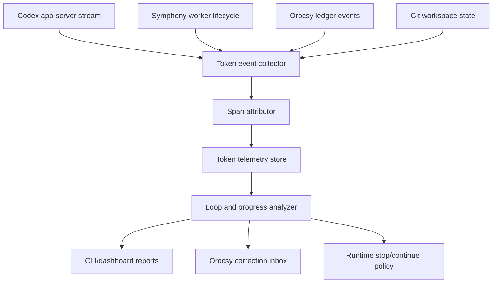

# Symphony Token Usage Telemetry Design

Status: Proposed runtime design
Date: 2026-07-01
Scope: Orocsy/Symphony worker token accounting, loop detection, and handoff
diagnostics. This is an operational design for the delivery runtime, not an
application product feature.

## Purpose

The current Symphony dashboard can show that a worker burned a large number of
tokens, but it does not explain what the worker was doing, whether the spend was
useful, or which task caused it. Recent COD-246 review rework made this gap
visible: a worker consumed more than one million total tokens, mostly in cached
input and repeated reasoning/file-read activity, but produced no dirty files,
commit, validation evidence, or handoff progress.

The telemetry tool should answer four questions quickly:

1. Which issue, worker, turn, and phase consumed the tokens?
2. Did that spend produce durable progress?
3. Was the burn caused by a known loop pattern such as read-loop,
   review-loop, validation-loop, handoff-loop, or no-durable-progress?
4. What should Symphony do next: continue, handoff-recover, retry later, or
   park with a correction?

## Non-Goals

- Do not log raw prompts, hidden chain-of-thought, user free text, secrets,
  provider tokens, or full tool output bodies.
- Do not replace Orocsy corrections, MIU traces, gates, or handoff events.
  Token telemetry explains cost; Orocsy events remain the source of truth for
  progress.
- Do not treat high token use alone as failure. Hard implementation work can be
  expensive and still valid when recent durable proof exists.
- Do not add product analytics to downstream apps. This design is for the
  agentic delivery runtime.

## High-Level Design



The runtime should record token deltas as structured spans. A span connects
token movement to a worker item such as a reasoning step, command execution,
tool result, edit phase, validation command, review fetch, or handoff action.
The analyzer then correlates those spans with durable-progress evidence from
Orocsy and git.

### Core Concepts

| Concept | Meaning |
| --- | --- |
| Worker session | One Codex app-server worker attached to one Linear issue workspace. |
| Turn | One user-message-to-worker interaction inside the worker session. |
| Item | A Codex stream item such as reasoning, agent message, command execution, MCP call, or token update. |
| Span | A normalized time interval with token deltas, phase, issue, worker, files, command, and progress state. |
| Durable progress | Dirty files, commits made after turn start, or passed Orocsy events such as `tool.finished`, `gate.*`, `eval.*`, or `handoff.*` from the current run window, excluding lifecycle-only checkpoints such as `first-turn-miu-handoff` and `technical-miu-trace`. |
| Loop signature | A repeated high-token pattern with little or no durable progress. |

## Runtime Outcomes

Every worker turn should end with one of these token-aware outcomes:

| Outcome | Meaning | Runtime action |
| --- | --- | --- |
| `productive` | High or low token use with recent durable progress. | Continue within normal turn limits. |
| `handoff_recovery` | Product work exists, but push/PR/review/Linear handoff is incomplete. | Start a constrained handoff-only retry. |
| `retryable_runtime` | Provider/network/runtime failure before product work. | Retry within `agent.max_failed_worker_retries`. |
| `blocked_no_durable_progress` | Token spend exceeded the progress window and no durable proof exists. | Park with Orocsy correction and attach telemetry summary. |
| `blocked_hidden_interaction` | Permission, MCP elicitation, unsafe command, or interactive prompt. | Park with Orocsy correction. |

No-progress spend may accumulate across consecutive summaries for the same issue,
thread, and running window. A summary with current-turn durable progress resets that
accumulator: `durable_progress_events`, `dirty_files`, or `new_commits` must contain
evidence. Later no-progress spend starts a new window and cannot be combined with
spend from before the reset.

## Low-Level Data Model

### Token Span

```json
{
  "schema_version": 1,
  "span_id": "span_20260701_000001",
  "issue": "COD-246",
  "linear_issue_id": "b3664052-36d9-4d27-aaa5-5b7057e11ecf",
  "worker_session_id": "019f...e28a0e",
  "turn": 1,
  "item_id": "call_C5fRQHH8uU2Z63jBSYSNJQfb",
  "phase": "code_read",
  "kind": "command",
  "started_at": "2026-06-29T14:17:04Z",
  "ended_at": "2026-06-29T14:17:07Z",
  "input_tokens_delta": 70582,
  "cached_input_tokens_delta": 68470,
  "output_tokens_delta": 77,
  "total_tokens_delta": 70659,
  "counted_guard_tokens_delta": 2112,
  "command_fingerprint": "sed-read-src-features-swipe-SwipeHome-tsx",
  "files": ["src/features/swipe/SwipeHome.tsx"],
  "durable_progress_before": false,
  "durable_progress_after": false,
  "correction_id": "correction_20260629141709_3"
}
```

### Worker Token Summary

```json
{
  "schema_version": 1,
  "issue": "COD-246",
  "worker_session_id": "019f...e28a0e",
  "turn": 1,
  "started_at": "2026-06-29T14:15:46Z",
  "ended_at": "2026-06-29T14:17:09Z",
  "status": "blocked_no_durable_progress",
  "total_tokens": 1006360,
  "input_tokens": 1004296,
  "cached_input_tokens": 931712,
  "output_tokens": 2064,
  "counted_guard_tokens": 30347,
  "durable_progress_events": [],
  "dirty_files": [],
  "new_commits": [],
  "top_phases": [
    {"phase": "reasoning", "total_tokens": 742000},
    {"phase": "code_read", "total_tokens": 190000},
    {"phase": "startup", "total_tokens": 74360}
  ],
  "loop_signatures": ["no_durable_progress", "read_before_miu_handoff"]
}
```

### Storage Paths

Store machine-readable telemetry inside each worker workspace:

```text
.orocsy/delivery/token-telemetry/
  spans.jsonl
  workers.jsonl
  summaries/
    COD-246-019f-e28a0e-turn-1.md
```

The workspace-local files are the recovery source. A future controller command
can aggregate them into a repo-level or operator-level report.

## Event Collection

The collector should subscribe to three streams:

1. Codex app-server events.
   - Token usage updates.
   - Item started/completed events.
   - Command execution metadata.
   - Tool/MCP metadata.
2. Symphony lifecycle events.
   - Issue picked.
   - Worker started/stopped.
   - Retry attempt.
   - Runtime guard result.
3. Orocsy and git evidence.
   - `.orocsy/delivery/events/events.jsonl`.
   - Open/resolved correction inbox items.
   - `git status --short --branch`.
   - new commits since worker start.

The collector must compute token deltas from cumulative token updates. It should
not store raw prompt or tool output text. For commands, store a sanitized
fingerprint plus a small allowlisted path list.

## Phase Attribution

Attribution should be deterministic and explainable:

| Signal | Phase |
| --- | --- |
| worker startup, MCP status, initial user message | `startup` |
| reading AGENTS, policy, state, issue brief | `preflight_read` |
| reading source/test files via `sed`, `rg`, `git show` | `code_read` |
| reasoning item without active command/edit/test | `reasoning` |
| `apply_patch`, file edit, formatter edit | `edit` |
| `pnpm`, `vitest`, `eslint`, `tsc`, `playwright` | `validation` |
| `gh pr view`, review thread scan, `@codex review` | `review_handoff` |
| `git status`, commit, push, Linear update | `handoff` |
| correction create/resolve/guidance | `correction` |

If multiple signals overlap, prefer the most concrete user-visible action:
`edit` over `reasoning`, `validation` over `reasoning`, and `handoff` over
generic command execution.

## Loop Signatures

### `no_durable_progress`

Trigger when counted guard tokens and elapsed time exceed configured thresholds
and there is no current-window durable progress.

Evidence:

- no dirty files
- no commits made after turn start
- no passed `tool.finished`, `gate.*`, `eval.*`, or `handoff.*` event from the
  current run window, excluding lifecycle-only checkpoints such as
  `first-turn-miu-handoff` and `technical-miu-trace`

Action:

- create or update `symphony.runtime.no-durable-progress`
- attach worker token summary and top spans
- stop dispatch for the issue until the correction is resolved

### `read_loop`

Trigger when the same files are read repeatedly or too many files are read
before the first MIU handoff/progress event.

Evidence:

- repeated command fingerprints such as `sed-read-src-...`
- more than N source files read before first durable event
- no edit or blocker recorded

Action:

- stop and require a smaller code-level issue brief or first-turn MIU handoff

### `review_loop`

Trigger when the worker repeatedly fetches or classifies the same PR review
threads without producing a code change, stale/outdated classification, or
handoff event.

Action:

- park with a review-loop correction that lists active thread ids and required
  classification/fix evidence

### `validation_loop`

Trigger when the same failing validation command is rerun without an intervening
diff.

Action:

- park with command, failure fingerprint, and last changed files

### `handoff_loop`

Trigger when commit/push/PR/Linear operations repeat without changing remote
state or recording an external-provider blocker.

Action:

- enter constrained handoff recovery or park with provider/network blocker

## CLI And Reports

Proposed commands:

```bash
symphony tokens top --since 24h
symphony tokens issue COD-246 --timeline
symphony tokens worker 019f...e28a0e --summary
symphony tokens worker 019f...e28a0e --flamegraph
symphony tokens loops --since 24h
symphony tokens compare --issue COD-246 --runs last-3
orocsy.py --repo . tokens summary --issue COD-246
orocsy.py --repo . tokens spans --worker 019f...e28a0e --json
```

Example summary:

```text
COD-246 / worker 019f...e28a0e / turn 1

Status: blocked_no_durable_progress
Total: 1,006,360 tokens
Cached input: 931,712
Counted guard tokens: 30,347
Output: 2,064

Top phases:
1. reasoning: 74%
2. code_read: 19%
3. startup/preflight: 7%
4. edits/tests/handoff: 0%

Durable progress:
- dirty files: none
- commits: none
- current-run Orocsy progress events: none

Likely root cause:
- worker_prompt_defect / read-before-MIU-handoff

Next action:
- keep product correction open
- resolve runtime correction only after the issue brief or prompt guard is made
  smaller and more code-directed
```

## Runtime Policy Integration

Add telemetry summaries to existing runtime guards instead of creating a
separate stop system.

Recommended workflow config:

```yaml
codex:
  max_turn_total_tokens: 1500000
  durable_progress_timeout_ms: 60000
  durable_progress_min_tokens: 30000
  durable_progress_first_event_max_tokens: 120000
  token_telemetry:
    enabled: true
    spans_path: .orocsy/delivery/token-telemetry/spans.jsonl
    summaries_path: .orocsy/delivery/token-telemetry/summaries
    redact_command_args: true
    max_command_output_bytes: 0
```

Policy rule:

- Continue high-token workers when current-window durable progress exists.
- Park high-token workers when there is no current-window durable progress.
- Prefer a constrained handoff retry when local product work exists.
- Never redispatch the same issue against an open token/runtime correction
  unless the correction resolution states what changed.

## Privacy And Safety

Telemetry may contain file paths, command names, issue ids, PR ids, branch
names, and token counts. It must not contain:

- raw prompt text
- raw AI response text
- user free-text content
- secrets or auth tokens
- full command output
- environment variable values
- provider request/response bodies

Commands should be fingerprinted, not copied verbatim, unless they are on a
safe allowlist such as `git status --short --branch` or focused validation
commands. File paths should remain relative to the workspace.

## Implementation MIUs

### MIU 1 - Capture Token Spans

Runtime problem:
Symphony receives cumulative token updates but does not persist deltas with
worker/item attribution.

Target:
Add a collector that writes `spans.jsonl` for worker start, token update,
item start/complete, and command execution events.

Validation:

- unit test cumulative-token delta calculation
- unit test command/path redaction
- fixture replay test from a recorded app-server event stream

### MIU 2 - Correlate Durable Progress

Runtime problem:
Token spend is evaluated separately from Orocsy/git progress evidence.

Target:
Join token spans with current-run Orocsy events, dirty file state, and local
commit/ahead state.

Validation:

- no progress -> `blocked_no_durable_progress`
- dirty files after edit -> `productive`
- local commit before push -> `handoff_recovery`
- stale previous-run gate event does not count

### MIU 3 - Detect Loop Signatures

Runtime problem:
Runtime corrections say the worker lacked durable progress, but not what kind
of loop caused it.

Target:
Implement loop classifiers for no-durable-progress, read-loop, review-loop,
validation-loop, and handoff-loop.

Validation:

- fixture for repeated file reads before first MIU event
- fixture for repeated review scan without fix/classification
- fixture for repeated failed validation without diff

### MIU 4 - Reporting CLI

Runtime problem:
The workflow owner needs quick answers without reading raw logs.

Target:
Add `symphony tokens ...` and workspace-local `orocsy.py tokens ...` reports.

Validation:

- golden markdown summary
- JSON output schema test
- top phases sorted by total token delta

### MIU 5 - Correction Attachment And Dispatch Gate

Runtime problem:
Corrections currently include token totals but not an actionable attribution
report.

Target:
Attach token summary artifacts to Orocsy corrections and block redispatch while
a token/runtime correction is open.

Validation:

- correction includes telemetry artifact paths
- open runtime correction blocks issue pickup
- resolving correction with a reason allows redispatch

## Acceptance Criteria

- A workflow owner can identify the highest token-burning issue, worker, phase,
  and loop signature in one command.
- A no-durable-progress correction includes token totals, cached-token split,
  top phases, repeated command/file fingerprints, and progress evidence status.
- High-token productive work is not parked if it has current dirty files,
  commits, or passed Orocsy evidence.
- Redispatch is blocked when a token/runtime correction is open and unresolved.
- Telemetry artifacts contain no raw prompt, raw tool output, secrets, or user
  free text.

## Open Questions

- Should telemetry summaries be uploaded to a central store, or stay
  workspace-local until explicitly collected?
- Should phase thresholds be global defaults or per workflow config?
- How much command fingerprint detail is safe enough for debugging without
  leaking sensitive arguments?
- Should cached input tokens have separate budget alerts from counted/charged
  tokens?
- Should Linear comments include the full summary, or only a short redacted
  link/path to local artifacts?
