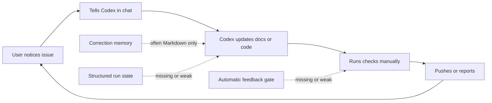
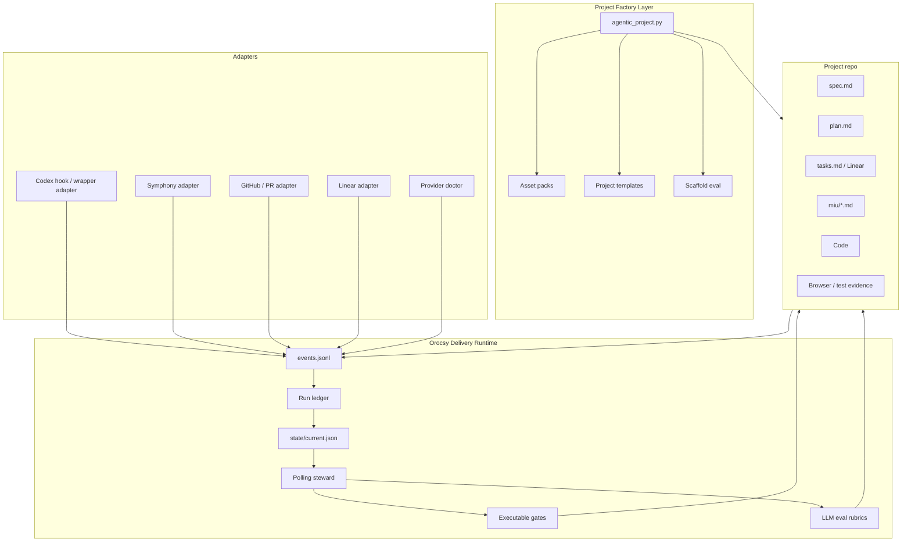
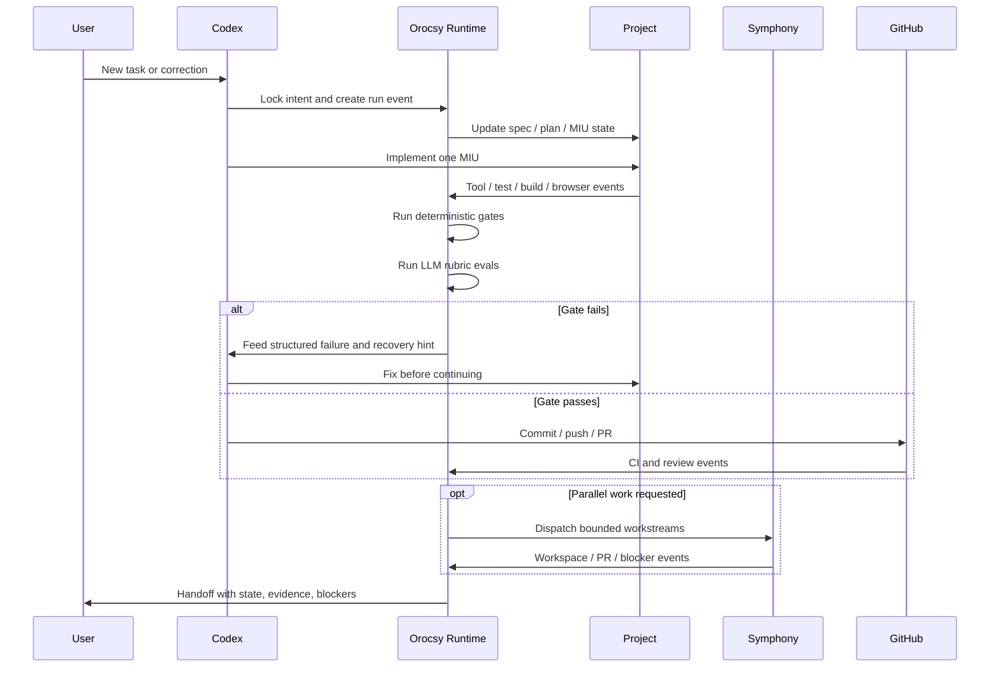

# Orocsy Delivery Runtime Architecture

This note separates the current reusable project factory from the next
delivery-runtime layer. The key decision is that `agentic_project.py` remains a
factory and scaffold verifier. Orocsy Delivery Runtime becomes the ongoing
workflow layer beside it.

## Current Shape


Current pain:



This works, but too much depends on a human being present and careful.

## Target Shape



## Target Work Loop



## Responsibility Split

```mermaid
flowchart TD
  Factory["agentic_project.py"]
  Runtime["Orocsy Runtime"]
  Symphony["Symphony"]
  Control["Control plane later"]

  Factory --> F1["Create repo scaffold"]
  Factory --> F2["Install templates"]
  Factory --> F3["Generate stack/provider docs"]
  Factory --> F4["Verify scaffold output"]

  Runtime --> R1["Track run state"]
  Runtime --> R2["Record events"]
  Runtime --> R3["Run gates"]
  Runtime --> R4["Evaluate MIU/business quality"]
  Runtime --> R5["Feed failures back to agent"]

  Symphony --> S1["Spawn agents"]
  Symphony --> S2["Manage workspaces"]
  Symphony --> S3["Coordinate parallel Linear work"]

  Control --> C1["Pause / resume / retry"]
  Control --> C2["Budgets / cost"]
  Control --> C3["Provider / production operations"]
```



## Markdown, Code, And LLM Judgment

Do not convert every workflow rule into code. The target is a hybrid system.

Use executable checks for deterministic conditions:

- leaked old project names or asset IDs
- secrets in tracked files
- build artifacts staged for commit
- missing required docs or evidence
- tests, lint, typecheck, build, or browser checks not run
- PR review threads unresolved
- branch and remote state mismatch
- provider environment variables missing
- stale run timeout

Use LLM evals for judgment-heavy checks:

- MIU quality and technical detail
- business correction and boundary fit
- stale versus valid review comments
- design alignment with the current product
- provider or stack tradeoffs
- whether a recovery plan actually addresses the failure

Use hybrid gates when code can gather facts and an LLM should decide the
verdict. The LLM output should be structured so a gate can pass, fail, or mark
the run as blocked.

## Run Ledger Artifacts

A project using Orocsy Delivery Runtime should have durable run state, not only
free-form status notes.

```text
.codex/delivery/
  spec.md
  plan.md
  tasks.md
  miu/
    <issue-or-run-id>.md
  state/
    current.json
  events/
    events.jsonl
  evals/
    miu-quality.json
    browser-evidence.json
    review-hardening.json
  handoff.md
```

The Markdown files remain human-readable. The structured files become the
source for automation, polling, recovery, and summaries.

## Event Shape

The runtime should record the six observability dimensions: goal, step, tool,
failure, recovery, and cost.

```json
{
  "ts": "2026-05-09T00:00:00Z",
  "run_id": "run_...",
  "goal_id": "goal_...",
  "intent": "Sanitize generated project scaffold",
  "phase": "verification",
  "miu_id": "miu_...",
  "step": "scan-for-project-origin-leaks",
  "tool": "rg",
  "status": "passed",
  "failure": null,
  "recovery": null,
  "cost": {
    "duration_ms": 842,
    "tokens": null,
    "provider_calls": 0
  },
  "artifacts": [
    "SCAFFOLD_DECISIONS.md",
    ".codex/agentic/ASSET_DECISIONS.yml"
  ]
}
```

## Runtime Options

Start conservative.

| Option | Capability | Risk | Recommendation |
| --- | --- | --- | --- |
| Read-only steward | Polls git, files, PRs, Linear, tests; writes events and state. | Low. | Build first. |
| Gate steward | Adds pass/fail gates and recovery hints. | Medium. | Build after the ledger works. |
| Symphony adapter | Observes Symphony workspaces and blockers. | Medium. | Add after gates are stable. |
| Control plane | Owns pause/resume/retry, budget, provider operations. | High. | Delay. |

Symphony should remain the concurrency and worktree runner. Orocsy should
provide policy, ledgers, gates, evals, and adapters around it.

## Eval Split

There are two different eval systems.

| Eval type | Owner | Purpose |
| --- | --- | --- |
| Scaffold eval | `agentic_project.py` | Prove generated starter code is runnable and has clean decisions. |
| Workflow eval | Orocsy Runtime | Prove ongoing delivery behavior is high quality: MIU, gates, evidence, review handling, and handoff. |

Do not merge these concepts. The factory produces and verifies the initial
project. The runtime evaluates ongoing delivery work.

## Next Implementation Order

1. Add the run ledger schema: `state/current.json` and `events/events.jsonl`.
2. Add deterministic hygiene gates: project-name leak, secrets, artifacts, git
   state, required evidence.
3. Add LLM rubrics for MIU quality, business correction, and review
   classification.
4. Add a read-only polling steward that summarizes what is happening without
   controlling agents.
5. Capture user corrections as one of: durable rule, deterministic check, LLM
   rubric, or regression eval.
6. Add a Symphony adapter that observes workspaces and issues but does not own
   scheduling.
7. Add control-plane behavior only after the ledger and evals catch real
   failure modes reliably.

## Architecture Decision

`agentic_project.py` stays the factory. Orocsy Delivery Runtime becomes the
ongoing workflow layer. Symphony remains the parallel agent runner. The control
plane comes later.
