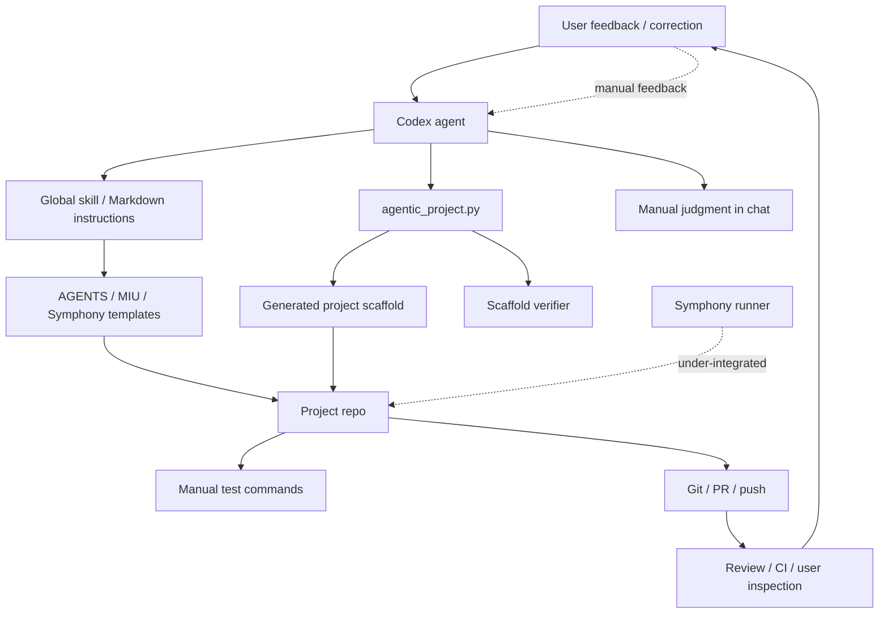
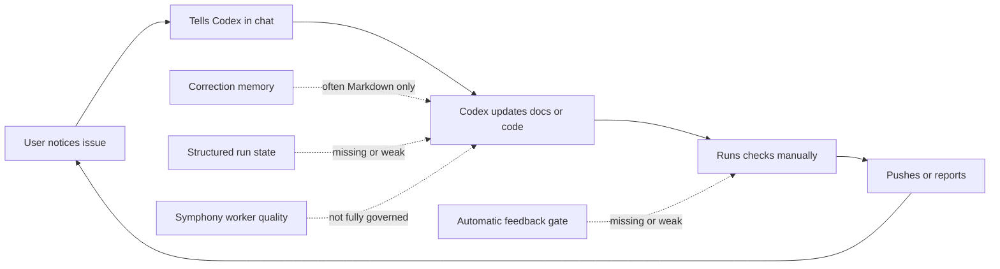
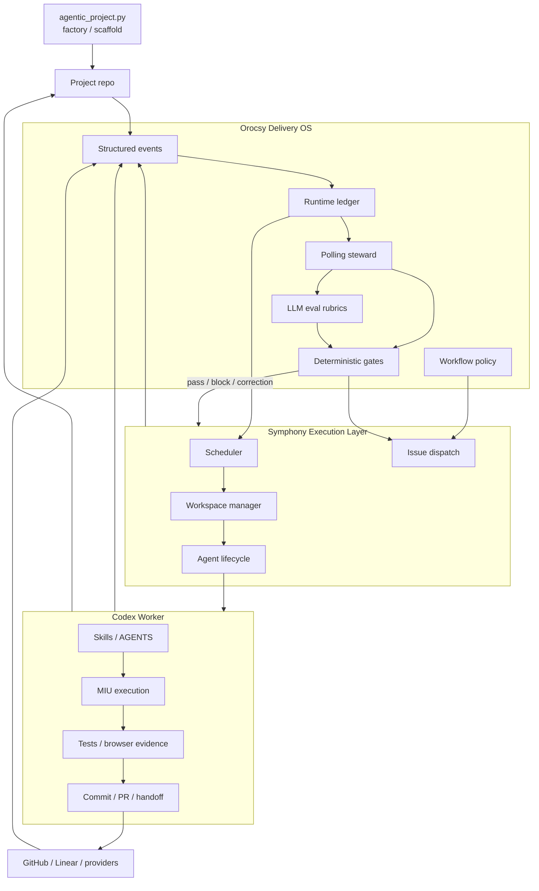
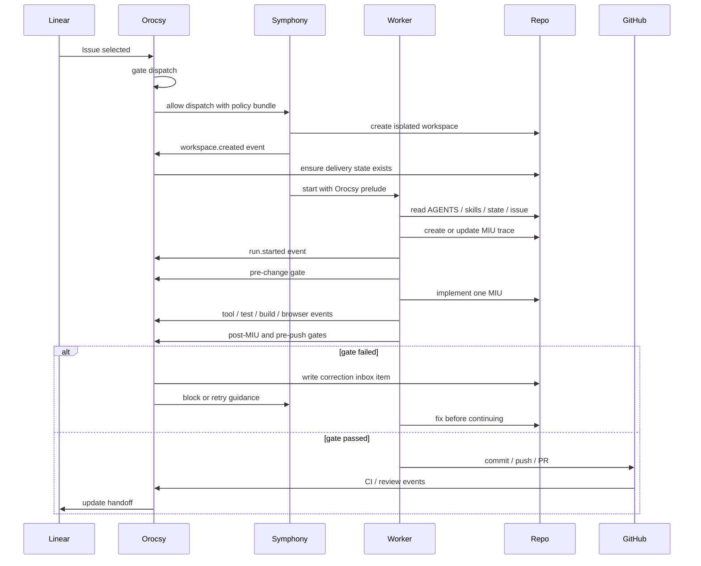
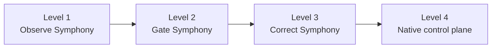
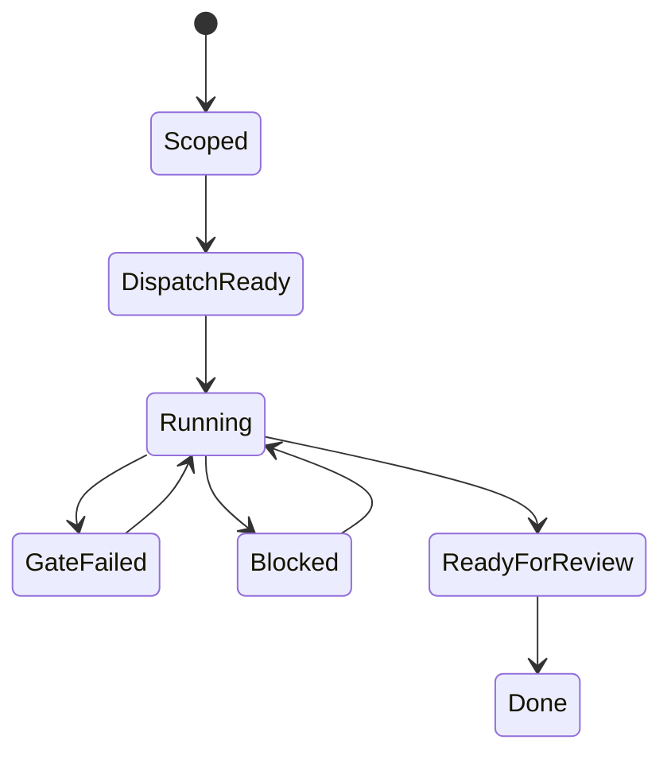

# Orocsy Delivery Runtime Architecture

This note defines the corrected architecture for Orocsy Delivery OS.

The important distinction:

- `agentic_project.py` is the project factory and scaffold verifier.
- Orocsy Runtime is the ongoing delivery governance layer.
- Symphony is a first-class concurrent execution layer inside the Orocsy
  delivery system, not a separate side tool.
- Codex workers do the implementation work, but they must run inside Orocsy
  policy, gates, state, observability, and correction loops.

## Current Shape

Today the system works, but too much depends on a human noticing issues and
feeding corrections back into the agent.



Current pain:



This is semi-automation. The workflow has good rules, but too many rules are
passive instructions rather than executable gates, structured events, or
runtime feedback.

## Corrected Target Shape

Symphony should be governed by Orocsy, not outside it. Symphony owns concurrent
execution mechanics; Orocsy owns policy, quality, gates, state, and correction.



## High-Level Design

Orocsy has five major runtime layers.

| Layer | Responsibility |
| --- | --- |
| Runtime ledger | Durable state for goal, run, MIU, step, tool events, failures, recovery, cost, and evidence. |
| Gate engine | Deterministic checks plus LLM-judged checks. Blocks unsafe dispatch, commit, push, PR, or handoff. |
| Symphony integration | Injects Orocsy policy into Symphony dispatch, workers, workspaces, and handoffs. |
| Eval engine | Evaluates MIU quality, business correction, review handling, browser evidence, and workflow quality. |
| Steward | Polling, cron, or daemon layer that watches runs and reports stuck, failed, stale, or unsafe state. |

Symphony owns:

- workspace creation
- concurrent worker lifecycle
- issue dispatch
- branch and PR workstreams
- agent execution mechanics
- timeout and process-level state

Orocsy owns:

- whether a workstream is allowed to start
- what every worker must read
- what every worker must prove
- what events and evidence are required
- whether commit, push, PR, or handoff is allowed
- when to block, correct, retry, or escalate
- how user corrections become durable rules, gates, rubrics, or evals

## Responsibility Split

```mermaid
flowchart TD
  Factory["agentic_project.py"]
  OrocsyRuntime["Orocsy Runtime"]
  SymphonyLayer["Symphony"]
  CodexWorker["Codex worker"]
  Control["Control plane later"]

  Factory --> F1["Create repo scaffold"]
  Factory --> F2["Install templates"]
  Factory --> F3["Generate stack/provider docs"]
  Factory --> F4["Verify scaffold output"]

  OrocsyRuntime --> O1["Track run state"]
  OrocsyRuntime --> O2["Record events"]
  OrocsyRuntime --> O3["Run gates"]
  OrocsyRuntime --> O4["Evaluate MIU and business quality"]
  OrocsyRuntime --> O5["Feed failures back to Symphony/workers"]

  SymphonyLayer --> S1["Schedule agents"]
  SymphonyLayer --> S2["Manage workspaces"]
  SymphonyLayer --> S3["Coordinate parallel Linear work"]
  SymphonyLayer --> S4["Surface lifecycle status"]

  CodexWorker --> W1["Read skills and AGENTS"]
  CodexWorker --> W2["Implement one MIU"]
  CodexWorker --> W3["Run validation"]
  CodexWorker --> W4["Emit evidence and handoff"]

  Control --> C1["Pause / resume / retry"]
  Control --> C2["Budgets / cost"]
  Control --> C3["Provider / production operations"]
```



The clean line: Symphony runs agents. Orocsy governs the agents. Codex workers
implement. Skills teach worker-local behavior. Gates and the ledger make the
system observable and self-correcting.

## Symphony Integration Model

Symphony should not just receive a ticket and code. Each Symphony worker should
start inside an Orocsy worker contract.



Mandatory worker prelude:

```text
1. Read AGENTS.md.
2. Load the Orocsy / agentic-delivery-loop skill.
3. Read .codex/delivery/state/current.json if present.
4. Read assigned issue, write scope, dependencies, and out-of-scope notes.
5. Create or update the MIU trace.
6. Emit run-start event.
7. Run pre-change gates.
8. Implement one MIU at a time.
9. Emit tool, test, build, browser, and decision events.
10. Run post-MIU, pre-commit, and pre-push gates.
11. Handoff only after gates pass.
```

## Low-Level Runtime Design

Project-local runtime state:

```text
.codex/delivery/
  policy.yml
  gates.yml
  spec.md
  plan.md
  tasks.md
  miu/
    <issue-or-run-id>.md
  state/
    current.json
  events/
    events.jsonl
  evals/
    miu-quality.rubric.md
    business-correction.rubric.md
    review-classification.rubric.md
    browser-evidence.rubric.md
    workstream-split-safety.rubric.md
  inbox/
    correction-*.md
  handoff.md
```

The Markdown files remain human-readable. The structured files become the
source for automation, polling, recovery, and summaries.

Suggested CLI surface:

```bash
orocsy init
orocsy run start --issue COD-123
orocsy event append --type tool.started
orocsy gate dispatch
orocsy gate pre-change
orocsy gate post-miu
orocsy gate pre-commit
orocsy gate pre-push
orocsy eval list
orocsy eval rubric miu-quality
orocsy eval record miu-quality --status passed --summary "..."
orocsy inbox list --open-only
orocsy symphony prepare-workspace
orocsy symphony guidance
orocsy symphony monitor
orocsy control status
orocsy report
```

`agentic_project.py` can install these files and templates, but it should not
become the long-running runtime brain.

## Event Shape

The runtime should record the six observability dimensions: goal, step, tool,
failure, recovery, and cost.

```json
{
  "ts": "2026-05-09T00:00:00Z",
  "run_id": "run_...",
  "goal_id": "goal_...",
  "intent": "Sanitize generated project scaffold",
  "phase": "verification",
  "miu_id": "miu_...",
  "step": "scan-for-project-origin-leaks",
  "tool": "rg",
  "status": "passed",
  "failure": null,
  "recovery": null,
  "cost": {
    "duration_ms": 842,
    "tokens": null,
    "provider_calls": 0
  },
  "artifacts": [
    "SCAFFOLD_DECISIONS.md",
    ".codex/agentic/ASSET_DECISIONS.yml"
  ]
}
```

Symphony-level events should also be recorded:

```json
{
  "ts": "2026-05-09T00:00:00Z",
  "run_id": "run_...",
  "issue": "COD-123",
  "workspace": "~/.codex/symphony-workspaces/project/COD-123",
  "event": "symphony.worker.blocked",
  "reason": "pre-push gate failed",
  "gate": "declared-write-scope",
  "next_action": "worker must update MIU and remove out-of-scope file edits"
}
```

## Gate Types

Deterministic gates:

- no secret leaks
- no generated artifacts staged
- no leaked old project names or asset IDs
- branch, base branch, and PR target are correct
- Linear issue has write scope, dependencies, MIUs, validation, and out-of-scope
- touched files stay inside declared scope
- tests, lint, typecheck, build, and browser evidence are present when required
- provider env presence checked without printing secrets
- remote state and local branch state are understood before push

LLM gates:

- MIU has enough technical depth
- business boundary is correctly identified
- rejected alternatives are meaningful
- review comments are classified correctly
- UI evidence matches the user-visible flow
- recovery actually fixes the failure
- Symphony workstream split is safe and non-overlapping

Hybrid gates:

- code gathers facts
- LLM returns a structured verdict
- gate engine passes, fails, or blocks based on the verdict

## Markdown, Code, And LLM Judgment

Do not convert every workflow rule into code. The target is a hybrid system.

Use code for deterministic, repeatable checks. Use LLM judgment for ambiguous
engineering judgment, business correction, review interpretation, and design
evaluation. Use small command wrappers where a few lines of shell or Python save
the agent from re-reading context every time.

Avoid building a large traditional workflow app too early. The first runtime
should be small, inspectable, file-backed, and easy for agents to operate.

## Auto-Correction Model

Do not jump directly to goal-driven autonomy.



| Level | Meaning | Build now? |
| --- | --- | --- |
| Observe | Orocsy polls Symphony workspaces, branches, PRs, logs, tests, and Linear state. | Yes |
| Gate | Symphony workers must pass Orocsy checks before commit, push, PR, and handoff. | Yes |
| Correct | Orocsy writes correction inbox items and can block or restart work with guidance. | Soon |
| Control plane | Orocsy owns pause/resume/retry/budget/provider operations. | Later |

## Runtime State Machine



For Symphony, each issue/workspace should have the same state machine. A
parallel worker should not be allowed to bypass the gates just because it was
spawned by an automation runner.

## Eval Split

There are two different eval systems.

| Eval type | Owner | Purpose |
| --- | --- | --- |
| Scaffold eval | `agentic_project.py` | Prove generated starter code is runnable and has clean decisions. |
| Workflow eval | Orocsy Runtime | Prove ongoing delivery behavior is high quality: MIU, gates, evidence, review handling, Symphony safety, and handoff. |

Do not merge these concepts. The factory produces and verifies the initial
project. The runtime evaluates ongoing delivery work. Symphony uses the runtime
evals for every concurrent workstream.

## Success Criteria

The runtime is successful only if it changes the actual delivery outcome, not
just the documentation.

Minimum proof for the first runtime slice:

- A fresh repo can run `orocsy init` and receive a durable
  `.codex/delivery/state/current.json` plus `.codex/delivery/events/events.jsonl`.
- `orocsy run start` and `orocsy event append` update the ledger in a machine
  readable way without requiring chat memory.
- `orocsy gate` exits non-zero for deterministic delivery risks: leaked old
  project names, secret-looking tracked content, staged/generated artifacts,
  unsafe git state, out-of-scope file edits, and missing required evidence.
- `orocsy gate` can also emit JSON so Symphony, Codex, cron, or shell wrappers
  can consume the result without scraping prose.
- Running the gates in a clean repo does not require network access and does not
  print secrets.
- Symphony workers can call the same gates inside isolated workspaces; no
  parallel workstream bypasses the rules just because it was spawned by an
  automation runner.
- A read-only Symphony monitor can scan a workspace root and report branch/head
  state, dirty worktrees, Orocsy ledger state, event counts, last event, stale
  runs, and missing ledgers without mutating any workspace.
- LLM/human eval rubrics exist as structured CLI output and generated
  `.codex/delivery/evals/*.rubric.md` files, and verdicts can be recorded as
  `eval.<rubric>` ledger events.
- Failed gates/evals can write correction inbox items as JSON and Markdown
  under `.codex/delivery/inbox/`, and resolved corrections are recorded as
  ledger events.
- Symphony guidance can return controlled `block`, `retry`, or `continue`
  advice without mutating external trackers, provider systems, worker
  processes, or PRs.
- The current control-plane command clearly reports which actions are supported
  now and which remain deferred.
- User corrections can be translated into one of four durable forms: a
  deterministic gate, an LLM rubric, a policy entry, or a regression eval.

This is the acceptance bar for implementation orders 1 through 8.

## Implementation Order

1. Add the run ledger schema: `state/current.json` and `events/events.jsonl`.
2. Add deterministic `orocsy gate` commands for leaks, secrets, artifacts, git
   state, declared scope, and required evidence.
3. Add worker prelude and Symphony workflow integration so every worker loads
   Orocsy rules and emits events.
4. Add read-only `orocsy symphony monitor` for workspaces, branches, PRs, logs,
   and stale runs.
5. Add LLM eval rubrics for MIU quality, business correction, review
   classification, browser evidence, and workstream split safety.
6. Add correction inbox files under `.codex/delivery/inbox/`.
7. Add controlled block/retry guidance for Symphony workers.
8. Delay full control plane behavior until the ledger and evals catch real
   failure modes reliably.

## Architecture Decision

`agentic_project.py` stays the factory. Orocsy Runtime becomes the ongoing
workflow governance layer. Symphony is the concurrent execution substrate inside
that governance layer. Codex workers implement one MIU at a time. Skills and
templates define worker-local behavior. Gates and the ledger make the system
observable, enforceable, and eventually self-correcting.
