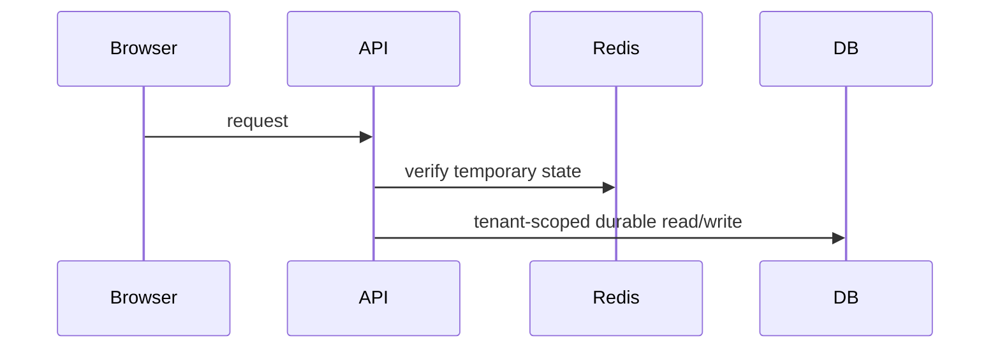

# Technical MIU Trace

MIU means **Minimum Implementable Unit**.

Use one MIU per smallest meaningful behavior change that can be implemented,
tested, reviewed, and handed off independently. A MIU is not a status update,
not a checklist heading, and not a few abstract bullets. It is the technical
reasoning that lets another engineer or agent implement the change without
guessing.

The trace must include the technical analysis, tradeoffs, thought process, and
decision. It should read like engineering design notes tied to code and runtime
behavior, not like an outcome summary.

## Required Shape

````md
## MIU <id> - <name>

### Runtime Problem
Concrete user action, API request, job, race, deploy path, or browser path.

Current risky code:
```ts
// Paste the real risky code shape.
```

Why it breaks or is unsafe:

### Data Shape
Values, examples, lifetime, and scope.

| Value | Example | Lifetime | Scope |
| --- | --- | --- | --- |
| Customer session cookie | `luxebook_customer_manage_session` | 30 days | browser/httpOnly |
| OTP Redis state | `{ codeHash, attempts, expiresAt }` | 10 minutes | tenant/contact |

### Technology Constraint
Framework/database/browser/provider behavior that makes the naive solution
unsafe.

### Design / Flow


### Best-Practice Fix
Chosen pattern, why it fits this codebase, and target code shape.

```ts
// Paste the core target code shape.
```

### Alternatives Rejected
- Alternative:
  Reason rejected:

### Code Translation
Core lines and why they exist. Explain only the lines that carry the important
decision.

```ts
const importantLine = true;
// Trace explanation: this line exists because...
```

### Risk / Test
Exact failing test before fix, expected failure, and validation command.
````

## Quality Bar

Good MIUs include:

- A concrete runtime scenario.
- At least one code snippet.
- Data lifetime and ownership.
- The framework/database/browser constraint.
- Chosen fix and alternatives rejected.
- Exact test names and commands.
- Business invariant or user truth being preserved.
- Evidence that the MIU is independently reviewable.

Weak MIUs to reject:

- "Fix auth issue."
- "Add tests."
- "Use Redis for OTP."
- "Browser tested."
- "Update UI."
- "Handle edge cases."
- "Refactor service."

## Detail Bar

Every required section must have project-specific content. Do not leave generic
sentences in place. If a section does not apply, write `N/A` plus the reason.

The trace must show enough code or API shape to prevent guessing. For example:

- Current selector or query and target selector/query.
- Request/response DTO shape.
- Cache/session/token value lifetime.
- UI state transition.
- Transaction, lock, or retry boundary.
- Browser storage versus durable storage distinction.

The thought process belongs in the MIU trace and handoff, not as verbose
production code comments.

## When Mandatory

Always use a Technical MIU for:

- Auth, sessions, OTP, magic links, cookies, identity, roles, and permissions.
- Scheduling, concurrency, locks, queues, retries, and idempotency.
- Any tenant/account/org/project/customer-style data boundary.
- Payments, refunds, credits, subscriptions, entitlements, or money-adjacent state.
- Storage, media uploads, generated files, object storage, and cleanup.
- External providers such as SMS, email, payment, storage, search, analytics, or AI APIs.
- Customer/user/operator-visible routes or UI state that crosses browser/API boundaries.
- PR review fixes in any of the areas above.
- Compacted-session resumes where the next action touches these areas.

For projects without LuxeBook's exact business model, first discover the
project's equivalent boundaries and apply the same MIU bar to those.
