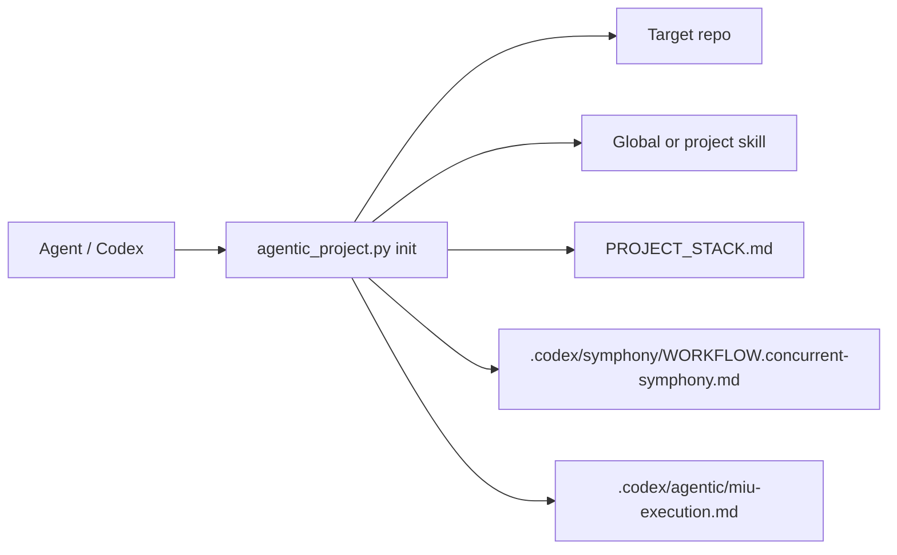

# Project Bootstrap CLI

Use the CLI when starting a new project or turning an existing repo into an
agent-ready repo.

## Why It Exists

The workflow skill tells Codex how to work, but a project also needs a
repeatable way to install the workflow files, record stack choices, and create a
Symphony workflow. The CLI wraps that setup so the user does not need to copy
files manually.

## Runtime Shape



## Command Pattern

```bash
python3 examples/orocsy-agentic-delivery/cli/agentic_project.py list
python3 examples/orocsy-agentic-delivery/cli/agentic_project.py list-assets

python3 examples/orocsy-agentic-delivery/cli/agentic_project.py init \
  --repo /path/to/new-repo \
  --project-name my-app \
  --stack nextjs-fullstack \
  --deploy vercel-plus-managed-backend \
  --feature-pack auth \
  --skill-mode global

python3 examples/orocsy-agentic-delivery/cli/agentic_project.py evaluate \
  --domain auth \
  --stack nextjs-fullstack

python3 examples/orocsy-agentic-delivery/cli/agentic_project.py scaffold \
  --repo /path/to/new-repo \
  --project-name my-app \
  --profile nextjs-fullstack \
  --asset-pack media-r2-s3-luxebook \
  --asset-pack auth-evaluated

python3 examples/orocsy-agentic-delivery/cli/agentic_project.py providers doctor \
  --repo /path/to/new-repo
```

## What It Writes

- `AGENTS.md`
- `PROJECT_STACK.md`
- `.codex/agentic/PROJECT_STACK.yml`
- `.codex/agentic/miu-execution.md`
- `.codex/agentic/linear-workstream.md`
- `.codex/symphony/WORKFLOW.concurrent-symphony.md`
- `.codex/symphony/start-symphony.sh`
- Optional project-local `.codex/skills/agentic-delivery-loop/`

`scaffold` writes runnable code and decision memory:

- `package.json`, TypeScript, Next.js, ESLint, Vitest, and optional Playwright
  setup.
- `src/app/*` first screen and selected `src/lib/*` integration helpers.
- `.env.example` with placeholders only, never real secrets.
- `.codex/agentic/ASSET_DECISIONS.yml`.
- `SCAFFOLD_DECISIONS.md`.
- `docs/providers/PROVIDER_SETUP.md`.

## Selection Rule

Do not assume LuxeBook's stack. Pick a stack/deploy profile based on the new
project's real product shape:

- `nextjs-fullstack`: one deployable web app is enough.
- `next-nest-prisma-postgres-redis`: separate API plus web apps, SaaS-style.
- `api-service`: backend-first or integration-heavy product.

If the stack does not fit, use the closest profile only as a record of starting
assumptions, then update `PROJECT_STACK.md`.

## Code Asset Rule

Do not generate a blank official starter when a reusable asset fits. The CLI
should compose from:

- `framework-base`: minimal runnable foundation.
- `luxebook-extracted`: proven patterns such as media storage, env validation,
  tenant boundaries, booking concurrency, and browser evidence.
- `third-party-evaluated`: official SDK or mature OSS/provider choices with
  rejection reasons.
- `project-overlays`: domain-specific boundary seeds.

Before using an asset that touches auth, payments, storage, external delivery,
tenant data, or customer-visible truth, check the generated decision file and
add an MIU trace with code shape, data lifetime, tradeoffs, and tests.
