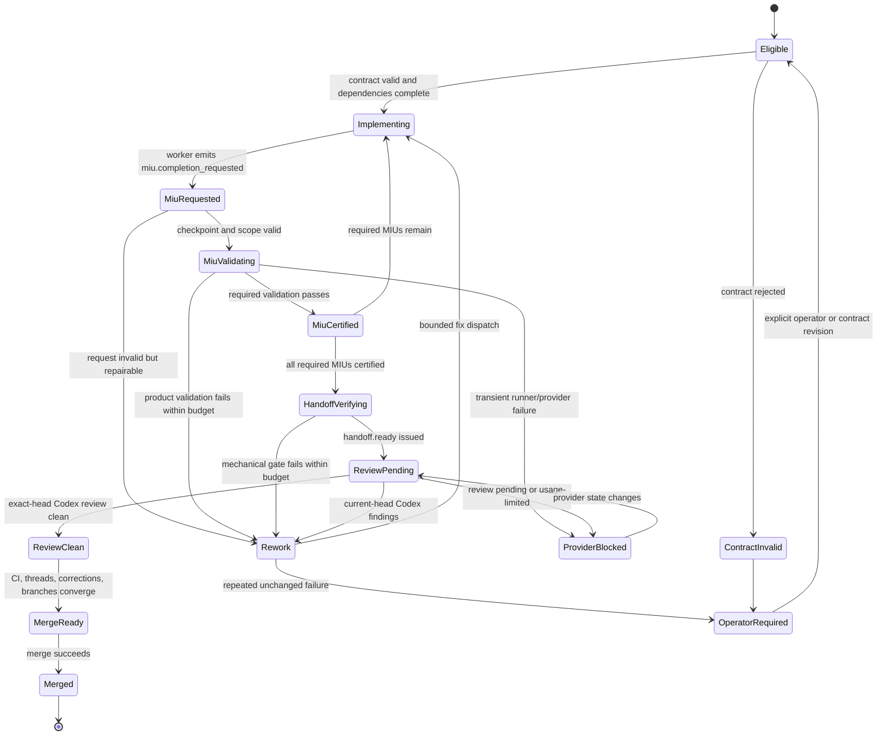

# Symphony Runtime Delivery Workflow

Status: Implemented on `codex/current-issue-contract-handoff-gate`; awaiting PR validation
Owner: Orocsy Symphony runtime

## Goal

Run an issue from dispatch through implementation, validation, PR review, and
handoff without empty token-burning loops, stale completion inference, or
monitoring-driven execution changes.

## Resolved Decisions

### Final review requires explicit handoff certification

Symphony MUST NOT infer whole-ticket completion from a clean tracked branch,
generic passing validation, `gate.post-miu`, or another partial checkpoint.

Before Symphony requests final Codex review without starting a worker, it MUST
have a runtime-verifiable `handoff.ready` certificate bound to all of:

- issue ID and identifier;
- current issue-contract hash;
- canonical integration branch;
- current pushed head SHA;
- required MIU completion evidence;
- required validation evidence.

Missing, malformed, legacy, stale, partially matched, or superseded evidence
MUST fail closed and continue through a bounded worker run. It MUST NOT trigger
review or terminal handoff.

Runtime-owned certificates and terminal controller events MUST be signed by a
persistent controller key outside the worker workspace. An authority label in
worker-writable JSON is not proof of runtime ownership.

### Runtime readiness and model review are separate gates

Symphony MUST use deterministic runtime checks only to decide whether a pushed
head is ready to enter review. Those checks establish mechanical facts; they do
not constitute code review or semantic verification.

The default review authority is GitHub Codex review on the exact PR head. The
same Linear issue owns the complete review loop:

1. A Symphony Codex app-server worker implements or fixes the issue.
2. Symphony verifies the current contract, canonical branch and PR, clean and
   pushed head, required MIU evidence, and required validation evidence.
3. Symphony issues `handoff.ready` and requests GitHub Codex review for that
   exact head.
4. Current-head findings return the same issue to `Rework` for another bounded
   Symphony worker.
5. The worker fixes accepted in-scope findings and reruns required validation.
6. Symphony invalidates the prior certificate, certifies the new head, and
   requests a fresh GitHub Codex review.
7. The loop repeats until the current head has a clean GitHub Codex review.

Symphony MUST NOT start an additional local Codex app-server verification
session by default. A contract hash only prevents stale evidence reuse; it is
not code review. Passing tests and deterministic checks MUST NOT substitute for
GitHub Codex review. If GitHub Codex is unavailable or usage-limited, the issue
remains review-blocked unless an explicitly configured human-review authority
provides the equivalent current-head decision.

### Dispatch authority comes from a structured runtime contract

Every Symphony-dispatchable Linear ticket SHOULD contain one machine-readable
`Runtime Contract` block. Normal Markdown remains the authoritative human and
worker explanation of runtime problem, data shape, constraints, design,
tradeoffs, implementation outline, risks, tests, and validation. Runtime scope
and completion authority MUST come only from the validated structured block,
not from regex extraction across that prose.

The contract MUST have a versioned schema and stable identifiers for:

- ticket type;
- base and canonical integration branches;
- dependencies;
- MIUs;
- per-MIU write scope;
- per-MIU required validation;
- final required validation;
- PR/review behavior.

Illustrative shape:

```yaml
schema_version: 1
ticket_type: implementation
base_branch: main
integration_branch: orocsy/cod-246-preference-miu-guest-setup-controls
dependencies: []
mius:
  - id: COD-266-MIU-1
    write_scope:
      - tests/integration/cards-route.test.ts
    validations:
      - pnpm exec vitest run --configLoader runner tests/integration/cards-route.test.ts
  - id: COD-266-MIU-2
    write_scope:
      - src/app/api/cards/handler.ts
    validations:
      - pnpm exec vitest run --configLoader runner tests/integration/cards-route.test.ts
final_validations:
  - pnpm typecheck
review:
  authority: github_codex
  require_current_head: true
```

The parser MUST reject unknown schema versions, duplicate MIU IDs, malformed
paths, prose-shaped scope entries, undeclared validation commands, and invalid
branch contracts. It MUST preserve source and validation errors for the
operator instead of silently falling back.

Scope entries support literal path segments plus `*` and `**` wildcards.
Other glob metacharacters are rejected until the runtime matcher implements
their semantics.

Legacy prose-only tickets MAY run through a bounded worker for compatibility,
but MUST NOT receive automatic `handoff.ready` certification. They require a
contract upgrade or an explicit operator-controlled handoff.

### MIU completion is certified by the runtime

A worker MUST request completion with `miu.completion_requested`; it MUST NOT
author authoritative `miu.completed` evidence directly. The request names the
MIU ID and current contract hash.

Symphony MUST issue `miu.completed` only after it independently verifies:

- the MIU exists in the locked current contract;
- the changed paths are within that MIU's declared write scope;
- the code state being validated is identifiable and current;
- every required MIU validation was executed by a runtime-controlled runner;
- each result is legitimate, current, and passing.

Validation evidence MUST be bound to a fingerprint containing at least:

```text
issue + contract hash + MIU ID + code/tree or head identity
+ command hash + validation-runner/environment fingerprint
```

Runtime validation MUST reject shell bypasses such as `|| true`, unexpected
command substitutions or chains, success with zero collected tests when tests
are required, results for a stale code identity, worker-authored success text,
and commands not declared by the locked contract. Known test adapters SHOULD
record collected/passed/failed counts; non-test gates such as typecheck, lint,
and build MUST record the exact command, exit status, duration, and bounded
output evidence.

The runtime MUST persist every validation attempt and its fingerprint. It MUST
NOT execute the same failed fingerprint repeatedly without a relevant state
change. A failed validation produces a structured failure transition with the
exact command and bounded diagnostic output; it does not count as MIU
completion.

### Validation recovery is bounded and state-change gated

Symphony MUST execute each validation fingerprint at most once.

For a product validation failure, Symphony MAY run at most two automatic fix
cycles for the affected MIU. Each cycle MUST produce a new code identity before
the failed validation can run again. An unchanged code identity MUST remain
parked rather than consume another worker or validation attempt.

For an infrastructure validation failure, Symphony MAY retry once only after
the environment fingerprint changes or a deterministic failure classifier
marks the failure transient. Infrastructure retries and product fix cycles MUST
have separate counters.

When either configured ceiling is exhausted, the issue transitions to
`operator_required` with the attempt history, fingerprints, bounded diagnostic
output, and required next decision. Process restarts MUST NOT reset these
counters. Only a new contract revision or explicit operator action MAY reset
the applicable budget.

### MIU evidence is bound to micro-commit checkpoints

Before emitting `miu.completion_requested`, the worker MUST create a clean local
checkpoint commit for the MIU. The commit SHOULD contain one independently
reviewable behavior or contract change, such as a focused function
implementation, contract/type definition, or its bounded regression test.

Symphony validates the exact checkpoint `HEAD` and records that SHA in
`miu.completed`. Failed checkpoints MUST remain local and MAY be amended or
superseded by a corrective checkpoint. They MUST NOT be pushed merely because a
completion request was made.

Scope certification audits the complete uncertified range. For the first MIU,
the range begins at the pre-existing remote integration head when present, or
at the merge base with the declared base branch. Later MIUs begin at the prior
valid MIU certificate. This preserves shared integration history while
preventing an earlier out-of-scope commit from hiding behind an allowed final
checkpoint.

Before final certification, Symphony MUST verify that every required certified
MIU checkpoint remains an ancestor of the final head. It MUST rerun the
contract's final validations against that exact final head. Rebase, amend, or
squash operations that remove a certified checkpoint invalidate its old
certificate and require recertification for the resulting code identity.

Final handoff certification MUST verify the canonical branch head against the
configured GitHub repository. Workspace tracking refs and workspace Git remote
configuration are transport hints, not authoritative push evidence.

### Command policy is based on parsed intent

Symphony MUST classify supported Git commands by semantic intent rather than
assuming every base-branch diff reads source content.

A strictly parsed metadata-only changed-path command MAY be classified as
`scope.audit` and allowed, including the canonical form:

```bash
git diff --name-only --no-renames <declared-base>...HEAD
```

The metadata allowlist MUST accept only known non-content output flags and the
declared base/current head refs. It MUST reject shell chains, substitutions,
patch flags, ambiguous output modes, undeclared refs, and unsupported options.
Patch-producing base-branch diffs remain blocked unless they include explicit
allowed path scope.

MIU and handoff certification MUST run the changed-path audit directly through
the runtime's Git adapter. Paths outside the contract's effective write scope
produce an `undeclared_write` certification failure. The audit itself MUST NOT
be reported as broad source reading.

The command parser and policy decision SHOULD be exposed through one small
interface returning a typed intent and decision reason, so worker interception,
runtime certification, telemetry, and tests use the same classification.

### Observers never control execution

This workflow reaffirms the previously accepted Symphony invariant:
monitoring observes; controllers act.

Telemetry collectors, token monitors, logs, and dashboards MUST be append-only
observers. They MUST NOT terminate workers, mutate Linear state, create or
resolve corrections, change dispatch eligibility, apply policy patches, or
select retry behavior.

Execution decisions belong to explicitly named runtime controllers, including
`ScopeController`, `ProgressController`, `ValidationController`, and
`HandoffController`. Each controller MUST act from a versioned policy, persist
its state independently of the dashboard, and emit a structured decision event
containing its input fingerprint, decision, reason class, and next allowed
transition. Observability surfaces consume those events without feeding hidden
decisions back into the state machine.

Any existing path where a telemetry/dashboard module directly causes an
execution mutation is a workflow-conformance defect, not an accepted runtime
shortcut.

### General no-progress recovery is single-use

`ProgressController` MAY permit exactly one bounded recovery from a preserved
workspace after a no-durable-progress decision.

The first decision MUST preserve and report the current contract, branch,
head/tree identity, dirty paths, latest command/action, blocker class, command
fingerprint, token accounting, and last durable event. The recovery prompt MUST
name the smallest next action justified by that state; it MUST NOT restart
broad discovery.

If the bounded recovery reaches the same failure fingerprint without relevant
state change, `ProgressController` MUST transition the issue to
`operator_required`. It MUST NOT launch a third automatic worker. Process and
dashboard restarts MUST NOT reset this state.

A new contract hash, code identity, environment fingerprint, or genuinely
different blocker may produce a new recovery fingerprint. Incidental telemetry
timestamps, process IDs, cached-input totals, or rewritten wording MUST NOT.

### Current-head review findings are classified inside the issue loop

GitHub Codex findings against the certified current head MUST be classified in
the same Linear issue's `Rework` run using the runtime-supplied thread and the
smallest focused code context needed to decide it. Symphony MUST NOT start a
separate review session for this classification.

Classification has these effects:

- A valid finding caused, exposed, or worsened by the PR is blocking even when
  the original ticket omitted the concern. It requires an in-issue fix,
  validation, recertification, and fresh current-head GitHub Codex review.
- A valid finding in genuinely pre-existing, untouched behavior MAY be
  deferred. Deferral requires a detailed follow-up Technical MIU ticket,
  explicit ordering/dependencies, a review-thread reply linking that ticket,
  and a recorded non-blocking resolution for the current PR.
- A stale, duplicate, or incorrect finding MAY be resolved only with concrete
  current-head code, test, or thread evidence.
- An ambiguous finding transitions to `operator_required`; it MUST NOT be
  silently deferred or treated as clean.

Review classification MUST retain the finding ID/thread URL, reviewed head,
path, classification, reason, evidence, resulting issue ID when deferred, and
resolution state.

### Merge is automatic only after current-head gate convergence

Automatic merge requires an explicit schema-v1 `merge.automatic: true` opt-in;
contracts created before this field was introduced retain manual handoff.
`MergeController` MAY merge the PR only when all of the following refer to the
same current head:

- a current `handoff.ready` certificate;
- all required CI checks and runtime validations are passing;
- GitHub Codex produced a clean review for the exact head SHA;
- no blocking review thread remains unresolved;
- no Orocsy runtime correction remains open;
- canonical head branch and declared base branch still match the contract;
- GitHub reports the PR mergeable.

Any head change invalidates the previous certificate and review result. A
pending, unavailable, or usage-limited GitHub Codex review remains blocked and
MUST NOT degrade into automatic merge permission.

After a successful merge, Symphony MUST record the PR, reviewed head, merge
SHA, review authority, validation evidence, and completion timestamp; move the
Linear issue to its configured completed state; clean or archive the issue
workspace according to policy; and release newly unblocked dependencies for
dispatch.

### Exact supporting reads use bounded scope recovery

This workflow preserves the accepted scope-unblock policy: write scope is
strict, while exact justified supporting reads may be granted read-only access.

`ScopeController` MAY allow an exact read once when deterministic evidence
shows that the path is one of:

- declared `read_context`;
- a current-head review path;
- a direct local import of a write-scope file;
- the nearest caller of a write-scope file;
- an exact focused test or compiler-reported path;
- a current merge-conflict path.

An auto-allowed read MUST retain its reason, source, command fingerprint, file
identity, expiry, and policy hash. It MUST NOT become write scope. The same
unchanged request MUST NOT create repeated workers or policy patches.

Broad or ambiguous discovery remains blocked. An undeclared write requires a
contract amendment or explicit operator action unless current-head review has
already established it as a blocking PR-introduced correction and the runtime
creates a provenance-bound rework contract revision.

## Trigger And Terminal Outcomes

The workflow is event-triggered when Linear exposes an issue in a configured
active state whose dependencies are complete and whose project/workstream is
enabled for Symphony dispatch.

Before claiming the issue, Symphony validates the `Runtime Contract`. Invalid
or unsupported contracts transition to `contract_invalid` with one concise
operator brief; they do not start a worker.

Terminal outcomes are:

- `merged`: all gates passed, PR merged, Linear completed, dependencies
  released;
- `operator_required`: ambiguity or a durable retry ceiling requires a human
  decision;
- `provider_blocked`: GitHub, Codex review, Linear, or another required
  provider is unavailable or usage-limited; retry occurs only after provider
  state changes;
- `cancelled`: Linear or an operator made the issue ineligible.

## State Machine



Every transition MUST be persisted before its side effect. On restart,
Symphony resumes from persisted controller state and revalidates external truth
instead of reconstructing authority from dashboard output or generic events.

## Evidence Contracts

### Issue revision

The runtime retains two separate identities:

- `contract_hash`: SHA-256 of canonical JSON produced from the validated
  structured Runtime Contract;
- `issue_revision`: Linear issue `updatedAt` plus SHA-256 of the complete
  current description.

The contract hash controls machine authority. The issue revision prevents
silent reuse after explanatory requirements change. A change to either
invalidates pending completion and handoff certificates. Local issue briefs are
context only unless their exact file and blob identity are declared by the
Runtime Contract; they MUST NOT be appended into authority-bearing scope.

### MIU completion request

```json
{
  "schema_version": 1,
  "event": "miu.completion_requested",
  "issue_id": "linear-id",
  "issue": "COD-266",
  "contract_hash": "sha256:...",
  "issue_revision": "...",
  "miu_id": "COD-266-MIU-2",
  "branch": "orocsy/cod-246-preference-miu-guest-setup-controls",
  "head_sha": "full-local-checkpoint-sha",
  "worker_run_id": "...",
  "requested_at": "RFC3339"
}
```

### Runtime validation result

```json
{
  "schema_version": 1,
  "event": "validation.completed",
  "authority": "symphony.runtime.validation-controller",
  "issue": "COD-266",
  "miu_id": "COD-266-MIU-2",
  "head_sha": "...",
  "command_id": "cards-route-focused",
  "command_hash": "sha256:...",
  "environment_fingerprint": "sha256:...",
  "validation_fingerprint": "sha256:...",
  "status": "passed",
  "exit_code": 0,
  "tests": {"collected": 8, "passed": 8, "failed": 0},
  "duration_ms": 1432,
  "output_digest": "sha256:...",
  "bounded_log_path": ".orocsy/delivery/validation/..."
}
```

The environment fingerprint SHOULD include the validation adapter version,
runtime/toolchain versions, lockfile digest, and declared environment identity.
Secrets and raw environment values MUST NOT be persisted.

### Runtime MIU certificate

```json
{
  "schema_version": 1,
  "event": "miu.completed",
  "authority": "symphony.runtime.validation-controller",
  "issue": "COD-266",
  "contract_hash": "sha256:...",
  "issue_revision": "...",
  "miu_id": "COD-266-MIU-2",
  "branch": "...",
  "base_head_sha": "prior-certified-or-integration-head",
  "head_sha": "...",
  "changed_paths": ["src/app/api/cards/handler.ts"],
  "validation_event_ids": ["..."],
  "completed_at": "RFC3339"
}
```

### Final handoff certificate

```json
{
  "schema_version": 1,
  "event": "handoff.ready",
  "authority": "symphony.runtime.handoff-controller",
  "issue": "COD-266",
  "contract_hash": "sha256:...",
  "issue_revision": "...",
  "base_branch": "main",
  "branch": "orocsy/cod-246-preference-miu-guest-setup-controls",
  "head_sha": "...",
  "pr_number": 103,
  "completed_mius": ["COD-266-MIU-1", "COD-266-MIU-2"],
  "validation_event_ids": ["..."],
  "issued_at": "RFC3339"
}
```

Certificates are immutable facts. Supersession creates a new event and marks
the prior certificate stale; history is never rewritten.

## Runtime Modules

The implementation SHOULD concentrate behavior behind these interfaces:

- `RuntimeContract.compile(issue, workspace)` validates the structured block
  and returns canonical contract, hashes, and diagnostics. It never recovers
  authority from arbitrary prose.
- `CommandIntent.classify(command, runtime_context)` returns a typed intent such
  as `scope_audit`, `bounded_read`, `content_diff`, `validation`, or `unknown`.
- `ScopeController.decide(intent, contract, state)` returns `allow`,
  `allow_once`, `block`, or `operator_required` with a reason and fingerprint.
- `ValidationController.evaluate(request, contract, workspace)` verifies the
  checkpoint, audits changed paths, runs declared commands through adapters,
  persists attempts, and issues `miu.completed`.
- `ProgressController.evaluate(run_state)` owns bounded no-progress recovery.
- `HandoffController.evaluate(issue, contract, workspace, review_state)` issues
  and invalidates `handoff.ready`, requests review, and authorizes merge.
- `Telemetry.record(event)` and dashboard readers remain observation-only.

`PromptBuilder`, `AgentRunner`, and `Orchestrator` SHOULD call these modules
rather than reimplementing completion or scope heuristics independently.

## Controller Invariants

- Generic passing events never imply whole-ticket completion.
- No certificate survives a contract, issue revision, branch, or relevant head
  change.
- No validation result is reused across a different validation fingerprint.
- No retry occurs for an unchanged exhausted fingerprint.
- No write scope is inferred from prose, review-body support paths, or an
  auto-allowed read.
- No review result applies to a different head SHA.
- No merge occurs without exact-head certificate, checks, review, threads, and
  mergeability convergence.
- No monitoring or dashboard module performs a controller transition.

## Failure Brief

When an operator checkpoint is required, Symphony presents one decision-ready
brief containing:

- issue, branch, PR, contract hash, and current head;
- controller and failed transition;
- exact failure fingerprint and attempt count;
- changed paths and dirty state;
- command and bounded diagnostic evidence when applicable;
- what changed between attempts;
- the single decision or external state change required;
- links to Linear, PR thread, correction, and durable evidence.

Raw telemetry remains available below the brief but is not the primary operator
interface.

## Implementation Slices

1. Structured contract parser and schema validation; remove prose fallback from
   authority-bearing scope.
2. Typed command intent parser and metadata-only Git scope audit regression.
3. Durable controller state/evidence store and certificate invalidation.
4. Runtime validation adapters, fingerprints, test-count validation, and retry
   budgets.
5. MIU completion request/certification flow with micro-commit ancestry checks.
6. Replace `PromptBuilder`/`AgentRunner`/`Orchestrator` pushed-handoff inference
   with `HandoffController` certification.
7. Separate progress control from telemetry/dashboard modules and migrate
   durable no-progress retry state.
8. Current-head review classification, deferral evidence, merge convergence,
   and terminal cleanup.
9. Compatibility migration: legacy tickets may run but cannot auto-certify;
   existing generic gate events remain historical telemetry only.

Each slice requires focused unit tests before implementation tests and a final
integration test that replays the COD-266 failure sequence.

## Required Regression Scenarios

- `git diff --name-only --no-renames origin/main...HEAD` is allowed as
  `scope.audit`; `git diff origin/main...HEAD` remains blocked as content read.
- A partial `gate.post-miu` on a clean pushed branch cannot request review.
- A changed Linear description or Runtime Contract invalidates old MIU and
  handoff certificates.
- Prose bullets never become write/read paths.
- Zero-test success cannot certify a test validation.
- The same failed validation fingerprint runs once and does not loop.
- Product validation permits two changed-code fix cycles, then requires an
  operator.
- No-progress permits one preserved-workspace recovery, then requires an
  operator for an unchanged fingerprint.
- Monitoring/dashboard events alone cannot stop, retry, park, or mutate an
  issue.
- A current-head blocking Codex finding returns the same issue to Rework.
- A valid pre-existing untouched finding creates a linked follow-up MIU before
  its thread is resolved as non-blocking.
- A new commit invalidates the previous Codex review and `handoff.ready`.
- Usage-limited or pending Codex review never authorizes merge.
- Exact-head clean review plus all mechanical gates merges once, records the
  merge, completes Linear, and releases the next dependency.

## Definition Of Done

The workflow is implemented when all required regression scenarios pass, the
full Symphony quality gate passes, COD-266 can be replayed without either
reported false decision, telemetry remains observer-only, and an operator can
determine every stop reason from one failure brief without inspecting raw
process logs.

## Open Decisions

None.
